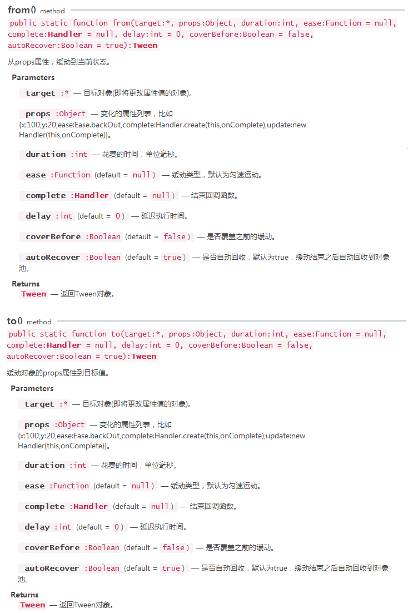
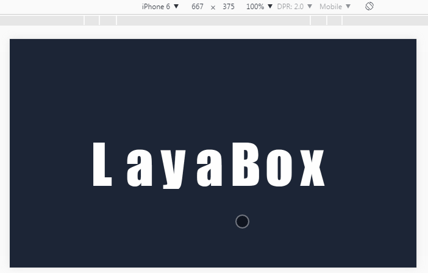
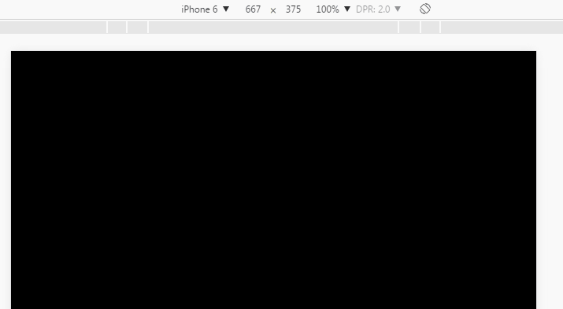

#アニメを見る

###1.アニメの概要を緩やかにする

ゲーム開発ではアニメの動きを緩めることが一般的で、ゲームUIの体験を高める重要な要素の一つとして、例えばダイアログのポップアップ、クローズ、ボタンの効果の出現と消失、道具のバックパックへの飛び込みなどがあります。

`Tween`緩動類は、目標オブジェクト属性の緩動を実現するために用いられ、例えば、対象のxまたはy軸の緩動距離などの目標値設定や、緩動開始、停止、清掃などの設定を行う。もっとTweenのAPI

`Ease`クラスは大量の緩動関数を定義しています。`Tween`アニメの具体的な動きを緩める効果。LayaAirエンジンのTween類とEase類を組み合わせて使うと、ゲーム開発の緩動効果がほぼ満足できます。リンクをクリックするとAPIを直接見ることができます。[https://layaair.ldc.layabox.com/api/?category=Core&class=laya.utils.Tween](https://layaair.ldc.layabox.com/api/?category=Core&class=laya.utils.Tween)

`Ease`種類のAPIにおいて、緩動関数についての基礎的な紹介が行われています。リンクをクリックしてAPIを直接見ることができます。[https://layaair.ldc.layabox.com/api/?category=Core&class=laya.utils.Ease](https://layaair.ldc.layabox.com/api/?category=Core&class=laya.utils.Ease)

`Ease`クラスのAPIのそれぞれの緩動関数効果はデモDEMO、リンクを見ることができます。[https://layaair.ldc.layabox.com/demo/?Tween_EaseFunctionsDemo](https://layaair.ldc.layabox.com/demo/?Tween_EaseFunctionsDemo)


###2.緩動類の常用API紹介

####2.1 Tween緩動類の常用方法from()とto()

緩動類Tweenは多くの方法を提供していますが、私達がよく使うのは二つです。`from()`を選択します`to()`この2つの方法のパラメータ設定は全く同じですが、効果は異なります。fromは、緩動目標点から初期位置に向かって動きます。`到缓动目标位置去`）後で実例に関連して詳しく説明しますが、開発者はまずこの2つの方法の基本的な説明を理解してもいいです。

 


（図1）

####2.2一般パラメータ説明

`to()`和`from()`これらの2つの方法は静的方法をサポートしていますので、Tween類を実用化する必要はありません。

図1のAPIを見て説明すると、`to()`和`from()`それらのパラメータは分かりやすく、ここではprops、duration、ease、complete、delayパラメータを強調します。

#####props

propsはターゲットの変更が必要で、緩動効果が生じる属性です。オブジェクトの共通属性は、最も一般的なx、y位置属性、およびalphaの透明性、および回転、軸軸、サイズなどの他の属性を設定することができます。

#####duration

durationは減速効果を実行するのに時間がかかります。単位は豪秒で、時間が多ければ多いほど、緩動効果が遅くなります。

#####ease

easeは緩動タイプで、Easeクラスで定義された各種関数を使ってアニメーションの変化過程を変えることができます。LayaAirエンジンは非常に多くの緩動方法を提供して、開発者達に使用を選択させます。開発者はAPIを見ることができます。または公式サイトのエンジンの例で、緩動関数を切り替えて、緩動効果を観察します。リンク先：[https://layaair.ldc.layabox.com/demo/?Tween_EaseFunctionsDemo](https://layaair.ldc.layabox.com/demo/?Tween_EaseFunctionsDemo)

#####complettee

completteeは、緩動完了後のコールバック方法です。たとえばボタンの緩動は、緩動中にユーザーにクリックさせてはいけません。この時には緩動で回転を完了し、コールバック関数の中にボタンを入れて傍受します。

#####delay

delayは、実行を遅延させる時間であり、後でインスタンス中の遅延実行によってテキストの緩やかな変動効果を作成します。


###3.緩動例

####3.1 Tween.from()の例

下記のコードの中で、まずTween.from()の方法を通じて、「LayaBox」の文字のテキストを動画の動きを緩めます。

TweenDemo.as文書クラスを作成し、コードの作成は以下の通りです。


```java

package 
{
	import laya.display.Text;
	import laya.utils.Tween;
	import laya.utils.Ease;
	import laya.webgl.WebGL;
	
	public class TweenDemo
	{
		
		public function TweenDemo() 
		{
			// 初始化舞台
			Laya.init(1334,750, WebGL);

			//背景颜色
			Laya.stage.bgColor = "#1b2436";
			
			//创建缓动文本
			createTween();
		}
		
		//创建缓动文本
		private function createTween():void 
		{	
			
			//"LayaBox"字符串总宽度
			var w:int = 800;
			
			//文本创建时的起始x位置(>>在此使用右移运算符，相当于/2 用>>效率更高)
			var offsetX:int = Laya.stage.width - w >> 1;

			//显示的字符串
			var demoString:String = "LayaBox";
			
			var letterText:Text;
			
			//根据"LayaBox"字符串长度创建单个字符，并对每个单独字符使用缓动动画
			for (var i:int = 0, len:int = demoString.length; i < len; ++i)
			{
				//从"LayaBox"字符串中逐个提出单个字符创建文本
				letterText = createLetter(demoString.charAt(i));
				letterText.x = w / len * i + offsetX;
				
				//文本的初始y属性
				letterText.y = 300;

				//对象letterText属性y从缓动目标的100向初始的y属性300运动，每次执行缓动效果需要3000毫秒，缓类型采用elasticOut函数方式，延迟间隔i*1000毫秒执行。
				Tween.from(letterText, { y : 100 }, 3000, Ease.elasticOut, null, i * 1000);
			}
		}
		
		
		//创建单个字符文本，并加载到舞台
		private function createLetter(char:String):Text
		{
			var letter:Text = new Text();
			letter.text = char;
			letter.color = "#FFFFFF";
			letter.font = "Impact";
			letter.fontSize = 180;
			Laya.stage.addChild(letter);			
			return letter;
		}
	}
}
```


運転効果は図2に示すようになります。

<br/>(図2)

実例コードに関連して、図2の動きの効果により、テキスト「Layabox」は初期位置(*y軸300*)が現れた後、瞬間的に消え、その後、緩動方法Twen.fromから設定されたターゲットが見えてきます。`{ y : 100 }`(*y軸100*)は初期位置に動きます(上から下までの緩動効果)。

この方法は最初の位置に表示してから、瞬間的に消滅して、緩動の目標位置から初期位置に移動します。視覚的な差が生じ、リバウンド効果のような感じがします。私たちはTween.toの効果を引き続き理解しています。開発者は必要に応じてどのような緩動方法を使うかを選択できます。

####3.2 Tween.to（）の例

上記の例を引き続き採用してもいいです。Tween.fromをTwen.toに変更するだけで、まず運行効果を見てみます。


```java

//文本的初始y属性
letterText.y = 300;
//Tween.from(letterText, { y : 100 }, 3000, Ease.elasticOut, null, i * 1000);//注释本行改为将Tween.from改变为Tween.to
Tween.to(letterText, { y : 100 }, 3000, Ease.elasticOut, null, i * 1000);
```


運転効果は図3に示すようになります。

<br/>(図3)

コードに合わせて、図3の効果を見て、Tween.to（）はより直感的になります。初期属性yは300であり、緩動方法の属性はyは100である。`{ y : 100 }`)したがって、図3は下から上に向かって動きを緩める効果があるということです。

####3.3 Propsパラメータを理解する

Tween.fromであれ、Tween.toであれ、第二のパラメータProps（属性）は、緩動効果の動きの軌跡などに影響を与える。

Tween.fromとTween.toの緩動効果は本来反対なので、Tween.fromは落下する感じがあります。図3のTween.toは上に向かって弾む感じがあります。

初期yの属性値と緩動目標のy属性値を合わせたら、Tween.toで実現した落下効果はTween.fromとどう違っていますか？

前の例を継続します。修正コードは以下の通りです。


```java

//文本的初始y属性
letterText.y = 100;
//Tween.from(letterText, { y : 100 }, 3000, Ease.elasticOut, null, i * 1000);//注释本行改为将Tween.from改变为Tween.to
Tween.to(letterText, { y : 300 }, 3000, Ease.elasticOut, null, i * 1000);
```


運転効果は図4に示すようになります。

<br/>(図4)

図4は、初期y属性が100であるため、Tween.toの効果は、初期属性から緩動ターゲットの属性に向かって動きます。従って、目標のy属性を緩やかにすると、初期y軸の100からy軸300に移動する、すなわち落下する効果が生じる。Tween.fromとの落下効果は明らかに異なる。ですから、開発者はこの二つの効果の違いに注意して運用します。

####3.4緩動継続時間（*duration*）と遅延実行（*delay*）パラメータを理解する

前の例を続けて、図5に示すように、第3のパラメータdurationを1000ミリ秒に変更し、第6のパラメータdelayを100ミリ秒に変更します。緩動の速度も落下間隔の速度も明らかに変化します。このため、持続時間や遅延時間の調整によって、異なる効果目標が達成されることがわかる。ここはもう深くないです。開発者は自分で体験を調節できます。

<br/>(図5)

図5の効果で修正されたコードは以下の通りです。


```java

//文本的初始y属性
letterText.y = 100;
//Tween.from(letterText, { y : 100 }, 3000, Ease.elasticOut, null, i * 1000);//注释本行改为将Tween.from改变为Tween.to
Tween.to(letterText, { y : 300 }, 1000, Ease.elasticOut, null, i * 100);
```


####3.5 easeパラメータを理解する

第四のパラメータease対応`laya.utils.Ease`これらの方法については、公式サイトのエンジンの例で示しています。開発者はリンクをクリックできます。[https://layaair.ldc.layabox.com/demo/?Tween_EaseFunctionsDemo](https://layaair.ldc.layabox.com/demo/?Tween_EaseFunctionsDemo)）一つ一つ確認して、この例の効果を置き換えて体験することができます。

この節では私たちは`Ease.bounceIn`効果は、図6に示すようになります。

<br/>(図6)

図6の効果で修正されたコードは以下の通りです。


```java

//文本的初始y属性
letterText.y = 100;
//Tween.from(letterText, { y : 100 }, 3000, Ease.elasticOut, null, i * 1000);//注释本行改为将Tween.from改变为Tween.to
Tween.to(letterText, { y : 300 }, 1000, Ease.bounceIn, null, i * 100);
```


####3.6調整済みパラメータを理解する

5番目のパラメータcompletteeは、ウォームアップ効果を実行した後のコールバックに使用されます。これまでの例を踏襲して、緩動終了後にフォントの色を赤くするためのフィードバックを追加します。

使用例:


```java

Tween.to(letterText, { y : 300 }, 1000, Ease.bounceIn, Handler.create(this,changeColor,[letterText]), i * 100);
```


新しい引用を追加する必要があるので、今回は全部の例示コードを貼り付けます。

TweenDemo.as：


```java

package 
{
	import laya.display.Text;
	import laya.utils.Ease;
	import laya.utils.Handler;
	import laya.utils.Tween;
	import laya.webgl.WebGL;
	
	public class TweenDemo
	{
		
		public function TweenDemo() 
		{
			// 初始化舞台
			Laya.init(1334,750, WebGL);

			//背景颜色
			Laya.stage.bgColor = "#1b2436";
			
			//创建缓动文本
			createTween();
		}
		
		/**
		 * 创建缓动文本
		 */	
		private function createTween():void 
		{	
			
			//"LayaBox"字符串总宽度
			var w:int = 800;
			
			//文本创建时的起始x位置(>>在此使用右移运算符，相当于/2 用>>效率更高)
			var offsetX:int = Laya.stage.width - w >> 1;

			//显示的字符串
			var demoString:String = "LayaBox";
			
			var letterText:Text;
			
			//根据"LayaBox"字符串长度创建单个字符，并对每个单独字符使用缓动动画
			for (var i:int = 0, len:int = demoString.length; i < len; ++i)
			{
				//从"LayaBox"字符串中逐个提出单个字符创建文本
				letterText = createLetter(demoString.charAt(i));
				letterText.x = w / len * i + offsetX;
				
				//文本的初始y属性
				letterText.y = 100;

				/**
				* 对象letterText属性y从100缓动到300的位置
				* 用1000毫秒完成缓动效果
				* 缓动类型采用bounceIn
				* 单个字符的缓动效果结束后，使用changeColor回调函数将字符改变为红色
				* 延迟间隔i*100毫秒执行
				*/
				Tween.to(letterText, { y : 300 }, 1000, Ease.bounceIn, Handler.create(this,changeColor,[letterText]), i * 100);
			}
		}
				
		/**
		 * 缓动完成后的回调方法
		 * @param txt  缓动对象
		 */		
		private function changeColor(txt:Text):void
		{
			//将文本字体改变成红色
			txt.color="#FF0000";			
		}		
		
		/**
		 * 创建单个字符文本，并加载到舞台
		 */		
		private function createLetter(char:String):Text
		{
			var letter:Text = new Text();
			letter.text = char;
			letter.color = "#FFFFFF";
			letter.font = "Impact";
			letter.fontSize = 180;
			Laya.stage.addChild(letter);			
			return letter;
		}
	}
}
```


コード運転効果は図7に示すようになります。

 


####3.7 Propsパラメータによりプロセスのコールバックを実現する

compplete(*のリフレクト*)パラメータは、5番目のパラメータだけでなく、2番目のパラメータPropsでも実現できます。しかし、コードをより明瞭に読みやすくするために、私達は完成したコールバックをPropsにおいて実現することを提案していません。

ここでは、Propsでudateの更新を実現するためのフィードバックを紹介します。つまり、もし私たちが緩動中にフィードバック方法を実行したいなら、5番目のパラメータでは不可能です。5番目のパラメータはきっと緩動終了後に実行されます。したがって、これまでの例を踏襲して、Propsパラメータにフォントの色を追加しました。

使用例:


```java


/**
* 对象letterText属性y从100缓动到300的位置，每一帧都通过回调方法更新颜色
* 用1000毫秒完成缓动效果
* 缓动类型采用bounceIn
* 单个字符的缓动效果结束后，使用changeColor回调函数将字符改变为红色
* 延迟间隔i*100毫秒执行
*/

Tween.to(letterText, { y : 300, update: new Handler(this, updateColor,[letterText])}, 1000, Ease.bounceIn, Handler.create(this,changeColor,[letterText]), i * 100);
```


すべての例示的なコード、TweenDemo.as：


```java

package 
{
	import laya.d3.math.Rand;
	import laya.display.Text;
	import laya.utils.Ease;
	import laya.utils.Handler;
	import laya.utils.Tween;
	import laya.webgl.WebGL;
	
	public class TweenDemo
	{
		public function TweenDemo() 
		{
			// 初始化舞台
			Laya.init(1334,750, WebGL);

			//背景颜色
			Laya.stage.bgColor = "#1b2436";
			
			//创建缓动文本
			createTween();
		}
		
		/**
		 * 创建缓动文本
		 */	
		private function createTween():void 
		{	
			
			//"LayaBox"字符串总宽度
			var w:int = 800;
			
			//文本创建时的起始x位置(>>在此使用右移运算符，相当于/2 用>>效率更高)
			var offsetX:int = Laya.stage.width - w >> 1;

			//显示的字符串
			var demoString:String = "LayaBox";
			
			var letterText:Text;
			
			//根据"LayaBox"字符串长度创建单个字符，并对每个单独字符使用缓动动画
			for (var i:int = 0, len:int = demoString.length; i < len; ++i)
			{
				//从"LayaBox"字符串中逐个提出单个字符创建文本
				letterText = createLetter(demoString.charAt(i));
				letterText.x = w / len * i + offsetX;
				
				//文本的初始y属性
				letterText.y = 100;

				/**
				 * 对象letterText属性y从100缓动到300的位置，每一帧都通过回调方法更新颜色
				 * 用1000毫秒完成缓动效果
				 * 缓动类型采用bounceIn
				 * 单个字符的缓动效果结束后，使用changeColor回调函数将字符改变为红色
				 * 延迟间隔i*100毫秒执行
				 */
			
				Tween.to(letterText, { y : 300, update: new Handler(this, updateColor,[letterText])}, 1000, Ease.bounceIn, Handler.create(this,changeColor,[letterText]), i * 100);
			}
		}
		
		/**
		 * 缓动进行时的回调更新方法
		 * @param txt  缓动对象
		 */			
		private function updateColor(txt:Text):void
		{
			
			var c:int = parseInt(Math.random()*3);
			switch(c)
			{
				case 0:
				{
					txt.color="#EEE000";
					break;
				}
				case 1:	
				{
					txt.color="#FFFFFF";
					break;
				}
				case 2:	
				{
					txt.color="#FF0000";
					break;
				}
				default:
				{					
					txt.color="#EEE000";
					break;
				}
			}
		}		
		
		/**
		 * 缓动完成后的回调方法
		 * @param txt  缓动对象
		 */		
		private function changeColor(txt:Text):void
		{
			//将文本字体改变成红色
			txt.color="#FF0000";
		}		
		
		/**
		 * 创建单个字符文本，并加载到舞台
		 */		
		private function createLetter(char:String):Text
		{
			var letter:Text = new Text();
			letter.text = char;
			letter.color = "#FFFFFF";
			letter.font = "Impact";
			letter.fontSize = 180;
			Laya.stage.addChild(letter);			
			return letter;
		}
	}
}
```


コード実行時には、udateフィードバックはフレーム毎に実行されますので、緩動の過程で、フラッシュの効果があります。図8に示すように。

 


(図8)


LayaAirIDEの時間軸アニメーション編集は、対象属性に緩動効果を設定することもできます。IDE内の緩動効果設定方式を知りたいなら、「時間軸アニメーションエディタ詳細」の緩動についての紹介を読んでください。