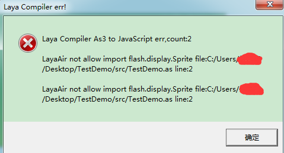
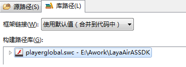
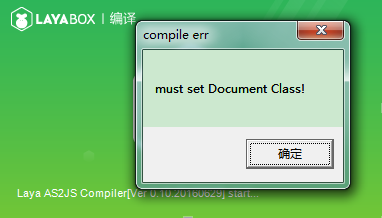
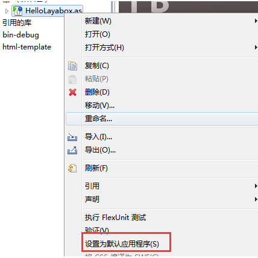

# 新手常见问题：配置环境之后点击运行报错、黑屏


###一、AS 3原生の引用によるエラー

**現象:**

FBに新規プロジェクトを作成してFBのコンパイル環境を設定し、環境設定後にアプリケーション-実行エラーをクリックして、図1に示すように：

​<br/>
（図1）

**理由:**

エラーは、コードにFlash AS 3を導入したAPIと、元のAS 3を継承したSpriteによるものです。LayaAirエンジンはFlash AS 3言語の基礎文法をサポートしていますが、元AS 3 APIの引用と継承はサポートされていません。

​<br/>
（図2）

**提案:**

1、プロジェクトの右ボタン->>属性->構築経路->flash元のsdkを削除します。ライブラリパスにLayaのswcファイルを導入し、ソースパスにLayaのエンジンライブラリファイルを導入したことを確認します。図3、図4、図5に示すように。

2、開発にはLayaAirエンジンAPIを熟知し、LayaAirエンジンのAPIを使って開発する必要があります。


​           <br/>
（図3）既存のsdkを削除する

​<br/>
（図4）LayaAirエンジンライブラリ圧縮パッケージにあるplayrglobal.swcを導入し、図中の経路は参考のみとする。

​<br/>
（図5）エンジンライブラリを導入し、図中の経路は参照のみとする。


###二、文書類（デフォルトプログラム）が設定されていないため、コンパイルエラー

**現象:**


​        <br/>
（図6）プロジェクトのコンパイル中にエラーが発生しました。

**理由:**

コンパイル時に図6のエラーが発生した場合、ドキュメントクラス（デフォルトプログラム）が設定されていないことは間違いない。

**ソリューション:**

​<br/>
（図7）FlashBuiderでは、入り口プログラムをデフォルトのアプリケーションに設定する必要があります。

​<br/>
（図8）Flash Developでは、入口プログラムを文書クラスに設定する必要があります。

​<br/>
（図9）LayaAirIDEで、asconfig.jsonプロジェクトファイル内で修正


###三、余分な文字によるコンパイルエラー

**現象:**

​<br/>
（図10）

図10のエラーが発生したら、クリックして確定します。ブラウザ操作台のエラーは図11に示すようになります。

​<br/>
（図11）

**理由:**

このようなエラーが発生したのは、多くの場合、余分な文字などの文法的な不正問題によるものです。

**提案:**

Flash Buiderを使ってAS 3言語のバージョンを開発するLayaAirエンジンプロジェクトを推奨します。FlashBuiderの中では自動文法検査機能が成熟しています。


###四、プログラムファイルが選択されていないため、コンパイルエラー

**現象:**

ショートカットキーでコンパイルすると図12のエラーが発生します。

​<br/>
（図12）

**理由:**

マウスが選択されていないため、直接コンパイルを実行すると、図12のエラーが発生します。

**ソリューション:**

有効なプログラムファイルまたはフォルダを選択して、再編集すればいいです。


###五、クロスドメインによるブラックスクリーン問題

**現象:**

プロジェクトを実行すると、ブラウザにブラックスクリーンが表示され、コンソールには図13に示すように表示されます。


​        <br/>
（図13）


 


**理由:**
ブラウザはデフォルトではファイルをファイルにまたがって読み込むことができません。ドメインをまたぐ問題があります。

**ソリューション:**

1、ローカルデバッグ解決：

chromeブラウザショートカット->右クリックで開くプロパティ->ショートカットの欄->ターゲットの末尾に追加します。`--allow-file-access-frome-files`

2、サーバwebServer解決：

webServerを修正する必要があります。（一般的なwebserverの多くはapache、nginx、tomcatなどです。）特定のドメイン名を要求してドメインをまたぐタグを付けます。ここではnginxを例にします。


```nginx

http {

  ......

  add_header Access-Control-Allow-Origin *;

  add_header Access-Control-Allow-Headers X-Requested-With;

  add_header Access-Control-Allow-Methods GET,POST,OPTIONS;

  ......

}

```


これでGET、POST、OPTTIONSのクロスドメイン要求のサポートが実現できます。

いいです`add_header Access-Control-Allow-Origin http://www.layabox.com;`--許可のurlを指定します。

3、データ要求がドメインをまたぐ場合、バックエンドの言語協力の修正が必要で、リガでheaderの標識を要求します。ここではphp言語を例にします。

`header("Access-Control-Allow-Origin: *");`必ずしも使うとは限らない`*`を選択します`*`すべてのホストがドメインを越えてアクセスできるようにすることです。指定されたドメイン名の下のホストを書いてもアクセスできます。
