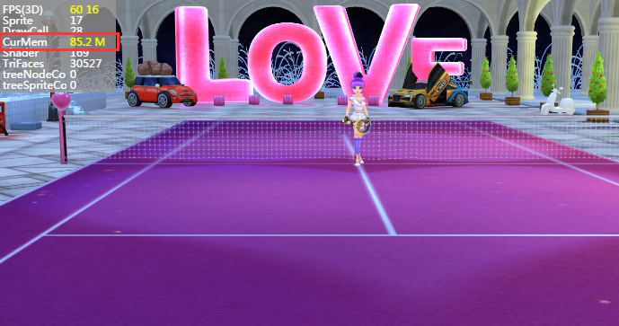
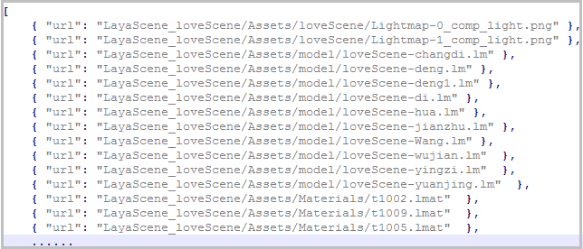

##LayaAir 3 Dの資源放出

###### 修改时间:2019-4-24,version:2.0.1

###なぜ資源を解放しますか？

LayaAir 3 Dゲームの開発において、資源の放出は非常に重要です。3 Dリソースは、モデル、スタンプ、材質、アニメーションなどを含み、良い画面効果を達成するために、ファイルは2 Dよりも大きくなります。3 Dエンジンは基本的にすべてのリソースをGPUに入れて計算してレンダリングしますので、多くの現存を占めています。ゲームのレベルがどんどん読み込まれて、ゲームがどんどん深くなって、現存中の資源がだんだん多くなります。資源を解放しないと、ゲームは最終的に崩壊します。

現存はメモリと違って、メモリはゴミ回収の仕組みがあります。現存は違っています。手動で釈放しなければならないので、現存する資源の放出は重視されなければなりません。

図1、図2の統計ツールにおける現存サイズを観察する。

図1は、ゲーム起動後にロードされる最初のシーンで、表示量は30527で、85.2 Mを占有する。

<br/>(図1)

図2はゲームにロードされた第2のシーンで、面数は7455しかないが、ロード後の現存リソースは118.91 Mである。これはどういう理由ですか？顔の数が少なくて、シーンが小さくて、スタンプも図1のシーンより少ないです。光のスタンプも小さいです。しかし、現存資源はもっと大きいです。

これは第1の関所のシーンが解放されていないためで、その資源はまだ現存中で、そのため現存占用は大きくなりました。手動でクリアしないと、ゲームは引き続き他のシーンを切り替えます。一定量に達したら、携帯のディスプレイは消耗されます。ゲームカードが死んで、フラッシュバック、発熱などの現象が頻繁に現れます。

<br/>(図2)


###資源をロードする時の処理原則

上の図の例を通して、LayaAir 3 Dエンジンの処理資源と現存の関係を見ることができます。ゲームの性能最適化の目的を達成するために、資源をロードする時も原則を注意しなければなりません。

1、資源をロードする時は、すべての資源を一度に全部ロードしないでください。必要な資源だけをロードします。3 Dリソースのロードが完了すると、リソースの拡張子の名前に基づいて直接3 D表示オブジェクトを作成します。例えば.lsはScheneを作成します。lhはSprite 3 Dオブジェクトを作成します。作成した対象リソースはステージに置いていなくても直接に現存に入れるので、資源が多すぎると大量に現存します。

2、合理的に現存を管理し、頻繁に繰り返し使用する資源は現存において釈放する必要がなく、繰り返し使用した資源は使用後直ちに釈放して、性能オーバーヘッドを節約する。例えば主役の資源、3 Dの道具の資源、プレーヤーはいつも使って、ずっと現存の中で保管することができて、スピードを抽出するのは速いです。


###現存資源の放出方法

現存リソースの解放には、オブジェクトを通じて現存リソースを解放する方法がありますが、リソースオブジェクトを遍歴するのは面倒くさいので、ここでは紹介しません。もう一つはリソースアドレスを通じて現存リソースを解放し、資源管理の観点から、リソースアドレス法を通じてより活性化し、JSONデータテーブルを構成して管理することができます。

####切り替えシーンとリリースリソースの遷移画面

リソースをロードしてシーンを切り替える時、図3のような遷移のための進捗表示画面をIDEで作成します。

<br/>(図3)

IDEリリース後、制御クラスを作成し、論理コードは下記を参照してください。


```java

package view {
  import ui.ProgressBarUI;

  public class loading extends ProgressBarUI {

    public function loading() {

    }
    public function setValue(num:Number):void{
      this.pro.value = num;
    }
    public function init():void{
      this.pro.value = 0;
      //进度增加帧循环
      Laya.timer.loop(20,this,loop);
    }		
    //资源加载进度模拟*（假进度）
    private function loop():void{
      //进度增加
      this.pro.value +=0.01;
      //最高进度度100%
      if(this.pro.value>=1)
      {
        this.pro.value = 100;
        Laya.timer.clearAll(this);
        this.removeSelf();
      }
    }
  }
}
```


####リソースアドレステーブルを通じて現存リソースを解放する。

メインクラスでは、マウスで舞台をダブルクリックして場面を切り替え、リソースアドレスを使って現存リソースを解放する方法を使って、新しいシーンをロードします。

リソースパスのリスト方法が柔軟で、テーブルを構成することによって、テーブル内の削除リソースを増やすことができます。例えば美術はシーンをエクスポートする時、JSON表を新たに作って、このシーンの中で切り替えた後に必要でない資源のルートをすべてJ表の中に置いて、役に立つ資源は表に入れないで、資源は釈放しないで、たとえばいくつかの公共のNPC、道具、特効などのゲームの元素の資源。

Tips：リソースは、シーン光のスタンプlightmap、材質、lmat、モデル、lm、様々なタイプのスタンプ、pngまたは.jpg、動画、lani、骨格、lavなどの資源を含みます。

ここでは、リソース表の方法を紹介します。まず、エクスポートされたリソースファイルディレクトリにjsonファイルを作成し、リリースするパスリソースを編集し、Json配列を形成します。名前はlsファイルと一致しています。図5、6のように。

<br/>(図5)

<br/>(図6)

Json編集が完了したら、チェックツールでフォーマットが正しいかどうかを確認できます。次にメインクラスのコードを作成します。


```java

package {
  import laya.d3.core.Camera;
  import laya.d3.core.MeshSprite3D;
  import laya.d3.core.Sprite3D;
  import laya.d3.core.light.DirectionLight;
  import laya.d3.math.Vector3;
  import laya.d3.math.Vector4;
  import laya.d3.resource.models.BoxMesh;
  import laya.display.Stage;
  import laya.utils.Stat;
  import laya.d3.core.scene.Scene3D;
  import laya.d3.core.material.BlinnPhongMaterial;
  import laya.webgl.resource.Texture2D;
  import laya.utils.Handler;
  import view.loading;
  import laya.events.Event;
  import laya.resource.Resource;
  public class LayaAir3D {
    public var load:loading;
    private var scene:Scene3D;
    public function LayaAir3D() {

      //初始化引擎
      Laya3D.init(0, 0);

      //适配模式
      Laya.stage.scaleMode = Stage.SCALE_FULL;
      Laya.stage.screenMode = Stage.SCREEN_NONE;

      //开启统计信息
      Stat.show();
      //加载2D资源文件
      Laya.loader.load("h5/res/atlas/comp.atlas",Handler.create(this,Complete2D));
    }
    public function Complete2D():void{
      //实例化加载进度界面
      load = new loading();
      Laya.stage.addChild(load);
      load.init();
      //加载场景3D资源(不能全部加载，否则太占显存)
      Laya.loader.create(["h5/LayaScene_test/test.ls","h5/LayaScene_twonScene/twonScene.ls"],Handler.create(this,Complete3D))

    }	
    //加载3D资源完成的回调
    public function	Complete3D():void{
      //添加场景
      scene = Laya.stage.addChild(Laya.loader.getRes("h5/LayaScene_test/test.ls"))as Scene3D;
      Laya.stage.setChildIndex(scene,0);
      //点击游戏画面切换场景
      Laya.stage.on(Event.MOUSE_DOWN,this,ChangeScene);
    }
    //加载第二关场景资源，切换场景
    private function ChangeScene():void{
      //去除场景的点击切换事件
      Laya.stage.off(Event.MOUSE_DOWN,this,ChangeScene);
      //移出之前的场景
      scene.removeSelf();
      load.init();
      Laya.stage.addChild(load);
      scene.destroy();

      //加载第二关场景资源到游戏中
      scene = Laya.loader.getRes("h5/LayaScene_twonScene/twonScene.ls");
      Laya.stage.addChild(scene);
      //设置游戏场景层级
      Laya.stage.setChildIndex(scene,0);

      //列表释放显存资源的方法（利用资源表方式，每个场景配置资源路径表）
      assetsDispose();
    }
    private function assetsDispose():void{
      //加载释放的资源配置表
      Laya.loader.load("loveScene.json",Handler.create(this,this.onAssetOK));
    }
    //加载资源释放表完成后
    private function onAssetOK():void{
      //获取加载的数据（Json数据转换成数组）
      var arr:Array = Laya.loader.getRes("loveScene.json");
      for(var i:Number = arr.length-1;i>-1;i--)
      {
        //根据资源路径获取资源
        var resource:Resource = Laya.loader.getRes(arr[i].url)as Resource;
        //非空
        if(resource)
        {
          //销毁资源
          resource.destroy();
        }
        else
        {
          console.log(arr[i].url);
        }
      }
    }
  }
}
```


上記コードassites Displaseを観察して、配置表をロードした後、Laya.loader.getsRes（arr[i].url）方法で直接にリソースによって生成されたオブジェクトを取得します。LayaAir 2.0の正式版の後で、もう一つの方法でresource.destroyを呼び出しました。

リソースをリリースした後、Loader.loadeMap属性によってキャッシュ中のリソースを確認することもできます。

上記のコードをコンパイルして実行すると、図4の効果が見られます。リリースが完了し、新しいフィールドシーンをロードすると、グラフィック占有率は前よりずっと小さくなります。これまでリリースされていなかったリソースは118.91 mで、リリース後現存は56.11 Mのみを占めています。

<br/>(図4)

###リソースの自動リリース

LayaAir 2.0は開発者の開発を容易にするために、3 D資源のリリースに便利なリリース方式を追加しました。

シーン（または精霊）を破壊した後に呼び出します。`Resource.destroyUnusedResources()`使用していないリソースは自動的に放出されます。


```typescript

//自动释放没有被使用的资源
Resource.destroyUnusedResources();
```


