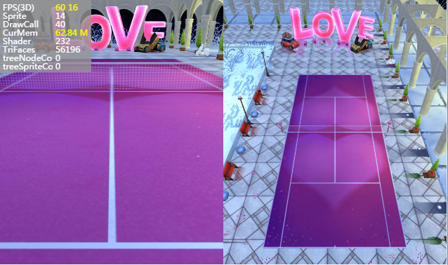

##LayaAir 3 DカメラカメラCamera

LayaAirのカメラは、映画やドラマを撮影する時のカメラとして認識され、三次元世界の画面をキャプチャーしてスクリーンに表示されます。シーンにカメラがないと、ゲーム画面にはジョブ物体が表示されません。シーン中のカメラは、例えば主人公のキャラクターモードに追加するなど、シーン中のサブノードにおいても同様に3 D画面を表示することができる。

また、LayaAir 3 DエンジンにVRカメラが追加され、開発者たちはVR立体アプリケーションやゲームを開発することができます。

もちろん、カメラは他に重要な属性があります。その機能を紹介します。


###Unityからカメラをエクスポート

エンジン1.7.10版とユニティ導出プラグイン1.5.0版がリリースされた後、ユニティで作成されたカメラがエクスポートされます。また、ファイルのエクスポートは、カメラの3 D空間における位置、画角、背景色、キャリアカット、視野などのパラメータを保持しています。エクスポート後のシーンをロードすると、表示される画面効果はunityと完全に一致し、開発者たちがカメラの画角を制御するのに便利です。

また、LayaAir 3 Dエンジンはマルチカメラに対応していますので、unityに複数のカメラを設置してエクスポートすることもできます。マルチカメラのビューの設定については、本課の最後の「マルチカメラ使用」の小節をご覧ください。

では、unityでカメラを作成してエクスポートした場合、コードにファイルをロードした後、カメラはどうやって取得しますか？これはシーンのサブノードインデックスや名前で取得できます。取得後は移動回転、スカイボックスの設定、スクリプトの追加などの操作もできます。

コードは以下の通りです


```java

package {
	import laya.d3.core.Camera;
	import laya.d3.core.scene.Scene;
	import laya.display.Stage;
	import laya.utils.Handler;
	import laya.utils.Stat;
  
	public class LayaAir3D
	{
		public function LayaAir3D() 
		{
			//初始化引擎
			Laya3D.init(1000, 500,true);			
			//适配模式
			Laya.stage.scaleMode = Stage.SCALE_FULL;
			Laya.stage.screenMode = Stage.SCREEN_NONE;
			//开启统计信息
			Stat.show();			
			//预加载角色动画资源
			Laya.loader.create("monkey/monkey.ls",Handler.create(this,onSceneOK));
		}		
		
		private function onSceneOK():void
		{
			//添加3D场景
			var scene:Scene3D = Laya.loader.getRes("monkey/monkey.ls");
			Laya.stage.addChild(scene);  
          
         	//从场景中获取摄像机
            var camera:Camera = scene.getChildByName("Main Camera") as Camera;
          	//后续对摄像机的逻辑操作.......
        }
	}
}
			
```


Unitiyでは、カメラのデフォルト名は「Main Camera」であるため、上記のコードでは、sceneのget ChildByName（「Main Camera」）方式により、後続の論理操作のためにカメラを入手した。開発者たちはユニティでカメラの名前をカスタマイズすることもできます。


###カメラの移動と回転

カメラはSprite 3 Dに引き継がれますので、3 D変換の操作もできます。3 Dシーンをtranform属性で移動して回転変化し、マルチアングルで撮影して、観客や遊戯者によりよりリアルな空間体験を得られます。

カメラの回転を設定:


```java

//实例化一个相机，设置纵横比，0为自动匹配。0.1最近看到的距离，100最远看到的距离。
var camera:Camera = new Camera(0, 0.1, 100)
//移动相机，设置相机的向z轴移动3米。true代表是局部坐标，false是相对世界坐标。 
camera.transform.translate(new Vector3(0, 0, 3),false);
//加载到场景
scene.addChild(camera);
```

カメラの回転を設定します。


```java

//欧拉角旋转相机。局部坐标，弧度制（false为角度制）。
camera.transform.rotate(new Vector3(0, 0, 3), true, true);
```


###カメラの直交射影と透視投影

私達が世界を観察する時、見たのはすべて“近くて遠いです”の透視の効果の世界を持つので、3 Dエンジンの中で、人の目の見た世界をより良いシミュレーションするため、デフォルトのカメラは“透視投影”の効果を持っています。

<br/>(図1)デフォルトの斜視投影

しかし、ゲームの多くの部分は、特に斜め45度の視角を持つ2 D、3 Dの混合ゲームで、ゲーム画面は透視効果がありません。この時、私たちはカメラを「直交射影」に設定して、近距離の透視効果を生まないようにします。


```javascript

	//正交投影属性设置
	camera.orthographicProjection = true;
	//正交垂直矩阵距离,控制3D物体远近与显示大小
	camera.orthographicVerticalSize = 7;
	//移动摄像机位置
	camera.transform.translate(new Vector3(0, 26.5, 45));
	//旋转摄像机角度
	camera.transform.rotate(new Vector3( -30, 0, 0), true, false);
```


<br/>(図2)直交射影


###カメラ裁断と視野

**遠近距離の裁断**

カメラはまた、遠近距離の裁断を設定し、遠近距離の間のシーンモデルのみを表示し、他のモデルはレンダリング表示しない。ゲームの性能を高めることが最大の強みです。

カメラを作成する時、カメラの構造関数はデフォルトでは、近距離0.3メートル、遠距離は1000メートルです。開発者はコンストラクション関数に設定したり、カメラのプロパティによって設定したりすることができます。

<br/>(図3)


```javascript

	//创建摄像机时初始化裁剪(横纵比，近距裁剪，远距裁剪)
	var camera:Camera = new Camera( 0, 0.1, 100);
	//近距裁剪
	camera.nearPlane=0;
	//远距裁剪
	camera.farPlane=100;
```


tips：一般的にゲームの中で、霧の効果をカメラと同時にカットして使います。霧の効果は遠いところ以外はほとんど見えません。この時に遠隔カットを設置して、ゲームのレンダリング性能を高めます。

**カメラ視野**

カメラの視野は焦点距離に類似しており、視野パラメータの調整により、ビュー中のシーン範囲、透視の近距離変化が見られます。角度値によって調整され、角度が大きいほど、視野範囲が大きくなり、開発者は自分のニーズに応じて設定できます。


  
```java

//设置相机的视野范围90度
camera.fieldOfView = 90;
  ```


###カメラキャプチャーターゲット

カメラを作る時、私たちは常にカメラの位置を調整して、ある三次元物体を表示したり、ある領域を表示したりする必要があります。初心者にとっては、まだ空間的な思考が習慣化されていないので、位置を調整するのに時間がかかります。

LayaAir 3 Dエンジン3 D変換は、ターゲットを捕捉するためのlook At（）方法を提供し、3 Dオブジェクトの位置合わせ句読点を自動的に調整する。カメラは私たちの画角を調整する目的にも使える。コードは以下の通りです

lookAt（targetは目標ベクトルを観察し、upは上ベクトル、isLocalは局所空間かどうか）


```java

//添加场景
var scene:Scene3D = new Scene();
Laya.stage.addChild(scene);
//添加自定义模型
var box:MeshSprite3D = scene.addChild(new MeshSprite3D(new BoxMesh(1,1,1))) as MeshSprite3D;
scene.addChild(box);
//添加摄像机
var camera:Camera = (scene.addChild(new Camera())) as Camera;
//摄像机捕捉模型目标
camera.transform.lookAt	(box.transform.position,new Vector3(0,-1,0));
```

私たちはカメラのupを（0、-1,0）の方向に設定します。カメラのy方向はマイナスになり、Y軸に逆回転しますので、画面は逆さまの方体になります（図4）。他のいくつかの方向は初心者たちがたくさん試してみてください。

<br/>(図4)ターゲットを捕捉する


###カメラの背景色とスカイボックス

**背景色**

3 Dシーンでは、背景色をカメラで制御し、カメラのclear Color属性を設定することにより3 D空間の背景色を変更し、色は3 DベクトルVector 3（赤、緑、青）を使用して調整し、エンジンはデフォルトでは黒一色に設定します。


```java

	//设置背景颜色
	camera.clearColor = new Vector4(0.5,0.5,0.6,1);
```


**スカイボックス**

シーンでは空の遠景を表現することが多いです。例えば、青い空、白い雲、夕暮れ、星空など、LayaAir 3 Dエンジンでは、カメラのプロパティにスカイボックス（SkyBox）を追加して作成します。

ただし、カメラが直交投影を使用すれば、スカイボックスは所望の効果を達成できなくなります。

スカイボックスはキューブモデルと6枚のシームレスな材質スタンプで構成されています。360パノラマ地図に似ています。視野角の回転によって、四方八方に遠景効果があります。


```java


	//清除标记，使用天空（必须设置，否者无法显示天空）
	camera.clearFlag=BaseCamera.CLEARFLAG_SKY;
	//天空盒加载（测试资源可能有更新与文档截图不一致，以实际为准）
	BaseMaterial.load("https://layaair.ldc.layabox.com/demo2/h5/res/threeDimen/skyBox/DawnDusk/SkyBox.lmat", Handler.create(null, function(mat:SkyBoxMaterial):void {
				var skyRenderer:SkyRenderer = new SkyRenderer();
				skyRenderer.mesh = SkyBox.instance;
				skyRenderer.material = mat;
				camera.skyRenderer = skyRenderer;
				var exposureNumber:Number = 0;
				Laya.timer.frameLoop(1, this, function():void {
					mat.exposure = Math.sin(exposureNumber += 0.01) + 1;
					mat.rotation += 0.01;
				});
			}))
```


<br/>(図5)スカイボックスを使用しています。


###マルチカメラの使用

同じシーンでは、複数のカメラが使用され、シーンにロードされると、それぞれのゲームビュー画面が生成される。以前会ったゲームの中で、2人で3 Dゲームをするなら、2つの3 Dカメラを使って、左半分のスクリーンは1人のプレーヤーを表示して、右半分のスクリーンは別の1つを表示して、きわめて大きいのはゲーム性を豊かにしました。

しかし、マルチカメラの欠点は非常に消耗した性能で、モデルの三角面数とDrawCallの数は倍に上がり、いくつかのカメラでは数倍の性能損失が多くなります。

3 Dシーンの表示サイズと位置は、2 Dゲームとは違って、主にカメラのシャッター（ViewPort）によって制御され、スクリーンの分割が行われます。

次の例では3 Dシーンをロードし、ViewPortを通して左右の視認分離を行います。コードは以下の通りです。


```java

package
{
	import laya.d3.core.Camera;
	import laya.d3.core.scene.Scene;
	import laya.d3.math.Vector3;
	import laya.d3.math.Viewport;
	import laya.display.Stage;
	import laya.utils.Handler;
	import laya.utils.Stat;

	public class LayaAir3D_MultiCamera
	{
		public function LayaAir3D_MultiCamera()
		{
			//初始化引擎
			Laya3D.init(1280, 720,true);
			//适配模式
			Laya.stage.scaleMode = Stage.SCALE_EXACTFIT;
			Laya.stage.screenMode = Stage.SCREEN_NONE;
			//开启统计信息
			Stat.show();			
			//加载3D资源
			Laya.loader.create("LayaScene_loveScene/loveScene.ls",Handler.create(this,on3DComplete));
		}
		
		private function on3DComplete():void
		{
			//创建场景
			var scene:Scene3D=Scene.load("LayaScene_loveScene/loveScene.ls");
			Laya.stage.addChild(scene);
			
			//创建摄像机1添加到场景
			var camera1:Camera=new Camera();
			scene.addChild(camera1);
			//摄像机1添加控制脚本
			camera1.addComponent(CameraMoveScript);
			//修改摄像机1位置及角度
			camera1.transform.translate(new Vector3(0,2,8),true);
			camera1.transform.rotate(new Vector3(-23,0,0),true,false);
			//设置视口为左半屏
			camera1.viewport=new Viewport(0,0,640,720);
			
			//创建摄像机2添加到场景
			var camera2:Camera=new Camera();
			scene.addChild(camera2);
			//修改摄像机2位置及角度
			camera2.transform.rotate(new Vector3(-45,0,0),false,false);
			camera2.transform.translate(new Vector3(0,0,25),true);
			//设置视口为右半屏
			camera2.viewport=new Viewport(640,0,640,720);
		}
	}
}
```


上記のコードをコンパイルして実行します。実行効果は図6のようです。開発者たちは同時にテストもできます。シングルカメラの下ではDrawCallと三角面の数が半分以下になります。

<br/>（図6）デュアルカメラのスクリーン分け

