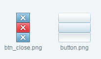
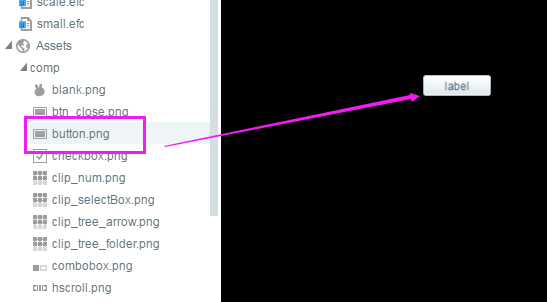
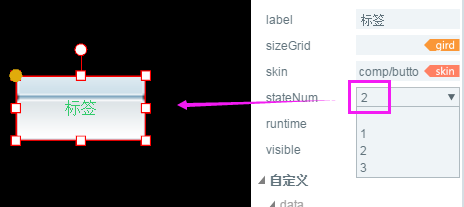

#Buttonコンポーネントの詳細

##1、Buttonコンポーネントを作成する

ボタンコンポーネントは最も一般的なコンポーネントの一つで、テキストラベル、アイコン、または両方を同時に表示することができます。LayaAirIDEにおけるボタン画像リソース（ボタン肌）の名前は、図1に示すように、一般にbtnをプレフィックスとする。

 （图1）


###1.1エンジンで直接Buttonコンポーネントを作成する

LayaAirエンジンを使ってButtonコンポーネントを作るのは簡単です。通常はいくつかのステップだけが必要です。`laya.ui.Button`パッケージパス、ローディングリソース、Buttonのインスタンスを作成し、Buttonをステージに追加し、Buttonコンポーネントのプロパティを設定します。具体的には下記のコードとコメントを参照してください。

**エントリクラスのComponentDemo.asを作成し、下記のコードを作成します。**


```java

package
{
	import laya.ui.Button;
	import laya.utils.Handler;
	import laya.webgl.WebGL;
	
	public class ComponentDemo
	{
      	//按钮资源路径
		private var skin:String = "./res/img/btn_test.png";
		
		public function ComponentDemo()
		{
          	//初始化引擎，设置宽高并开启WebGL渲染模式
			Laya.init(1334,750, WebGL);
			//设置舞台背景颜色
			Laya.stage.bgColor = "#ffffff";
			//加载资源成功后，执行onLoaded回调方法			
			Laya.loader.load(skin, Handler.create(this, onLoaded));
		}
		
		private function onLoaded():void {
			
			//创建一个Button实例
			var btn:Button = new Button(skin);
			//将Button添加到舞台
			Laya.stage.addChild(btn);
			//设置Button相关的属性
			btn.width = 100;
			btn.height = 50; 
			btn.pos(100,100);
			btn.label = "按钮";
			
		}
	}
}
```


上記コードの運転効果は、図2に示すように、

<br/>(図2)

**Tips:**Buttonコンポーネントのプロパティインターフェース紹介を参照してください。[Button API](http://layaair.ldc.layabox.com/api/index.html?category=Core&class=laya.ui.Button)。


###1.2.LayaAirIDEを使ってButtonを作成する

LayaAirIDEを使ってButtonを作成するのはより簡単で、IDEの可視化操作により、プログラムの基礎が全く必要なく、コンポーネントの作成とレイアウトを実現することができます。次にLayaAirIDEを用いて動図1の実現効果を作成します。

第1ステップ：uiのDEMOページを作成し、リソースマネージャにボタンコンポーネントのリソースをシーンエディタにドラッグします。図3に示すように。

<br/>(図3)

第二ステップ：コンポーネント属性を設定し、図3に示すように

<br/>(図4)

上記の2ステップを設定したら、そのままIDEに図2のような効果が見られます。この過程ではプログラムコードは必要なく、美術や企画に任せて実現できます。プログラマとのコミュニケーションコストを削減し、ゲームの開発効率を向上させました。


##2、Buttonコンポーネントの属性紹介

以下の文書では、Buttonコンポーネントの基礎となる常用属性と、文字では理解できない属性について重点的に紹介します。比較的理解しやすい属性については、ここでは言及しません。開発者はIDE属性マネージャの属性名にマウスを置いて止まってもいいです。属性のTips中国語で説明します。

###2.1ボタン肌（skin）

ボタンの肌はカットの仕方によって、三状態、二状態、一状態に分けられます。ここの状態はボタンの肌の状態を指します。

三状態は皮膚の画像を縦方向に等比で分割する形で、図1に示すように、**上から下まで**順に`弹起或离开状态`肌、`经过状态`肌、`按下和选中`(*を押し続けます*)状態の皮膚、3状態はよくPCブラウザの中で使います。

モバイルデバイスでは、通常は2つの状態だけを採用しています。画像は縦方向で2つの部分に切断されています。上の部分は`弹起或离开状态状态`皮膚の下の部分は`经过和按下以及选中状态`（＊肌を押し続ける）。

ワンタッチボタンはカットしないで、どんな状態でもボタンの皮膚は一つしかないです。

###2.2指定ボタンの肌の切断状態（stateNum）

stateNumの属性値は皮膚資源画像のカット方式を決定します。デフォルトの値は3です。つまりデフォルトでは3状態のボタンを押してカットし、等比は3つの部分に分割されます。二状態ボタンであれば、stateNumの属性値を2に設定し、等比を2つにカットする必要があります。シングルボタンは1に設定し、カットは行いません。

ここで注意したいのは、ボタンの状態を指定するには、ボタンの肌に対応する必要があります。三状態のボタン肌なら、stateNumを2に設定し、カット後は図5に示すように誤っています。

<br/>(図5)


###2.3指定ボタン選択状態（selected）

selected属性はデフォルトでは未選択のfalse状態です。一旦私たちはselected属性をtrueに設定します。ボタンは常に選択された状態を維持します。他の状態は変更されません。

###2.4ボタンの表示状態を切り替えますか？

toggale属性はデフォルトでは未選択のfalse状態です。一旦私達はtoggale属性をtrueに設定します。ボタンのセットをクリックすると、ボタンは選択されたまま（押し続けます）。もう一度クリックしたら元に戻ります。

###2.5状態に応じてButtonのエッジテキスト色を設定する（StrokeColor）

label StrokeColorはButtonのテキストの端に統一色を設定することができます。StrokeColor属性は、状況に応じてButtonのエッジテキスト色を設定することができる。

StrokeColorの色は順次フォーマットに設定されています。up Color、overColor（状態を経た色）、downColor（押した状態と選択した状態の色）、disable Color（使用禁止された時の色）。図6に示すように。

<br/>(図6)

*Tips：より鮮明にエッジの色の変化を感じるためには、エッジ幅のlabel Stroke属性値を大きく設定することができます。*


