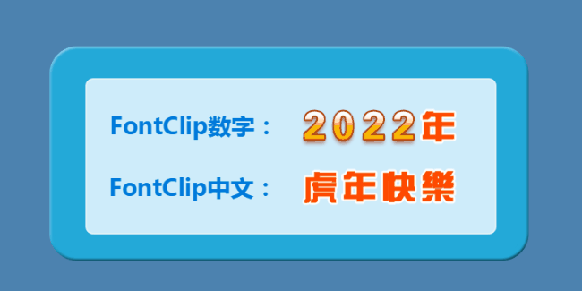

#FontClipコンポーネント参照


##1、FontClipコンポーネントを知る

###1.1 FontClipの役割と効果のデモンストレーション

LayaAirエンジンが新たに増加したFontClip機能はより強く、カスタムアイコン、テキスト、数字などのセットを素早く切り替えます。ClipスライスとBitmapFontビットマップフォントの機能結合体としてカウントされます。

Clipコンポーネントでは、より複雑なコンテンツに遭遇すると、カウントダウン「50:46」などの複数のClipスプライスが必要です。私たちは5つのClipを組み合わせて、それぞれ論理コードを追加してから効果が得られます。もしFontClipコンポーネントを使ったら、一つのコンポーネントだけが必要です。そして、valueに「50:46」の値を賦課すればいいです。コードの量も少なくなります。

BitmapFontビットマップフォントの作成は比較的面倒で、第三者のソフトウェアを使用する必要がありますが、第三者のソフトウェアのフォントスタイルは基本的に作成できません。フォントは比較的単一に見えます。美術に必要な効果を達成することはめったにありません。FontClipを使って、フォントのスタイル、サイズ、色の上で画像処理ソフトの中で自由に制作を改正することができて、豊富でよく変わります。

以下の図の効果はFontClip作成（図1）で、数字と中国語で割当値を切り替えることができます。フォントスタイルも任意に変更できます。


​        <br/>(図1)

​

###1.2 FontClipコンポーネントの肌（skin）仕様

FontClipリソースの名前は、FontClip_をプレフィックス名としており、そのリソースは、幅の高いグループの同じ単一図からなるリソースのグループ図であり、以下のように、ピクチャが長すぎても、複数の列が可能である。

​<br/>
（図2）

*FontClipコンポーネントの皮膚は九宮格属性を使用できないので、資源設計の時に実際のアプリケーションの大きさを確認します。またはscaleX、scaleYによるスケーリング制御*

###1.3 FontClipコンポーネントのAPI紹介

FontClipのAPI紹介は参考にしてください。[http://layaair.ldc.layabox.com/api/index.html?category=Core&class=laya.ui.FontClip](http://layaair.ldc.layabox.com/api/index.html?category=Core&class=laya.ui.FontClip)。


##2.LayaAirIDEでFontClipコンポーネントを作成する

###2.1 FontClipの作成

（図2）のリソースは、FontClipコンポーネントの命名規則に従って、それぞれfont Clipum.pngと命名されています。font Clipuyear.pngは、図2のリソース幅が長すぎるので、2列に修正されました。IDEリソースフォルダでは、それぞれシーンエディタにドラッグ＆ドロップし、背景リソースおよびlabelコンポーネントを追加して、以下の効果を達成します（図3）。

​<br/>
（図3）


###2.1 FontClipxコンポーネントsheet、value属性を調整する

リソースマネージャからドラッグして2つのFontClipコンポーネントを生成した後、どちらかを選択すると、sheet属性とvalue属性がデフォルト値を生成していることが分かりますが、それらは完全には正しくないので、改めて修正する必要があります。

​<br/>
（図4）

**sheet:** 
sheetの一般的な属性はコンポーネントの「ビットマップコンテンツ範囲」で、内容の合計を示す必要があります。内容は数字、句読点、記号でも中国語でもいいです。デフォルトは数字0—9ですが、入力の内容はビットマップリソースと一対一で、順序は同じで、総数も同じでなければいけません。

FontClipコンポーネントのビットマップリソースが二列以上の場合、sheetコンテンツは対応リソースマップの改行に「スペース」を入れるべきです。そうでないとvalue値を設定するとエラーが発生します。図3の中国語のビットマップの資源のように、sheetに記入されている内容は「鼠牛虎兔竜蛇馬羊猿鶏狗猪年快乐」であり、「羊」の後にスペースを入れる必要があります。

**value:**
valueの一般的な属性はコンポーネントの実際の表示内容であり、sheetの合計の内容の一部であり、合計の内容の中のサブ項目が任意に組み合わせられます。入力した値がsheetの内容に見当たらないと表示されません。


​<br/>
（図5）


##3、コード制御でFontClipコンポーネントを切り替えて表示する

上記のいくつかの制作段階では、IDEのコンポーネントの作成と組み合わせを完了しました。また、数年の変数名をfont Clipumと定義し、干支年の定義変数名をfont Clipuyearといいます。以下はプログラムコードでFontClipを変化させます。

ページを保存して、F 12によってページを発表して、発表した後にプロジェクトのuiフォルダの中でTestPageUID.as種類を生成して、私達は直接それを使います。

下記のコード例を実行します。（図1）の効果と完全に一致しています。

**サンプルコード:**


```javascript

package {
	import laya.display.Stage;
	import laya.net.Loader;
	import laya.ui.RadioGroup;
	import laya.utils.Handler;
	import laya.webgl.WebGL;
	
	import ui.test.TestPageUI;
	
	import view.TestView;
	
	public class LayaUISample {
		
		/**包含FontClip组件的测试页面**/
		private var testView:TestPageUI;
  		/**公历年数**/
		private var year:int=2017;
		/**12生肖数组**/
		private var yearArr:Array=["鼠","牛","虎","兔","龙","蛇","马","羊","猴","鸡","狗","猪"];
		private var yearIndex:int=9;
		
		public function LayaUISample() 
		{
			// 不支持WebGL时自动切换至Canvas
			Laya.init(1024, 720, WebGL);
			//画布垂直居中对齐
			Laya.stage.alignV = Stage.ALIGN_MIDDLE;
			//画布水平居中对齐
			Laya.stage.alignH = Stage.ALIGN_CENTER;
			//等比缩放
			Laya.stage.scaleMode = Stage.SCALE_SHOWALL;
			//背景颜色
			Laya.stage.bgColor = "#232628";
			//加载引擎需要的资源
			Laya.loader.load("res/atlas/comp.atlas", Handler.create(this, onLoaded));
		}
		
		private function onLoaded():void {
			//实例UI界面
			testView = new TestPageUI();
			//加载到舞台
			Laya.stage.addChild(testView);

          	//年增加帧循环
			Laya.timer.loop(1000,this,onLoop);
		}
		private function onLoop():void
		{
			//公元年增加
			year++;
			
			//“位图字体切片”年更新
			testView.fontClip_num.value=year.toString();
			//农历生肖年增加
			yearIndex++;
			//12年生肖一轮回
			if(yearIndex>11) yearIndex=0;
			//文本切片更新，新年快乐更新
			testView.fontClip_year.value=yearArr[yearIndex]+"年快乐";
			
			//大于2500年时间停止
			if(year>2500)
			{
				Laya.timer.clearAll(this);
			}
		}
	}
}
```


