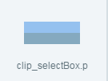
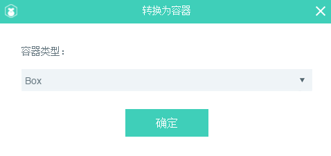

#Treeコンポーネントの参考


##一、LayaAirIDEでTreeコンポーネントを作成する

ツリー構造を表示するためにTreeコンポーネントを使用します。ユーザは、拡張可能なツリーに配置された階層構造データを見ることができる。
Treeコンポーネントのスクリプトインターフェースを参照してください。[Tree API](http://layaair.ldc.layabox.com/api/index.html?category=Core&class=laya.ui.Tree)。


 


###1.1 Treeコンポーネントは主に二つの部分から構成されています。

##-セル(Box、ページView、カスタムページ)縦スクロールバーVcrollBar；


###1.2 Treeコンポーネントのセルは通常4つの部分から構成されています。

##-一つのセルの状態を選択してClipアニメーションを切ります。アニメーションClipの折り畳み矢印カット;
##-ファイル状態スライスアニメーションClip;セルの他の要素;


###1.3 Treeコンポーネントの画像リソース例

1.セル選択状態スライスアニメーションClipリソース：
スライス数は2で、スライスインデックスは0から順に表します。セルが選択されていない状態図、セルが選択されているか、または停止されている状態図です。
​<br/>
（図）
2.折りたたみ矢印カットアニメーションClipリソース：
スライス数は2で、スライスインデックスは0から順に代表されます。フォルダノード折畳み状態図、フォルダノード展開状態図。
​<br/>
（図）
3.ファイル状態スライス動画Clipリソース：
スライス数が3であれば、スライスインデックスは0から順に代表される。フォルダノード折畳み状態図、フォルダノード展開状態図、非フォルダノード状態図。
スライス数が2であれば、スライスインデックスは0から順に代表される。フォルダノード状態図、非フォルダノード状態図。
​<br/>
（図）


###1.4 Treeコンポーネントの作成


 ####1.Treeコンポーネントのリスト項目を編集します。

リスト項目は、Boxタイプ、Viewタイプ、またはカスタムページタイプとすることができます。ここではBoxタイプを例にとる。
a.リソースパネルから一つのセルの選択状態にドラッグするスライスアニメーション（Clipコンポーネント）を選択し、このClipコンポーネントのオブジェクトのname属性値をselectBoxとし、属性clipYの値を2とする。
   *ここでの選択状態スライスアニメーションオブジェクトのname属性値は、selectBoxに設定されていなければならない。このプログラムのみが識別でき、Clipコンポーネントオブジェクトの表示状態がセル項目の選択状態に従って変化する機能を実現する。そうでないと、このClipペアは、このセル項目の通常の表示オブジェクトを識別することになる。*

​<br/>
（図）


b.リソースパネルから一つのセルの折り畳み矢印カットアニメーション（Clipコンポーネント）を選択してドラッグし、このClipコンポーネントオブジェクトのname属性値はarrowであり、属性clipYの値は2である。
   *ここでの折りたたみ矢印カットアニメーションのname属性値は、arrowに設定されていなければなりません。このようにしてこそ、プログラムを認識し、Clipオブジェクトをクリックしてツリーノードを開いたり、折りたたみたりする機能を実現します。このClipオブジェクトは、このセルアイテムの通常の表示オブジェクトとして認識されます。*

​        <br/>
（図）
c.リソースパネルから一つのセルのファイル状態スライスアニメーション（Clipコンポーネント）を選択してドラッグし、このClipコンポーネントオブジェクトのname属性値をfolderとし、属性clipYの値を3とする。
   *ここでのファイル状態スライスアニメーションのname属性値は、folderとして設定しなければなりません。このようにしてこそ、このClipコンポーネントオブジェクトの表示状態は、ユニット項目の折り畳み、展開、ノードタイプ（バイトポイントがあるかどうか）に従って変更される機能を実現します。このClipオブジェクトは、このセルアイテムの通常の表示オブジェクトとして認識されます。*
​<br/>
（図）

d.このセルの項目の通常の表示オブジェクトにドラッグします。
ここではLabelを例にとって、リソースパネルからLabelコンポーネントオブジェクトを選択してドラッグします。ここではこのLabelオブジェクトに属性name値をlabelとして設定してください。スクリプトで値を付けるのに便利です。このname属性値はカスタマイズすればいいです。Labelオブジェクトを設定して関連する属性を表示し、より美しく見えるようにします。

​<br/>
（図）
e.上記で編集したすべてのコンポーネントオブジェクトを選択し、ショートカットキーCtrl+Bまたは選択**\メニューバー->を使ってコンテナ*に変換します。**を選択して、容器の設定パネルに変換し、容器のタイプをBoxに選択し、決定ボタンをクリックしてBox容器の追加を完了します。****
​<br>
（図）

​

####2.Tree容器に変換します。
****リストレンダリング項目のオブジェクトを選択し、ショートカットキーCtrl+Bまたは選択を使用します。**メニューバー->>編集->>コンテナ＊オプションに変換し、容器設定パネルに変換し、容器の種類をTreeに選択し、決定ボタンをクリックしてTree容器の追加を完了します。
​<br/>
（図）

####3.Treeコンポーネントのリストレンダリング項目を指定します。
Treeコンポーネントのオブジェクトをダブルクリックして、Treeオブジェクトの内部に入って編集し、Treeコンポーネントのリストレンダリング項目の属性nameの値をレンダーに設定します。
   *注意：ここでレンダリング項目のプロパティnameの値はレンダーでなければなりません。そうでなければ、プログラムは認識できません。*
​<br/>
（図）

####4.Treeコンポーネントにスクロールバーを追加します。
資源パネルからVcrollBarコンポーネントを選択し、VcrollBarコンポーネントのリソースアドレス（skin属性値）をTreeコンポーネントのプロパティscrollBarSkinの値に設定します。
​<br/>
（図）

####5.Treeの幅の高さを調整します。
Treeオブジェクトの属性var（グローバル参照名）の値をmuutreeとして設定します。ここで名前をカスタマイズすることができます。目的はスクリプトでTreeコンポーネントのオブジェクトに値を割り当てることです。
​<br/>
（図）

####6.コードにTreeオブジェクトに値を付ける


```javascript

//树结构数据源
var xmlString:String="<data>"+
                        "<dir label='box1' isOpen='true'>"+
                            "<file label='child1 ' isOpen='true'/>"+
                            "<file label='child2 ' isOpen='true'/>"+
                            "<file label='child3 ' isOpen='true'/>"+
                            "<file label='child4 ' isOpen='true'/>"+
                            "<file label='child5 ' isOpen='true'/>"+
                        "</dir>"+
                        "<dir label='box2' isOpen='true'>"+
                            "<file label='child1 ' isOpen='true'/>"+
                            "<file label='child2 ' isOpen='true'/>"+
                            "<file label='child3 ' isOpen='true'/>"+
                            "<file label='child4 ' isOpen='true'/>"+
                            "<file label='child5 ' isOpen='true'/>"+
                        "</dir>"+
  					"</data>";
//解析xml字符。 
var xml:* = domParser.parseFromString(xmlString, "text/xml");
//设置 m_tree 的数据源。
m_tree.xml =xml;
```

####7.プログラムで実行して効果を確認します。

​<br/>
（図）

###1.5 Treeコンポーネントの一般的な属性

​<br/>
（図）

𞓜**属性**𞓜**機能説明**𞓜
|-------------------------------|
皮膚をローラーするためにscrollBarSkin。𞓜
_;space Bottom各項目間の間隔距離。単位はピクセルです𞓜
_;spaceLeft𞓜左側の字下げ距離。単位はピクセルです。𞓜


##二、コードでTreeコンポーネントを作成する

コードを書く時は、コード制御UIを通じてUUUUITee類を作成し、コードに導入することが避けられません。`laya.ui.Tree`Treeに関する属性をコードで設定します。

**実行例の効果:**
​<br/>
（図5）コードによるTreeの作成

Treeの他の属性もコードで設定できますが、コードによって異なる肌（スタイル）を作成するTreeを示します。

興味のある読者は自分でコード設定Treeを通じて自分の必要に合うフォルダを作成することができます。

**サンプルコード:**


```javascript

package
{
	import laya.display.Stage;
	import laya.ui.Tree;
	import laya.utils.Browser;
	import laya.utils.Handler;
	import laya.utils.Utils;
	import laya.webgl.WebGL;

	public class UI_Tree
	{
		public function UI_Tree()
		{
			// 不支持WebGL时自动切换至Canvas
			Laya.init(800, 600, WebGL);
			//画布垂直居中对齐
			Laya.stage.alignV = Stage.ALIGN_MIDDLE;
			//画布水平居中对齐
			Laya.stage.alignH = Stage.ALIGN_CENTER;
			//等比缩放
			Laya.stage.scaleMode = Stage.SCALE_SHOWALL;
			//背景颜色
			Laya.stage.bgColor = "#232628";
			//图像资源
			var res:Array = [
				"../../../../res/ui/vscroll.png", 
				"../../../../res/ui/vscroll$bar.png", 
				"../../../../res/ui/vscroll$down.png", 
				"../../../../res/ui/vscroll$up.png", 
				"../../../../res/ui/tree/clip_selectBox.png", 
				"../../../../res/ui/tree/clip_tree_folder.png", 
				"../../../../res/ui/tree/clip_tree_arrow.png"
			];
			//加载资源
			Laya.loader.load(res, new Handler(this, onLoadComplete));
		}
		
		/***加载资源完成***/
		private function onLoadComplete(e:*=null):void
		{
			// 组装tree的数据
			var treeData:String = "<data>";
			//外层循环为树的父节点（相当于文件夹）
			for(var i:int = 0; i < 5; ++i)
			{
				treeData += "<dir label='Directory " + (i + 1) + "' isOpen='true'>";
				//内层循环为子节点（相当于文件）
				for(var j:int = 0; j < 5; ++j)
				{
					treeData += "<file label='File " + (j + 1) + "'/>";
				}
				treeData += "</dir>";
			}
			treeData += "</data>";
			// 把数据转化成xml格式
			var xml:* = Utils.parseXMLFromString(treeData);
			//实例化树结构
			var tree:Tree = new Tree();
			//滚动条资源
			tree.scrollBarSkin = "../../../../res/ui/vscroll.png";
			//设置单元格为Item类（只能用类，不能用实例的对象）
			tree.itemRender = Item;
			
			//对树形结构赋值
			tree.xml = xml;
			//修改大小
			tree.size(300, 300);
			//修改树的位置
			tree.x = (Laya.stage.width - tree.width) / 2;
			tree.y = (Laya.stage.height - tree.height) / 2;
			//加载到舞台
			Laya.stage.addChild(tree);
		}	
	}
}


import laya.ui.Box;
import laya.ui.Clip;
import laya.ui.Label;

// IDE中生成的此类对应的json对象，在此作为参考，对应树形结构中的单元格Item类
// {"child": [{"type": "Clip", "props": {"x": "13", "y": "0", "left": "12", "height": "24", "name": "selectBox", "skin": "ui/clip_selectBox.png", "right": "0", "clipY": "2"}}, {"type": "Clip", "props": {"y": "4", "x": "14", "name": "folder", "clipX": "1", "skin": "ui/clip_tree_folder.png", "clipY": "3"}}, {"type": "Label", "props": {"y": "1", "text": "treeItem", "width": "150", "left": "33", "height": "22", "name": "label", "color": "#ffff00", "right": "0", "x": "33"}}, {"type": "Clip", "props": {"x": "0", "name": "arrow", "y": "5", "skin": "ui/clip_tree_arrow.png", "clipY": "2"}}], "type": "Box", "props": {"name": "render", "right": "0", "left": "0"}};

/****树形结构中的单元格****/
class Item extends Box
{
	public function Item()
	{
		//实例“文件夹”背景切片对象
		var selectBox:Clip = new Clip("../../../../res/ui/tree/clip_selectBox.png", 1, 2);
		//设置 selectBox 的name 为“selectBox”时，将被识别为树结构的项的背景。2帧：悬停时背景、选中时背景。	
		selectBox.name = "selectBox";
		selectBox.height = 32;
		selectBox.x = 13;
		selectBox.left = 12;
		addChild(selectBox);
		
		//实例“文件夹”图标切片对象
		var folder:Clip = new Clip("../../../../res/ui/tree/clip_tree_folder.png", 1, 3);
		//设置 folder 的name 为“folder”时，将被识别为树结构的文件夹开启状态图表。2帧：折叠状态、打开状态。
		folder.name = "folder";
		folder.x = 14;
		folder.y = 4;
		addChild(folder);
		
		//实例文件夹名字文本或子节点名字文本对象
		var label:Label = new Label();
		//设置 label 的name 为“label”时，此值将用于树结构数据赋值。
		label.name = "label";
		label.fontSize = 20;
		label.color = "#FFFFFF";
		label.padding = "6,0,0,13";
		label.width = 150;
		label.height = 30;
		label.x = 33;
		label.y = 1;
		label.left = 33;
		label.right = 0;
		addChild(label);
		
		//实例左边折叠小三角箭头对象
		var arrow:Clip = new Clip("../../../../res/ui/tree/clip_tree_arrow.png", 1, 2);
		//设置 arrow 的name 为“arrow”时，将被识别为树结构的文件夹开启状态图表。2帧：折叠状态、打开状态。
		arrow.name = "arrow";
		arrow.x = 0;
		arrow.y = 5;
		addChild(arrow);	
	}
}


```


 