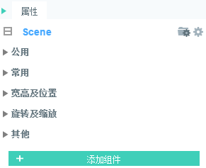
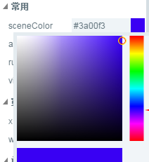
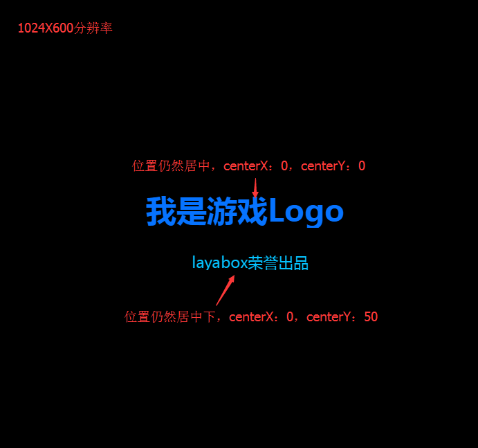
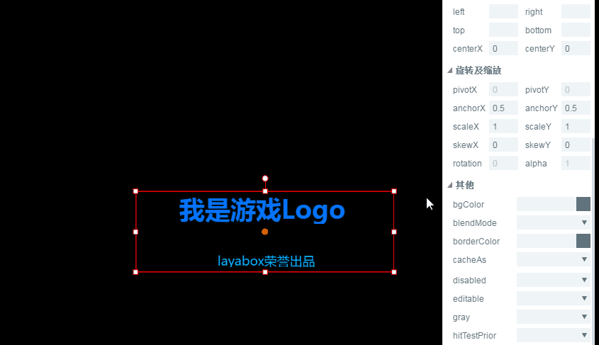
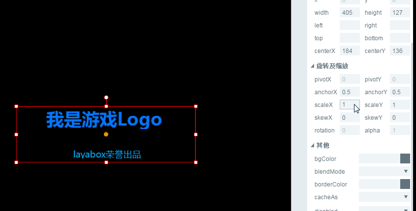

#属性設定器

プロパティ設定器は、現在選択されているコンポーネントのプロパティを確認して編集します。シーンエディタまたは階層マネージャでコンポーネントを選択すると、クエリと編集のために属性設定器にコンポーネントの属性が表示されます。

属性設定器パネルは、図1に示すように、上から下までは、コンポーネントまたはノード名、**共通**属性、**常用**属性、**幅の高さと位置**を選択します**回転と拡大縮小**を選択します**その他**など。

  

（図1）プロパティパネルグループ

##1、`公用`属性の紹介

共通属性の中では通常`var`を選択します`name`を選択します`eventscript`を選択します`位置`。図2-1に示すように。

 (図2)

###1.1グローバル変数名の設定

`Var`：名声の一意のグローバル変数名は、プロジェクトコードの中でこの名前に基づいてこのコンポーネントを呼び出すために使用されます。

###1.2コンポーネント識別名を設定する

`name`コンポーネントの識別名です。階層マネージャで他のコンポーネントを区別するために使用されます。彼の父親の容器もこの名前でこのコンポーネントを見つけることができます。

###1.3資源肌の設定

`eventscript`：リソースを入力ボックスにドラッグして皮膚を置換し、ポイントボタンを押すと皮膚の資源をすばやく位置決めすることができます。　　

##2、`常用`属性の紹介

通常の属性では、いくつかの操作が共通しています。ここでそれぞれ紹介します。

###2.1シーンの色（sceneColor）

シーンの色とは、シーンエディタの背景色であり、手動でコード変更色を入力することができます。また、パレットから図3-1、3-2に示すように変更することもできます。

 (図3-1)

 (図3-2)

###2.2シーン廃棄クローズ設定（aut DestoryAt Cloosed）

`autoDestoryAtClosed`シーンがクローズされた後、自動的に破壊されますか？

 (図3-3)

###2.3強力なruntime属性

`runtime`は、プロパティマネージャの非常に強力なコンポーネント拡張機能です。runtime属性に論理クラスを設定することにより、インスタンス時に作成されるのはコンポーネントの視認類ではなく、runtime属性で指定された論理クラスです。この属性には論理クラスの全パスを指定する必要があります。例えば「game.user.player」です。

###2.4 visible

`visible`デフォルトがtrueであるかどうかを表示します。

##3、幅の高さと位置の属性

幅の高さと位置の属性はUI制作において重要な役割を果たしている。位置およびUI画面の調整を主に行う（図4）。

 (図4)

###3.1 x、y属性

xとy属性は、シーンエディタにおけるコンポーネントのxとy軸座標である。

シーンエディタの左上が原点です。`（0, 0）`。 原点を中心にx軸を右に伸ばして正座標として増加し、y軸を下にして正座標として増加します。

はい、`场景编辑器`でセットを選択し、マウスを押してxとy軸の位置を変更したり、属性入力ボックスに固定値を設定したりできます。

###3.2 width、heightの幅と高属性

コンポーネントの大きさを変えないと、コンポーネントの幅の高さは自動的に計算されますが、プロパティパネルには表示されません。制約ボックスまたは固定値設定によってコンポーネントをスケーリングしてリセットすると、幅の高い属性が表示されます。また、数値のドラッグ操作も可能です。

任意のコンポーネントを選択しない場合、現在の幅はページ幅の高さになります。

*Tips：一部のコンポーネントは、制約ボックスのサイズを変更するだけで、実際のコンポーネントは拡大されませんが、マウスクリック領域は、例えばCheckBoxのような制約ボックスのサイズに縮小されます。*

###3.3 UI適応属性

`left、right、top、bottom`4つの属性は主にコンポーネントが親容器のエッジ距離位置に適合するために使用される。

`centerX、centerY`二つの属性は主にコンポーネントが親容器の中心位置に適合するために使用される。

ゲーム開発においては、すべての画面解像度をすべて考慮することはできません。高解像度、低解像度などがあります。ゲーム項目コードにフルスクリーンを使用すれば、コンポーネントはまた位置を固定し、異なる解像度の画面下でUIコンポーネントのビットずれを引き起こす。私たちは以下のように調整する必要があります。

####3.3.1余白位置が似合う

**設計目標**ゲームの右上に顔写真を置き、常に画面の上端と右端の50 pxを維持します。

**誤った実現効果**:

ある画面解像度でコンポーネントのxとyに固定値を設定すると、図4-1の効果が現れます。設計目標と一致しない。

 
（図4−1）はコンポーネントのxとyに固定値を設定する場合、画面解像度効果が異なります。

**効果を正しく実現する**:

`left、right、top、bottom`4つの属性はそれぞれ親容器の左端、右端、上端、下端に基づいている。したがって、異なる画面解像度での相同右効果を実現するには、rightとtopの属性値を設定し、50ピクセルに設定します。設定後の運転効果を図4-2に示します。

  (动图4-2)

**画面の余白の設定に適用されます。**:

ここで特に注意したいのは、`left、right、top、bottom`の属性効果は、親容器（ページ）の各エッジに基づいており、画面の各エッジではない。親容器（ページ）の解像度は必ずプロジェクトのLaya.init（）と同じ解像度で設定してください。同じ設定でないと図4-2の動作効果は実現できません。

####3.3.2余白の引張りが似合う

あるエッジに位置する適合作用に加えて、left、right、top、bottomの属性値を同時に設定し、異なる画面に応じてコンポーネントを引っ張り合わせることができます。例えば、私達はleft、right、top、bottomの属性値を全部100に設定して、運転後は図4-3に示すようにします。

 (図4-3)

*Tips：引張り適切な余白の設定方式は、通常、九宮格と組み合わせて実現する必要がある。*

####3.3.3センターの位置は適切です。

センターはスクリーンの中間のゲームに基づいてLOGOを起動したり、メッセージボックスをポップアップしたりするのによく使われます。私たちはセンターX、センターYによる位置中央設定ができます。図5-1、5-2に示すように。

 (図5-1)

 (図5-2)

##4、回転とズームのプロパティ

回転とズームのプロパティは、ゲームUIにおいて、特にIDEがアニメーションを作る時によく使われます。

####4.1ブッシュポイントの修正

「軸点」：コンポーネントの回転または拡大縮小の中心点は、デフォルトではコンポーネントの原点になります。`（0,0）`ポイントの位置。

ピvotX、ピvotY、アンチョルX、アンチョーYの4つの属性は、軸軸の位置を変更するために使用されます。

ピvotX、ピvotYは、セットの軸軸の点XY座標の固定値を変えることで、軸の位置を変更します。

アンチョーX、アンチョーYは、X軸とY軸のセット幅または高い割合で軸点座標位置を算出し、図6に示すように、幅と高さの50%で算出された座標が中心点座標位置となります。

 (図6)

**Tips**:*アンカーポイントを通過することは、非常に素早く軸軸をセットすることができます。しかし、アンカー方式はUIコンポーネントに対してのみ軸点を設定することができ、GraphicsコンポーネントやSpriteなどの2 Dベースコンポーネントの軸軸点は設定のみ可能である。`pivotX与pivotY`の方式で実現します。*

####4.2傾斜角度を修正する

skwax、skwayは、軸軸点を中心に水平・垂直角度の傾斜を行い、属性値効果を図7に示すように修正します。

 (図7)

####4.3コンポーネントのサイズ変更

scaleX、scaleYは、軸軸点を中心に水平、垂直の大きさでスケーリングされます。

デフォルトは1で、拡大縮小しません。正の値が大きいほど、サイズが大きくなります。

0にズームします。見えません。

`-1`を選択します**鏡像**効果は図8に示すようになります。負の値が大きいほど、鏡像後のサイズは大きくなります。

 (図8)

**Tips**:*中心に軸があれば、元の位置に鏡像ができます。例えば、キャラクターの二つの方向は同じ資源を使って実現できます。*

##5、その他の共通属性の紹介

LayaAirIDEは多くのコンポーネントを提供しています。それらはほとんどComponentコンポーネントのベースクラスに継承されているので、同じ他の共通の属性を持っています。ここでは主に他の属性の中の共通部分を紹介します。コンポーネント自体の特殊属性については、個々のコンポーネントを紹介する時に説明します。

共通の属性は以下のいくつかの種類があります。

関連属性を表示します。alpha、visible

キャッシュ関連属性：cacheAs、staticCache

マウス操作に関する属性：disabled、gray、httTestPrior、mouse Enbaled、mouse Through

label関連属性：label Align、label Colors、label Bold、labelFont、labelPadding、labelSize、label Stroke、label Stroke Color、stroke Color

###5.1関連属性の表示

表示に関する属性は比較的分かりやすく、表示オブジェクトはいずれもalphaとvisibleの属性を持っています。

`alpha`表示オブジェクトの透明度を調整します。数値は0-1の間、0はすべて透明で、1は不透明です。区間は半透明です。

**Tips**：表示オブジェクトのalphaの数値はどれぐらいであれ、マウスの傍受を加えると、マウスのイベントをサポートします。たとえアルファが0の場合でも、マウスのイベントが発生します。

`visible`コントロールコンポーネントの表示かどうか、この属性はブール値で、デフォルトはtrueで、正常に表示されます。falseの値は、コンポーネントが表示されません。マウスイベントは効果がありません。

*Tips：visibleがfalseの場合は表示されないということは、ブラウザで実行しても表示されないことを意味し、IDEでfalseに設定するとすぐに隠し変化が発生しません。*

###5.2キャッシュ関連属性

キャッシュの最適化に関する属性については、cache As、staticCacheは、単一のコンポーネントではなく、常に変化しない複雑なページを使用することを提案します。

**ゲーム中に大量のUIがあり、一つのUIには複数のノードがあり、変化が小さい場合は、cacheAsを使用することを推奨します。**

例えば、LayaAirIDEソフトウェアを使っていますが、ソフトウェアの多くのパネル、例えば属性設定器、資源管理器、プロジェクトマネージャなど、それらのアイデアの対象は多いですが、頻繁に変更されていないので、cacheAsを使ってキャッシュして、レンダリング効率を高めました。

**常に変化する複雑なUIについては、UIを2つの層に分割し、変化が少ない層にcacheAsを使用し、常に変化する層は使用しない。**例えば「カウントダウン」表示のUIがありますが、カウントダウンの部分と他の部分に分けてcacheAsを行い、カウントダウンの部分はcacheAsを行わないようにしてもいいです。

開発時にcacheAsを使うと、誤った理解とキャッシュメカニズムの使用はかえって性能を低下させます。以下は二つの主要な属性の詳細説明です。

**cacheAs:**

キャッシュコンポーネントは、静止画としてキャッシュされているかどうか、合理的な役割を果たすことができます。「none」と「normal」と「bitmap」の3つの値があります。

**「noneオプション」：**キャッシュを一切しないことを表す。

**「normalオプション」：**

canvasモードではキャンバスキャッシュを行います。複数のサブオブジェクトからなるUIをビットマップにキャッシュするのに相当します。各フレームをレンダリングする時は、キャッシュされたビットマップだけをレンダリングします。すべてのサブオブジェクトを一度レンダリングするのではなく、レンダリングオーバーヘッドを節約し、性能を向上させます。

ウィbglモードでコマンドキャッシュを行います。サブオブジェクトのみをキャッシュしたプロセスとプログラムコマンド組織に相当します。ビットマップとしてキャッシュされていません。各フレームをレンダリングする時、サブオブジェクトを再び遍歴する必要はなく、直接サブオブジェクトを遍歴した階層に従ってグラフィックカードでレンダリングします。DRawcalを減少させません。メモリ損失を増加させません。レンダリング性能は中ぐらいです。

**Tips**:*cacheAsBitmap属性機能はcacheAs属性のnormalモードに相当し、cacheAs Bitmap属性は古いバージョンIDEに対応して保留されています。現在関連する需要があれば、cacheAsのnormalを使って設定することを提案します。*

**「bitmapオプション」**:

canvasモードでは依然としてキャンバスキャッシュです。

webglモードでは、複数のサブオブジェクトからなるUIをビットマップにキャッシュし、グラフィックカードに提出してレンダリングすることに相当し、DRawcalを低減し、レンダリング性能が最も高い。キャッシュされたビットマップはメモリオーバーヘッドの一部を追加し、キャッシュされたビットマップが大きいほどメモリオーバーヘッドが大きくなります。キャッシュビットマップサイズは2048を超えてはいけません。このモードは継続的に再描画するとCPUのオーバーヘッドが増加します。

**Tips**＊cacheAsが「normal」と「bitmap」を選択すると、サブオブジェクトが変化し、自動的にキャッシュが再起動され、同時に手動でreCacheメソッドを呼び出してキャッシュを更新することもできます。＊

**staticCache：**

cacheAsが「none」でない場合にこの値が有効です。staticCache=trueの場合、サブオブジェクトが変化しても自動的にキャッシュが更新されません。ReCacheメソッドを呼び出して手動で更新するしかありません。

例えば、いくつかのデータが多いUIは、UIが開いてデータを読み出すと、UI表示を更新し続ける可能性があるので、データが読み終わったら、reCache方法で一気にデータを読み取り、更新するようにstaticCacheを設定しても良い。

具体的な例とデータ分析は「技術文書―2 D階段編―cacheAs性能最適化」を参照してください。

###5.3マウス操作に関する属性

マウス操作に関する属性説明とプレゼンテーションの効果は以下の通りです。

𞓜**その他の属性**𞓜**機能説明**𞓜
|------------------------------------|
マウスのイベントを受け入れるかどうか。デフォルトはfalseで、マウスイベントを傍受すると、自動的に本オブジェクトと親ノードの属性mouse Enbaleの値がtrueに設定されます（親ノードが手動でfalseに設定されている場合は変更されません）。𞓜
|disabled𞓜は無効かどうか、無効にして灰色になり、マウスイベントを受信しません。𞓜
124 grayは灰になっていますか？灰になってもマウスのイベントを受けられます。𞓜

 （动图9） 

**mouse Through:**

モジュールmouse Enbaled=trueマウスが使用可能な場合、透過可能ですか？デフォルトの値はfalseです。trueに設定すると、空白の領域をクリックして透過し、自分だけに有効です。

**hitTestPrior：**

自分を優先的にチェックするかどうか。デフォルトはfalseで、マウス衝突検出は優先的にサブオブジェクトを検出し、親オブジェクトに泡を立てます。hitestPrior=trueマウスの衝突が優先的に本オブジェクトを検出すると、本オブジェクトがヒットした後、さらにサブオブジェクトを検出します。既知の大きさの容器（特に根容器）に対しては、デフォルトではfalseとして設定されています。この値をtrueとして設定すると、ノード衝突を低減し、性能を向上させます。

例えば、複雑なBoxでは、内部に複数のサブオブジェクトがありますが、Box自体をマウスでモニターする必要がありますので、hitTestPriorをtrueとして設定できます。マウスをクリックする時は、サブオブジェクトからBoxに泡を噴き出すプロセスを省き、直接マウスイベントをトリガし、性能を向上させます。

*Tips：UIのViewコンポーネントhitTestPriorのデフォルト属性値はtrueです。*

###5.4 label関連属性

多くのコンポーネントの内部には、Button、CheckBox、Tabなどのlabelラベルが含まれている。これらの他の属性にも同じラベル属性の設定があります。機能説明は下表をご覧ください。

𞓜**属性名**𞓜**機能説明**𞓜
|----------------------------------------|
|labelAlignラベル配置モードは、デフォルトでは中央揃えです。注：CheckBoxで無効になります。
ラベルの各状態のテキスト色を表す。フォーマット：「up Color、overColor、downColor、disable Color」。デフォルトは「青、緑」です。𞓜
|label Bold|はラベルのテキストラベルが太字であるかどうかを表しています。𞓜
|Label Font|はテキストラベルのフォント名を表し、文字列で表します。IDEで選択可能です。𞓜
|labelPadding|はテキストラベルの余白を表します。書式：「上余白、右余白、下余白、左余白」。𞓜
|LabelSize 124;はテキストラベルのフォントサイズを表します。𞓜
|label Stroke|文字のエッジ幅（ピクセル単位）。デフォルトの値は0で、トレースしないことを表します。𞓜
|label StrokeColorの文字の端の色を文字列で表現します。標準値は「#000000″（黒）;|
|strook Color|は、それぞれの状態におけるエッジの色を表します。フォーマット：「up Color、overColor、downColor、disable Color」。𞓜

*Tips：上記の表の属性はlabelコンポーネントにLabelを含まないが、作用は完全に一致している。`labelAlign`属性とlabelコンポーネントの`align`属性が完全に一致します。*