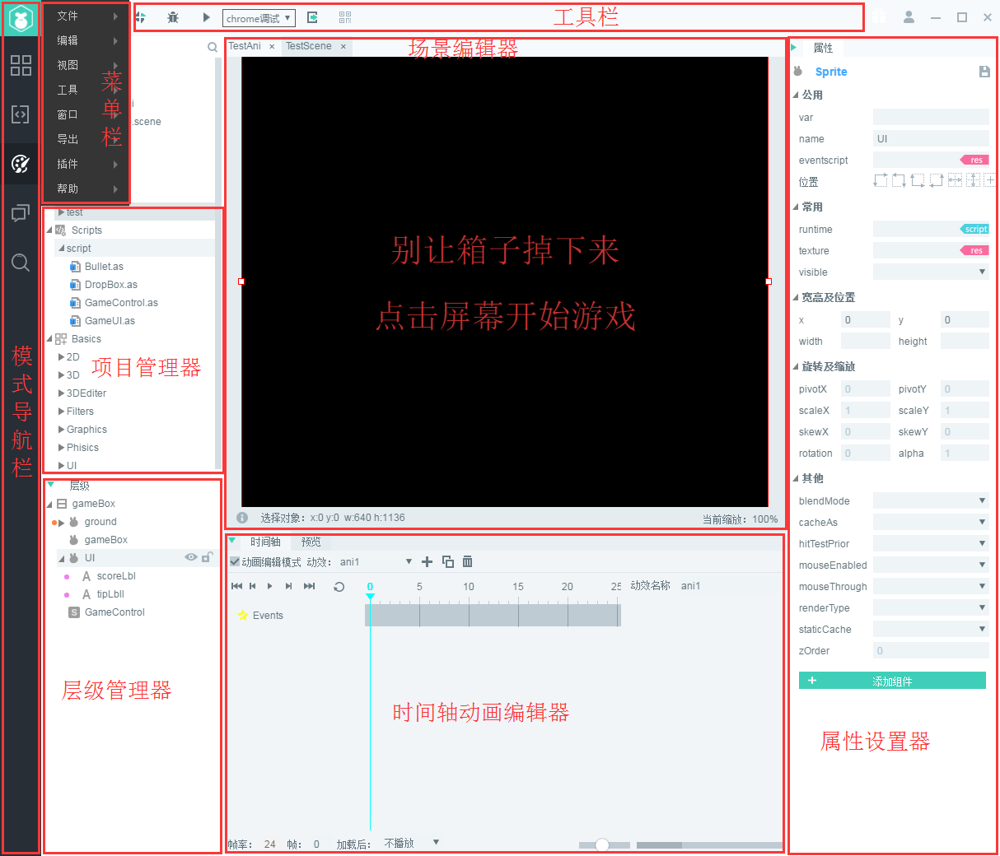
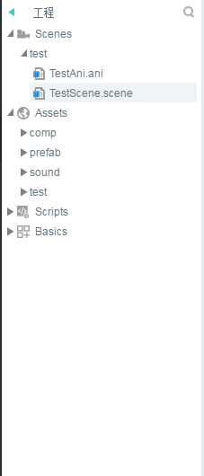
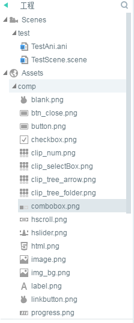
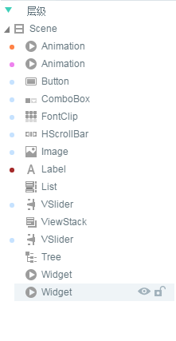

#設計モードインタフェースの概要

LayaAirIDEは設計モード、符号化モードなど複数のモジュールで構成されています。この章では、設計モードの常用レイアウトと機能エリアを紹介し、各パネルの名称と役割を素早く閲覧する。

​ 
（図1）

###一、モードナビゲーションバー:

モード切替ボタン機能は、インターフェースモードとコード編集モードの切り替えが簡単に行えます。

​	  

（図2）

###二、メニューバー：

メニューバーには、プログラム操作セット、インターフェース操作、コントロール操作コマンド、およびツールセットなどがあります。詳細はメニューバーをご覧ください。

​ 
（図3）

 

###三、ツールバー:

ツールバーには、ファイル操作、コントロール操作、シーン操作ボタンがあります。詳細はツールバーをご覧ください。
​ 
（図4）

###四、プロジェクトマネージャ：

プロジェクトマネージャには、プロジェクト内のすべてのページが表示されます。ここではツリー構造で表示されます。プロジェクトマネージャでダブルクリックして編集するページを開くことができます。詳細はプロジェクトマネージャのセクションをご覧ください。

​ 
（図5）

 

###五、リソースマネージャ：

リソースマネージャにはプロジェクトリソースフォルダのすべてのリソースが表示されます。フォルダのリソース内容はツリー構造で表示されます。右クリックで既存のフォルダを開けてリソースの追加ができます。詳細はリソースマネージャのセクションをご覧ください。

​ 
（図6）

 

###六、シーンエディタ：

シーンエディタは、UIやアニメーションシーンで見られるコンテンツを展示して編集するための作業エリアです。既得のシーンの構築作業は、シーンエディタの表示によって行われます。詳細はシーンエディタを読んでください。

​ 
（図7）

  

###七、属性設定器：

プロパティ設定器は、選択されたコントロールの属性データを表示して編集します。詳細はプロパティ設定器の一節を読んでください。

​	 
（図8）

###八、階層管理器：

階層マネージャは、シーン中のすべてのノードとその階層関係をツリー状のリストで示し、シーンエディタで見たすべてのコンテンツは階層マネージャに対応するノード項目を見つけることができ、シーンを編集する時には、この2つのパネルの内容は同期して表示されます。詳細はレベルマネージャのセクションをご覧ください。

​ 
（図9）

###九、時間軸アニメーションエディタ:

時間軸アニメーションエディタを使用して、ページ内で時間軸アニメーションを作成します。フレーム属性パネルは、設定された時間軸のフレーム詳細を表示するために使用されます。詳しい使い方は時間軸アニメーションエディタを読んでください。

​	 
（図10）

###十、粒子エディタ:

粒子エディタは、ページ内で粒子アニメーションを作成します。粒子属性パネルは、粒子を設定する属性の詳細を表示します。詳しい使い方は粒子エディタを読んでください。

​ 
（図11）