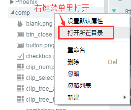
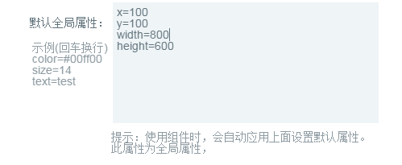
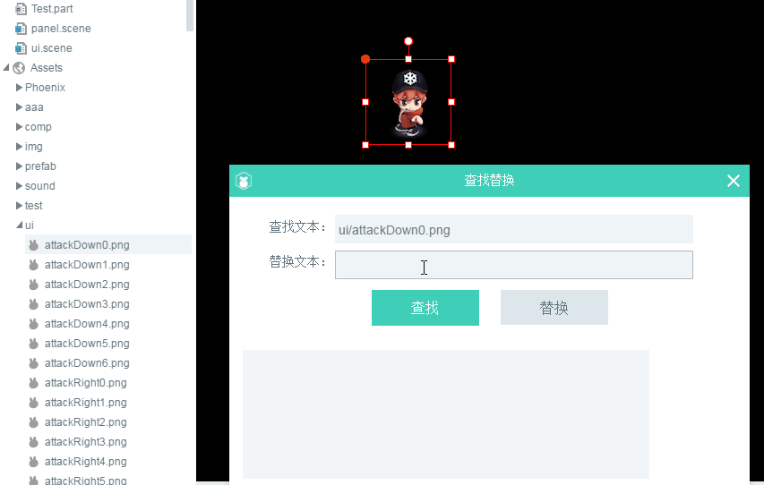

# 资源管理器介绍

リソースマネージャはプロジェクトのリソースをアクセスして管理するための作業領域です。作業を開始するには、リソースを追加する必要があります。この記事では、リソースマネージャの機能使用とリソース命名のルールを紹介します。

##1、インタフェース紹介

リソースマネージャは、プロジェクトのリソースフォルダの内容をツリー構造で示します。図1に示すように、各インターフェース要素を紹介します。

 (図1)

​`资源预览界面`:リソースリストで選択したリソースは直接`资源预览界面`表示されます。

​`资源列表`を選択します`项目根目录/laya/assets/`ディレクトリのリソースは`资源列表`に表示されます。ディレクトリまたはディレクトリのリソースを選択し、右クリックします。`打开所在目录`を選択すると、オペレーティングシステムのディレクトリが直接開きます。

##2、機能紹介

###2.1所在ディレクトリを開く

リソースマネージャ内のすべてのリソースは、IDEで管理されてもよく、直接システムで管理されてもよい。したがって`选中`ディレクトリまたはリソースの場合、`右键菜单`をクリックします`打开所在目录`場所を開いているディレクトリを直接クリックします。`功能按钮`直接に開く。操作は図2に示します。

 (図2)

###2.2作成、削除、リフレッシュ

####リソースとディレクトリを作成

場所ディレクトリを開くと、リソースとディレクトリを作成することができます。例えば、必要なリソースやディレクトリを直接リソースマネージャのルートディレクトリに貼り付け（＊プロジェクトのルートディレクトリ/laya/asets/*）、F 5で更新したら、リソースはIDEで使用できます。

####削除

ディレクトリまたはリソースを削除する場合、2つの方法があります。一つ目はIDEから削除するリソースまたはディレクトリを選択し、右クリックメニューから削除オプションをクリックするか、またはDeleteキーを押して削除します。二つ目は所在ディレクトリを開いて、システムディレクトリ内で直接削除します。両方の削除は自動的に更新されます。

*Tips：F 5ショートカットキーは、リソースマネージャを更新するだけでなく、プロジェクトマネージャも更新します。修正されたリソースがUIプロジェクトで使用される場合、F 5ショートカットキーを押す必要があります。*

リソースとディレクトリの作成、削除、リフレッシュについては図3を参照してください。

 (図3)

###2.3フィルタ資源

リソースが多い場合、リソースはリソースマネージャ検索ボックスにテキストキーを入力してフィルタリングできます。動作は図4に示すようになっています。

 (図4)

###2.4標準属性の設定

リソースまたはディレクトリを選択すると、デフォルトの属性を右クリックしたり、リソースマネージャの一番下の機能ボタンを直接クリックしたりできます。

 (図5)

クリック`设置默认属性`その後、弾面資源属性設定パネルを図6に示します。

 (図6)

**パネルの紹介を設定します**

`资源名称`：リソースマネージャのリソース名とパスを表示します。

`组件类型`：コンポーネントタイプのドロップダウンオプションは全部のコンポーネントタイプです。（＊全部のコンポーネントタイプはドキュメント「IDEコンポーネント詳細」＊を参照することができます。）IDEデフォルトで認識されているコンポーネントタイプを変更したいなら、他のコンポーネントタイプに指定すると、ここで設定できます。

`设置九宫`：リソースのために九宮格属性を設定します。この機能の効果は属性設定器の九宮格の設定と同じです。具体的な操作は属性設定器の九宮格の設定を参照して説明します。

`默认全局属性`：該当欄も対応です。`属性设置器`の属性設定、たとえばコンポーネントの属性widthを800に設定したいなら、この欄に「width=800」を設定すればいいです。複数の属性をあらかじめ設定する場合は、直接に改行して複数の属性値を設定すればいいです。図7に示すように

 (図7)

**Tips:`设置九宫`を選択します`默认全局属性`設定は、いずれもコンポーネント属性の予め設定されています。同じコンポーネントリソースが複数の場所で使用され、同じ属性を設定する必要がある場合、この設定は多くの重複動作を低減することができる。**

`打包类型`:`默认`プロジェクト設定（F 9）のパッケージルールが採用されます。この他に、ここの機能によって、手動でリソースに設定できます。`打包`または`不打包`。デフォルト以外のオプションを設定すると、指定されたパッケージタイプの優先度が項目設定より高いです。

`图片类型`：IDEの中で2枚の隣接している写真をつなぎ合わせて完全ですが、ブラウザの運転中にスペルギャップ（通常は黒い線）がある場合、ピクチャタイプを設定します。`Repeat`解決します。

###2.5使用資源

リソースを選択したら、図8に示すようにマウスを押しながらシーンエディタにドラッグします。

 (図8)

###2.6参照の検索とテキストの置換

####参照を検索

リソースコンポーネントを選択したら、`右键`クリック`查找引用`をクリックします。`查找`現在選択されているコンポーネントがどの項目のページで参照されているかが分かります。動作は図9に示すようになっています。

 (図9)

####テキストを置換

はい、`查找替换`パネル内をクリックします`替换`を選択します。`查找文本`の値が同じです`skin属性`内容です。図10に示すように。

 (図10)

###2.7シーンエディタで選択したコンポーネントをキーで置き換えます。

先に選択する`场景编辑器`のセットを`右键`選択`资源管理器`内の代替リソースは、右クリックメニューの`替换选中对象`を選択します。図11に示すように、シーンエディタのコンポーネントをワンタッチで置き換えることができます。位置を調整して他のリソースだけを切り替えたい場合には、この機能がより実用的です。

 (図11)

 *Tips：同じ種類のコンポーネントだけでなく、異なる種類のコンポーネントを一キーで置き換えることもできます。*

##3、リソース命名規則

リソースマネージャ内のリソースはシーンエディタでコンポーネントとして使用されていると認識され、コンポーネントタイプを識別するデフォルトの方法はリソースの名前付きプレフィックスである。例えばbtnuxxxという名前のものはボタンとして認識され、tabuxxxという名前のものはTabコンポーネントとして識別されます。資源名の詳細ルールを紹介します。開発者は覚えておいてください。コンポーネントについてよく知らない開発者は、まず「IDEコンポーネント詳細」ドキュメントを読んでください。

###3.1ベースコンポーネントの命名規則

LayaAirIDEベースコンポーネントのデフォルトのリソース命名規則を以下に挙げます。

|基礎コンポーネント名|コンポーネント中国語名称|リソースプレフィックス（全書き込み、大文字と小文字を区別しない）|リソースプレフィックス（略語、大文字と小文字を区別する）|
|----------------------------------------------------------------------------------------------|
|Label𞓜テキストボックス𞓜label𞓜--|
|TextInput 124;入力ボックス|textiput𞓜input𞓜
𞓜TextAreaベルトスクロールバーのテキスト領域
124 Buttonボタン𞓜button𞓜btn𞓜
|CheckBox|多選枠check box𞓜check check|
|Radio 124;の単一選択枠124; radio𞓜--124;
124タブラベル124タブ
|Radio Group𞓜ラジオボックスボタンセット
|Vlider垂直スライダー
|HSlider|水平スライダー
|Clip|ビットマップスライス
|fontclip𞓜の書体スライス
124プログレスバープログレスバー
𞓜Cobox𞓜プルダウンコンボボックス
|VcrollBar垂直スクロールバー
|HScroll Barレベルスクロールバー
|Image𞓜Image𞓜𞓜124124124;
|スプライトの精霊124;は構成要素の規則によって命名されていないのはすべてスプライト124;と見なされています。

**Tips**リソースは、下線を付けずに接頭辞名の全書または略語で直接使用できます。たとえば`textinput.png`和`input.png`。ただし、他の文字をフォローする場合は下線を付ける必要があります。`inputAAA.png`入力ブロックコンポーネントとして認識されません。`input_AAA.png`入力ボックス（TextInput）コンポーネントとして識別されます。

###3.2特殊部品

IDEの特殊なコンポーネントは全部で5つあります。それぞれ垂直スライダーのセットValder、水平スライダーのコンポーネントHSlider、プログレスバーのコンポーネントProgessBar、垂直スクロールバーのコンポーネントVcrollBar、水平スクロールバーのコンポーネントHScrollBarです。

####特殊部品の構成

特殊コンポーネントは一枚の写真ではなく、複数の写真から構成されています。メインリソースのイメージの命名規則は、ベースコンポーネントの命名規則に従い、追加資源は二つの部分から構成されています。`$`記号はつながっています`$`以前はメインリソースの名前で、`$`その後は関連状態の名前です。

`bar`はい、そうです`滑动\移动`状態です。たとえば`ProgressBa$bar.png`名前から分かるように、プログレスバーに所属しており、プログレスバーが発生すると`bar`)を使用します`ProgressBa$bar.png`資源

`down`はい、そうです`向下`状態です。横スクロールバーであれば、`down`通常は`向右`のデフォルト状態またはクリック時の状態です。

`up`はい、そうです`向上`状態です。横スクロールバーであれば、`up`通常は`向左`のデフォルト状態またはクリック時の状態です。

特殊なコンポーネントの命名と構成は、より直感的に理解するためには、図12のリソース名を比較することができる。

 (図12)

**Tips**:*によって`资源管理器`の特別なコンポーネントに対する追加のリソースは単独では表示されません。リストにはメインリソースコンポーネントのみが表示されます。特殊なコンポーネントのリソースを操作するには、`打开所在目录`機能は、システムのファイルディレクトリで管理操作を行います。*

###3.3容器セット

容器のコンポーネントはBox、List、Tab、RadioGroup、View Stock、Panel、HBox、VBox、Tree、Spriteを含む。Tabを除いては、通常はリソースリストには表示されません。`场景编辑器`に変換します。`场景编辑器`内で単一または複数のコンポーネントを選択した場合、ショートカットキーで`Ctrl + B`コンテナに変換できます。コンテナの種類は図13に示すように、プルダウンリストで見られます。

 (図13)

###3.4カスタムコンポーネント識別のプレフィックス

IDEデフォルトのコンポーネントプレフィックスを使用したくない場合、どうやって修正しますか？変更`laya.editorUI.xml`ファイルに対応するコンポーネント構成であればいいです。すべてのIDEはコンポーネント関連情報を持ち込んでファイルに保存します。

`laya.editorUI.xml`位置`LayaAirIDE根目录\resources\app\out\vs\layaEditor\renders\`目次の下。

`resName`の値は、コンポーネントのプレフィックスの略語名（コンポーネントのプレフィックスの全称は変更不可）であり、変更されます。`resName`の値で結構です。たとえば私たちは`Button`コンポーネントの識別プレフィックスは、`resName="btn"`レレスName="bt"に変更します。IDEエディタを再読み込みして保存すると、btnプレフィックスで命名されたButtonリソースがImageリソースとして識別され、btプレフィックスで命名されたリソースがButtonコンポーネントとして識別されることがわかった。図14に示すように。

 (図14)

*Tips：特別な要求がない場合は、デフォルトのプレフィックスは変更しないことを推奨します。*

###3.5識別可能なリソースタイプ（リソース拡張子）

LayaAir IDEで認識される画像リソースフォーマットは、標準的なpngおよびjpgの画像フォーマットのみである。他のタイプの画像リソースや他のタイプのリソースを使用しないでください。

