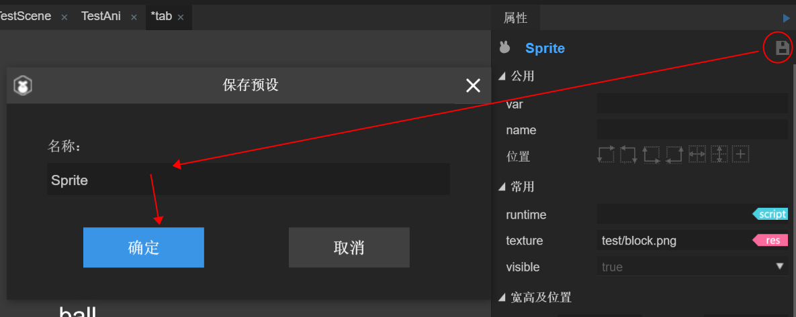

# 预设使用

プロジェクト開発において、よくこのような状況が現れます。

1.審査時、美術では標準的なフォントの色、サイズを規定し、各UIに応用していましたが、ある日突然美術がデフォルトのフォントの色、店名、苦労しているUIの製作者がすべてのインターフェースを変更すると言ってしまい、大変なことになりました。**この場合は、デフォルトの属性設定やデフォルトの設定を使うと簡単に対処できます。1箇所だけ変更すれば、全体に影響が出ます。**

2.異なるインターフェースでは、ローカルに同じモジュールがあり、論理コードも同じである場合、**ページブロック+runtime（ページ論理クラス）を使うと簡単に対応できます。**

3.異なる界面では、局所的に同じ配置があり、一度修正したいと思います。複数の界面の同じ配置が一緒に変化します。**この場合はページネストやプリセットを使うと簡単に対応できます。**

上記のような需要に対して、LayaAirIDEは3つの案を提供しています。

**1.リソースのデフォルト属性の設定**（単一のコンポーネントに標準値を設定し、グローバル効果を変更します。）

**2.UIコンポーネントプロビジョニング**（ローカルUIレイアウトをプリセットとして保存し、別のページにドラッグして使用し、プリセット属性を変更し、グローバル効果が発生します。）

**3.ページネスト**（ローカルUIをページとして保存し、別のページにドラッグして多重化し、runtimeを加えて論理を多重化することもできる）

この三つのプリセットはどうやって使うかを紹介します。

###一.リソースのデフォルト属性の設定

1.リソースパネルでリソースを選択し、ダブルクリックしてリソース属性設定パネルを開きます。

（図1）

2.デフォルトのグローバルにコンポーネント属性値を設定し、例に示すように属性設定値を直接設定すればいいです。**注意：等号「=」の前後にスペースがないこと。**を選択します。図2に示すように、

（図2）

表示効果は以下の通りです。

（図3）

ある場所がプリセット情報を使用したくない場合は、直接に事前設定コンポーネントをUIページにドラッグして属性バーで対応する属性値を変更して、デフォルト値を上書きします。

**このモードの特性：コンポーネントに九宮の格とピクチャーのタイプを設定することができて、あるフォントの色を設定することができます。**

**他のモードとの違い：単一のコンポーネントのみを事前設定できます。カスタムグループの要素に属性値を設定することはできません。**

###二.UIコンポーネントプロビジョニング

1、例えばカスタムSpriteプリセットコンポーネントを作って、ページの中でプリセットコンポーネントにする要素を使用する属性値に設定します。図4に示すように、

 

（図4）

2、右側の保存プリセットボタンをクリックして、このSpriteノードの下の全コンポーネントをプリセットとして保存し、名前を変更してからクリックして確定すればいいです。

 

（図5）

クリック`确定`保存後、シーンプリセットファイルパネル（prefab）で、プリセットファイルを作成します。同時にシーン画面のコンポーネントの色が変わります。この色はコンポーネントをカスタマイズしたものです。図6に示すように。

(图6)

prefabのプリセットファイルは、異なるページで直接ドラッグして使用できます。あるインターフェースでプリセットコンポーネントの属性値を変更したいなら、直接UIインターフェースで各プリセットコンポーネントをそれぞれ修正することもできます。図7に示すように。

 

（図7）

**このモードの特性：現在のノードとサブノードツリーのみをセットできます。**

**他のモードとの違い：現在のページを直接ダブルクリックして、サブレベルに変更することができます。また、各ページでプリセットファイルのコンポーネント属性を変更すると、自分だけに効果があり、他のプリセットコンポーネントに影響を与えません。**

###三.ページネスト

プロジェクト開発では、UIページが複数のところで使用される機能がある場合があります。LayaAirIDEでは、直接UIページを他のUIページにドラッグして使用することができます。図8に示すように、

(図8)

図8では、作成されたUIページをそのままドラッグして別のUIページに配置します。これがUIページのネストです。

**このモード特性：より複雑なノードコンポーネントの組み合わせを設定することができます。**

**他のモードと違います。コンポーネントの属性はあるページでは変更できません。ダブルクリックしてUIVewページに入るしかないです。修正したら、使うところは全部変わります。**

**終了語:**

3つのプリセットの共通の利点は、重複修正の操作を減らすことである。異なるインターフェースでプリセットコンポーネント（またはページ）を使ったら、直接にプリセットコンポーネント（またはページ）を変更すればいいです。使うところは変更されます。一つ一つ修正しなくてもいいです。