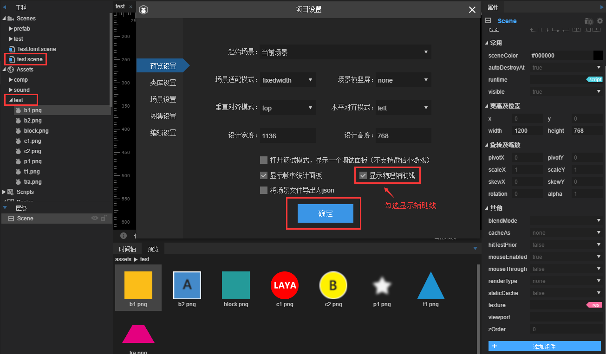
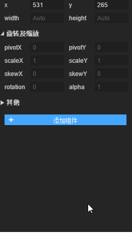
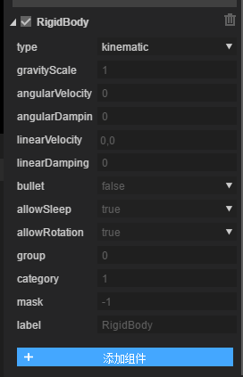

#2 D関節システム

###1.2 D関節

物理ゲームの開発では、複雑なシステムがプレイ可能性を高めるためには、オブジェクト間の様々な制約が必要であり、Box 2 Dは関節システムを提供している。関節は、2つ以上の物体を制約することができる。

**Box 2 D対応の関節はあります。**:

距離かんせつ`DistanceJoint`二つの物体の上にはそれぞれ一つの点があります。二つの間の距離は固定されています。

歯車の関節`GearJoint`：二つの歯車の間の制約関係をシミュレーションするために用いられ、歯車が回転する時に発生する運動量は二つの出力方式があります。一つは歯車自身の角速度、もう一つは歯車表面の線速度です。

エンジン・関節`MotorJoint`

マウスの関節`MouseJoint`：マウスで物体を操作します。オブジェクトを現在のマウスカーソルの位置にドラッグします。回転には制限がありません。

関節をずらす`PrismaticJoint`：関節を移動すると、指定された軸に沿って2つの物体が相対的に動くことができます。相対的な回転を阻止します。

プーリ関節`PulleyJoint`二つの物体を接地して互いに接続します。一つの物体が上昇すると、もう一つの物体が下がります。

関節を回す`RevoluteJiont`：二つの物体に一つのアンカーポイントを共有させ、二つの物体が相対的に回転するように強制します。

ロープの関節`RopeJoint`：2点間の最大距離を制限します。大きな負荷の下でも，接続された物体間の引張は阻止される。

溶接関節`WeldJoint`：二つの物体を相対的に動かすことができず、二つの剛体の相対的な位置と角度は同じで、一つの全体のようです。

車輪の関節`WheelJoint`：ノードの周りの回転は、剛体がノード位置で弾性オフセットを生じるような弾性特性を含む。

すべての関節はComponentから継承されています。

###2.関節部品の紹介

####2.1距離関節

 

関節が二つのノードを拘束する距離からは、棒、骨格、バネのような制約関係に使われます。

#####属性の説明

#####other Body

[最初の設定が有効]関節の接続剛体は、デフォルトでは左上の空剛体に設定できません。

#####other Ancher

[最初の設定が有効]剛体リンクポイントは、other Bodyの左上隅に対してオフセットされます。

#####self Ancher

[最初の設定が有効です]ご自身の剛体リンクポイントは、自身の剛体に対して左上の位置がずれています。

#####frequency

スプリングシステムの振動周波数は、スプリングの弾性係数と見なすことができます。

#####damping

剛体はノードへの回帰過程で受けた減衰について、0~1の値を取ることを提案しています。

#####length

拘束されたターゲット静止長。

#####collideConnect

[最初の設定が有効です]2つの剛体が衝突するかどうかは、デフォルトではfalseです。（スクリーンショットはtrueです。混同しないように注意してください。）

#####模範練習

私たちはまず関節を使います。`DistanceJoint`シングルスイングの効果:

2 dの例プロジェクトを新規作成して、testと名付けて、Aspsetsディレクトリの下のtestフォルダを展開します。予約された図形が見られます。物理エンジンをテストするために使います。

編集モードでは、f 9を押して、表示または物理補助線の表示をチェックすることができます。図のように:

クリックして確定したら、シーンの中でblock.pngにドラッグして、一つのc 1.pngで、効果は図の通りです。

この二つのスプライトにコンポーネントを追加します。ブロックを選択したら、右のプロパティパネルの追加コンポーネントボタンをクリックして、追加します。`BoxCollider`コンポーネント、IDEは自動的に剛体を追加します。`RigidBody`を選択します

同じようにボールに追加します。`CircleCollider`メニューの中の`DistanceJoint`IDEは自動的に追加されます`RigidBody`を選択します。

CTRL+Sで保存して実行すると、次のような効果が見られます。

シングルスイングの効果が現れませんでした。正方形の剛体タイプは`dynamic`ダイナミックで、彼にセットします。`kinematic`運動タイプは、重力の影響を受けないように、一点に固定します。四角いオブジェクトを選択して、type属性のプルダウンメニューから選択します。`kinematic`図のように:

保存後に実行します。シングルスイングの効果が見えます。

次に、少し豊かな物理効果をします。

シーンでは、2つの円をドラッグして、円形の衝突器を追加します。`CircleCollider`を選択して、その中の一つの円に距離関節を追加します。`DistanceJoint`を選択し、もう一つの円の剛体を結合し、二つのアンカーポイントを円の中心に設定し、IDE左下の「階層」パネルの中右ボタンにspriteを追加し、線形衝突器を追加します。`ChainCollider`をクリックします`ChainCollider`二つの点の距離を長くして、単独機の「線」はオンラインで折り返し点を追加して、上記のステップを繰り返して、はしご型の衝突体を作って、それから折れ線の剛体を作ります。`RigidBody`の`type`属性の設定`static`静的なタイプ（物理的な運動は必要ありません。）そして衝突体の上に四角形の衝突器を追加します。`BoxCollider`を選択します`restitution`摩擦力属性は0.5に設定し、弾力を持たせます。更にはしごの底に小さな山の斜面を作って、三角形に引きずり込んで、多角形の衝突器を追加します。`PolygonCollider`を選択し、三角形の`RigidBody`剛体タイプは`Kinematic`運動タイプは、力の影響を受けないようにします。最終効果と階層構造を図に示す。

上記の手順を完了したら、保存して運行します。私達は次のような効果が見られます。

本論文の例が完成したら、すべてのタイプの衝突体、3種類の剛体タイプ、弾性係数、距離関節の使用が理解され、把握されます。

次の文書では、次の図に示すすべての効果を紹介します。

