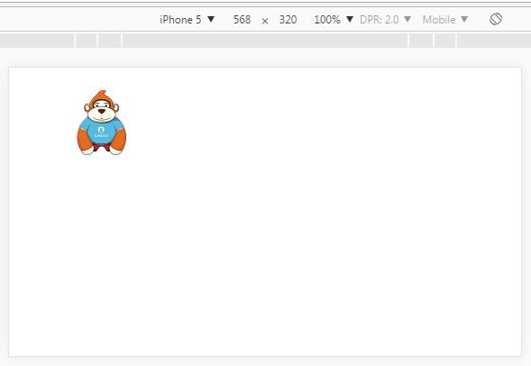
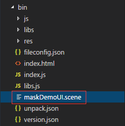

#カバーを設ける

>LayaAirのカバーは、オブジェクト（ビットマップとベクトル図に対応）を設定し、オブジェクトの形状に応じてカバー表示することができます。
>


##一、カバーAPIの紹介

カバーのプロパティがあります。[laya.display.Sprite](http://layaair.ldc.layabox.com/api/index.html?category=Core&class=laya.display.Sprite%3Ch1%3Emask)API内では、この属性の説明は図1に示されている。

<br/>(図1)


##二、簡単なカバーの例

###2.1まずLayaAirエンジンでビットマップを表示します。

MaskDemo.jsエントリプログラムを作成し、コードを作成します。


```javascript

(function()
{
  	var Sprite = Laya.Sprite;
	var Texture = Laya.Texture;
  	var Handler = Laya.Handler;

  	var Res;
	var img;
	(function()
	{
			Laya.init(1136,640);
			//设置舞台背景色
			Laya.stage.bgColor = "#ffffff"      
			//资源路径
			Res = "res/img/monkey1.png";		
			//先加载图片资源，在图片资源加载成功后，通过回调方法绘制图片并添加到舞台
			Laya.loader.load(Res,Handler.create(this,graphicsImg));   
		})();
		
		function graphicsImg()
		{
			img = new Sprite();
			//获取图片资源，绘制到画布
			img.graphics.drawTexture(Laya.loader.getRes(Res),150,50);
			//添加到舞台
			Laya.stage.addChild(img);
		}
})();
```


運転効果は図2に示す通りです。

<br/>(図2)

###2.2円形のカバーエリアを作成する

コードで円形のカバー領域を作成します。マスター属性により、カバー効果を実現します。コードとコメントを見続けて、2.1のコード例を下記のコードに修正します。


```javascript

(function()
{
  	var Sprite = Laya.Sprite;
	var Texture = Laya.Texture;
  	var Handler = Laya.Handler;

  	var Res;
	var img;
	(function()
	{
			Laya.init(1136,640);
			//设置舞台背景色
			Laya.stage.bgColor = "#ffffff"      
			//资源路径
			Res = "res/img/monkey1.png";		
			//先加载图片资源，在图片资源加载成功后，通过回调方法绘制图片并添加到舞台
			Laya.loader.load(Res,Handler.create(this,graphicsImg));   
		})();
		
		function graphicsImg()
		{
			img = new Sprite();
			//获取图片资源，绘制到画布
			img.graphics.drawTexture(Laya.loader.getRes(Res),150,50);
			//添加到舞台
			Laya.stage.addChild(img);
			
			//创建遮罩对象
			var cMask = new Sprite();
			//画一个圆形的遮罩区域
			cMask.graphics.drawCircle(80,80,50,"#ff0000");
          	//圆形所在的位置坐标
			cMask.pos(120,50);
         
         	//实现img显示对象的遮罩效果
			img.mask = cMask;
			
		}
})();
```


運転効果は図3に示す通りです。

<br/>(図3)

コードを比較することにより、カバーが簡単に実現され、作成された表示対象cMaskをカバー対象として、対象のmask属性に値を付けることができます。即ち、対象のカバー効果が実現されました。


##三、LayaAirIDEにカバーを設置する

>コードの中に直接カバーを設置する以外に、LayaAirIDEで簡単に対象にカバーを設置することができます。次は案内に従って手順に従って操作します。

ステップ1：UIページを作成する`maskDemo.ui`を選択します。*（本ステップでは分かりませんが、UIの作成とリソース導入に関する文書をIDEチャプターで確認してください。）*


ステップ2：リソースパネルで一つにドラッグします。`Image`セットはシーン編集エリアに行き、図4に示すように

 <br /> （图4）


ステップ3：ダブルクリックして入る`Image`コンポーネントの内部を、もう一つのモジュールパネルにドラッグします。`Sprite`コンポーネントを図5に示します。

<br/>(図5)


ステップ4:選択`Sprite`モジュールは、右側のプロパティパネルに共通のプロパティを配置します。`renderType`設定`mask`を選択します。

<br/>(図6)


ステップ5：ダブルクリックして入る`Sprite`コンポーネントの内部を、もう一つのモジュールパネルにドラッグします。`Graphics`円形のコンポーネントで、位置と大きさを調整します。階層関係を図7に示す。

<br/>(図7)


ステップ6：編集エリアの空白領域を連続的にダブルクリックして終了します。`Image`セットの内部には、図8に示すようにカバーの効果が見られます。

<br/>(図8)


##四、プロジェクトにLayaAirIDE設定のカバーを適用する。

###4.1 UIのリリース

IDE画面で`F12`カバーを作るUIページを発表します。`src/ui`ディレクトリからUIクラスが生成され、図9に示すように。

<br/>(図9)


###4.2 IDEで生成したクラスと図セットを使ってカバー効果を実現する

F 9のエンジンプレビュー設定で起動シーンをmark DemoUIとして設定します。


メインコードは以下の通りです


```javascript

import GameConfig from "./GameConfig";
class Main {
	constructor() {
		//根据IDE设置初始化引擎		
		if (window["Laya3D"]) Laya3D.init(GameConfig.width, GameConfig.height);
		else Laya.init(GameConfig.width, GameConfig.height, Laya["WebGL"]);
		Laya.stage.scaleMode = GameConfig.scaleMode;
		Laya.stage.screenMode = GameConfig.screenMode;
		Laya.stage.alignV = GameConfig.alignV;
		Laya.stage.alignH = GameConfig.alignH;

		//打开调试面板（通过IDE设置调试模式，或者url地址增加debug=true参数，均可打开调试面板）
		if (GameConfig.debug || Laya.Utils.getQueryString("debug") == "true") Laya.enableDebugPanel();
		if (GameConfig.stat) Laya.Stat.show();
		Laya.alertGlobalError = true;

		//激活资源版本控制，version.json由IDE发布功能自动生成，如果没有也不影响后续流程
		Laya.ResourceVersion.enable("version.json", Laya.Handler.create(this, this.onVersionLoaded), Laya.ResourceVersion.FILENAME_VERSION);
	}

	onVersionLoaded() {
		//激活大小图映射，加载小图的时候，如果发现小图在大图合集里面，则优先加载大图合集，而不是小图
		Laya.AtlasInfoManager.enable("fileconfig.json", Laya.Handler.create(this, this.onConfigLoaded));
	}

	onConfigLoaded() {
		//加载IDE指定的场景
		GameConfig.startScene && Laya.Scene.open(GameConfig.startScene);
	}
}
//激活启动类
new Main();

```


運転効果は図10に示すように、すばやくカバー効果を実現しました。

<br/>(図10)

