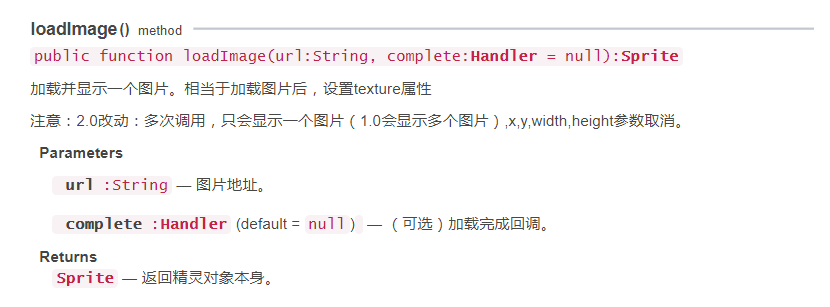
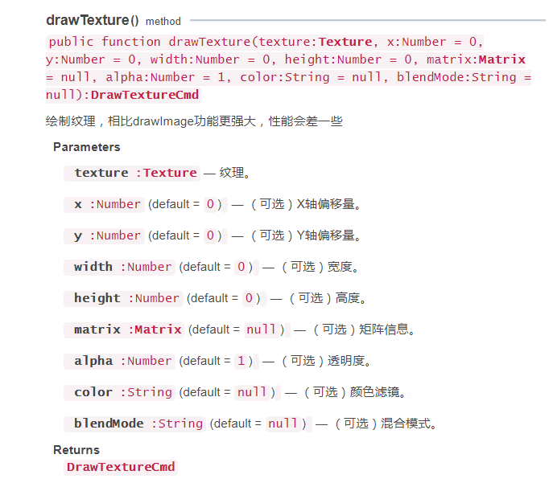

#画像の表示と切り替え

>画像の表示はゲーム開発の基礎であり、本編ではAPIから例に至るまで、それぞれSprite.loadImageとGraphics.drawTextureの2種類の画像を表示する方法を紹介します。

##1、loadImage方法で画像を表示し、切り替えする

###1.1 loadImage APIの概要

APIドキュメントでlaya.display.Spriteを検索すると、図1に示すように、loadImage（）の方法が見つけられます。まず、この方法のパラメータを熟知してみます。

 <br /> (图1)


###1.2 loadImageで表示画像をロードする例

Main.jsエントリクラスを作成し、コードを作成します。


```javascript

(function()
{
	var Sprite  = Laya.Sprite;
	var Stage   = Laya.Stage;
	var Texture = Laya.Texture;
	var Browser = Laya.Browser;
	var Handler = Laya.Handler;
	var WebGL   = Laya.WebGL;

	(function()
	{
		// 不支持WebGL时自动切换至Canvas
		Laya.init(Browser.clientWidth, Browser.clientHeight, WebGL);

		Laya.stage.alignV = Stage.ALIGN_MIDDLE;
		Laya.stage.alignH = Stage.ALIGN_CENTER;

		Laya.stage.scaleMode = "showall";
		Laya.stage.bgColor = "#232628";

		showApe();
	})();

	function showApe()
	{
		// 方法1：使用loadImage
		var ape = new Sprite();
		Laya.stage.addChild(ape);
		ape.loadImage("../../res/apes/monkey3.png");		
	}
})();
```


サンプルコードには、「`100,50`」は、画像の表示座標情報です。コードの実行例の効果は図2-1に示す通りです。

<br/>(図2-1)

###1.3 loadImageで画像を切り替える例

画像の切り替えは、表示画像の上に空の描画を追加し、コードロジックを介して新たな画像リソースを取得して再描画します。具体的なコード説明は、コード注釈およびAPIを参照して、インスタンスに関連して体験を実行することができる。

下記のようにMain.jsクラスでコードを修正します。


```javascript

(function()
{
	var Sprite  = Laya.Sprite;
	var Stage   = Laya.Stage;
	var Texture = Laya.Texture;
	var Browser = Laya.Browser;
	var Handler = Laya.Handler;
	var WebGL   = Laya.WebGL;

	var texture1 = "../../res/apes/monkey2.png";
	var texture2 = "../../res/apes/monkey3.png";
	var flag = false;

	var ape;

	(function()
	{
		// 不支持WebGL时自动切换至Canvas
		Laya.init(Browser.clientWidth, Browser.clientHeight, WebGL);

		Laya.stage.alignV = Stage.ALIGN_MIDDLE;
		Laya.stage.alignH = Stage.ALIGN_CENTER;

		Laya.stage.scaleMode = "showall";
		Laya.stage.bgColor = "#232628";

		Laya.loader.load([texture1, texture2], Handler.create(this, onAssetsLoaded));
	})();

	function onAssetsLoaded()
	{
		ape = new Sprite();
		Laya.stage.addChild(ape);
		ape.pivot(55, 72);
		ape.pos(200, 200);

		// 显示默认纹理
		switchTexture();

		ape.on("click", this, switchTexture);
	}

	function switchTexture()
	{
		var textureUrl = (flag = !flag) ? texture1 : texture2;

		// 更换纹理
		ape.graphics.clear();
		ape.loadImage(textureUrl);
		var texture = Laya.loader.getRes(textureUrl);
	}
})();
```


動作コードの効果は、図2-2に示すように、

<br/>(図2-2)


##2、DRawTexture方法で画像を表示し、切替する

###2.1 drawTexture APIの概要

APIドキュメントでlaya.display.Graphicsを検索すると、drawTexture（）方法が見つかるほか、laya.net.Loader Managerのロード（）方法とgetsRes（）方法、laya.utils.Handlerのcreate（方法）、各方法のパラメータ図3、図5、図6

<br/>(図3)

<br/>(図4)

<br/>(図5)

<br/>(図6)


###2.2 DRawTextureで表示画像をロードする例

loadImage（）方法は外部画像リソースを即時にロードしてもいいし、バッファから画像リソースを読み取ることもできます。drawTexture（）方法はまず画像をロードしてから舞台に追加する必要があります。したがって、コード例ではロードに使用する必要があります。`Laya.loader.load()`）とコールバック（`Handler.create()`）の方法は、以下の簡単な例示的なコードを通して画像をロードして表示します。コードの説明はコードの注釈部分と関連APIの説明を見てください。

Main.jsクラスを作成し、コードを作成します。


```javascript

(function()
{
	var Sprite  = Laya.Sprite;
	var Stage   = Laya.Stage;
	var Texture = Laya.Texture;
	var Browser = Laya.Browser;
	var Handler = Laya.Handler;
	var WebGL   = Laya.WebGL;

	(function()
	{
		// 不支持WebGL时自动切换至Canvas
		Laya.init(Browser.clientWidth, Browser.clientHeight, WebGL);

		Laya.stage.alignV = Stage.ALIGN_MIDDLE;
		Laya.stage.alignH = Stage.ALIGN_CENTER;

		Laya.stage.scaleMode = "showall";
		Laya.stage.bgColor = "#232628";

		showApe();
	})();

	function showApe()
	{
		//方法2：使用drawTexture
		Laya.loader.load("../../res/apes/monkey2.png", Handler.create(this, function()
		{
			var t = Laya.loader.getRes("../../res/apes/monkey2.png");
			var ape = new Sprite();
			ape.graphics.drawTexture(t, 0, 0);
			Laya.stage.addChild(ape);
			ape.pos(200, 0);
		}));
	}
})();
```


コード運転効果を図7-1に示します。

 <br /> (图7-1)


###2.3 drawTextureで画像を切り替える例

画像の切り替えは、表示画像の上に空の描画を追加し、コードロジックを介して新たな画像リソースを取得して再描画します。具体的なコード説明は、コード注釈およびAPIを参照して、インスタンスに関連して体験を実行することができる。

下記のようにMain.jsクラスでコードを修正します。


```javascript

(function()
{
	var Sprite  = Laya.Sprite;
	var Stage   = Laya.Stage;
	var Texture = Laya.Texture;
	var Browser = Laya.Browser;
	var Handler = Laya.Handler;
	var WebGL   = Laya.WebGL;

	var texture1 = "../../res/apes/monkey2.png";
	var texture2 = "../../res/apes/monkey3.png";
	var flag = false;

	var ape;

	(function()
	{
		// 不支持WebGL时自动切换至Canvas
		Laya.init(Browser.clientWidth, Browser.clientHeight, WebGL);

		Laya.stage.alignV = Stage.ALIGN_MIDDLE;
		Laya.stage.alignH = Stage.ALIGN_CENTER;

		Laya.stage.scaleMode = "showall";
		Laya.stage.bgColor = "#232628";

		Laya.loader.load([texture1, texture2], Handler.create(this, onAssetsLoaded));
	})();

	function onAssetsLoaded()
	{
		ape = new Sprite();
		Laya.stage.addChild(ape);
		ape.pivot(55, 72);
		ape.pos(200, 200);

		// 显示默认纹理
		switchTexture();

		ape.on("click", this, switchTexture);
	}

	function switchTexture()
	{
		var textureUrl = (flag = !flag) ? texture1 : texture2;

		// 更换纹理
		ape.graphics.clear();
		var texture = Laya.loader.getRes(textureUrl);
		ape.graphics.drawTexture(texture, 0, 0);

		// 设置交互区域
		ape.size(texture.width, texture.height);
	}
})();
```


コード運転効果を図7-2に示します。

<br/>(図7-2)


