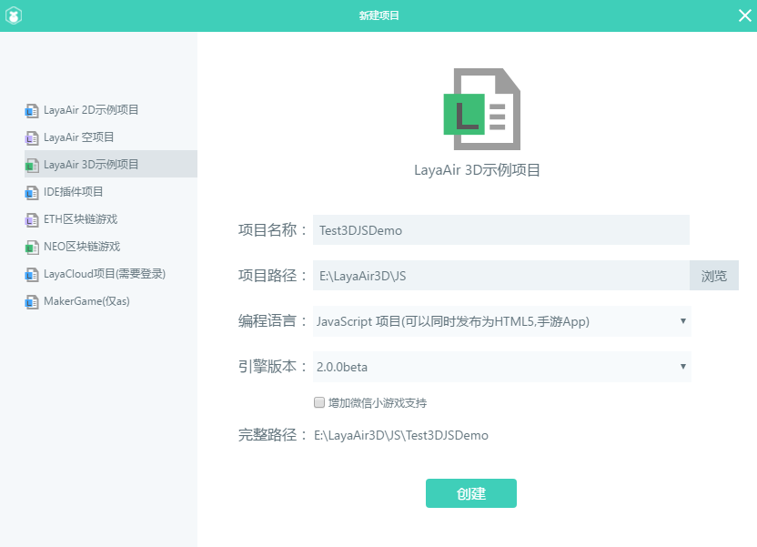
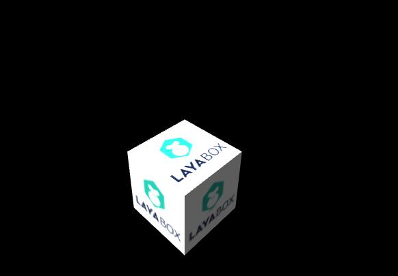

#早く3 Dプロジェクトを開始します。

次はLayaAirエンジンを使って3 Dプロジェクトを迅速に開始し、JS言語を教程として、エンジンコードで基本的な3 Dアプリケーションを実現する簡単なデモを行います。

###IDE作成3 Dサンプル項目

LayaAirIDEをダウンロードし、新規プロジェクトを起動して3 Dプロジェクトを選択します。下図のように：

</br/>(図1)

ここではJavaScript言語を選択します。作成が完了したらIDEが3 Dテンプレートを作成してくれていることが分かりました。プロジェクトの構造についての紹介開発者は2 Dの初心者教程を参考にすることができます。ここでは改めて言及しない。

そして、ショートカットキーF 5を押したり、運転ボタンを押したりして、デバッグウィンドウに四角体が表示されています。下図のように：

</br/>(図2)

Main.jsというスタートクラスは私たちのために3 Dの世界を作り上げてくれました。そして、簡単な3 D世界に必要ないくつかの要素（シーン、カメラ、光源、3 Dモデル、材質）を追加しました。これらの概念については後続教程をサポートします。詳しく紹介します。

この簡単な点のデモに対して、私達はこの立方体が静的であることを発見しました。3 Dのような立体視感をもたらすことができません。簡単なコードを追加して回転させます。まずスタートクラスのMain.jsを見つけて、下記のコードに修正します。


```javascript

var Main = (function () {
    function Main() {

        //初始化引擎
        Laya3D.init(0, 0);

        //适配模式
        Laya.stage.scaleMode = Laya.Stage.SCALE_FULL;
        Laya.stage.screenMode = Laya.Stage.SCREEN_NONE;

        //开启统计信息
        Laya.Stat.show();

        //添加3D场景
        var scene = Laya.stage.addChild(new Laya.Scene3D());

        //添加照相机
        var camera = (scene.addChild(new Laya.Camera(0, 0.1, 100)));
        camera.transform.translate(new Laya.Vector3(0, 3, 3));
        camera.transform.rotate(new Laya.Vector3(-30, 0, 0), true, false);
        camera.clearColor = null;

        //添加方向光
        var directionLight = scene.addChild(new Laya.DirectionLight());
        directionLight.color = new Laya.Vector3(0.6, 0.6, 0.6);
        directionLight.transform.worldMatrix.setForward(new Laya.Vector3(1, -1, 0));

        //添加自定义模型
        var box = scene.addChild(new Laya.MeshSprite3D(new Laya.BoxMesh(1, 1, 1)));
        box.transform.rotate(new Laya.Vector3(0, 45, 0), false, false);
        var material = new Laya.BlinnPhongMaterial();
		Laya.Texture2D.load("res/layabox.png", Laya.Handler.create(null, function(tex) {
				material.albedoTexture = tex;
		}));
        box.meshRenderer.material = material;
        // 这里我们添加旋转逻辑
        var vect =  new Laya.Vector3(1,1,0);
        // 利用时间循环每10ms旋转一次
        Laya.timer.loop(10,null,function(){
            box.transform.rotate(vect,true,false);
        });
    }
    return Main;
} ());

Main();

```


</br>(动图3)


ここではタイマーを使いました。10 msごとにこの本体を回してください。具体的な説明は開発者に関連する教程とAPIを読んでください。ここでは簡単なデモです。簡単なコードは下記の通りです。


```javascript

        var vect =  new Laya.Vector3(1,1,0);
        // 利用时间循环每10ms旋转一次
        Laya.timer.loop(10,null,function(){
            box.transform.rotate(vect,true,false);
        });
```


ここで簡単な例を通してこの方体を回転させることができます。


###LayaAir 3 D世界の基本構成

上のコードの例を通して、基本的な3 D世界が誕生したのを見ることができます。もちろん、上のコードは比較的に簡単です。多彩なゲームの世界を作るには、エンジンの機能をもっと知る必要があります。

図4位LayaAir 3 D世界可視要素図。3 Dシーン、カメラ、照明、模型の他、動画も表示可能な要素の一つです。後期の授業は私達は徐々に皆さんに紹介します。

</br/>(図4)


###3 D世界変換とベクトルの簡単な運用

以上の例では、表示に関するいくつかの要素モジュールが作成されているが、カメラ、照明、モデル上でベクトルVector 3やVector 4などに運用され、それらをオブジェクトの位置、方向、色などに適用することも見られた。

####座標系と位置、回転の変更

2 Dエンジンではx、y座標を直接調整して表示オブジェクトの位置と回転方向を制御します。3 Dエンジンでは表示オブジェクトが複雑で、z軸座標を追加していますので、Vector 3の3次元ベクトルを使って、その値でそれぞれx、y、zを表しています。

しかし、各種の3 Dエンジンと3 Dモデルのアニメーション制作ソフトは座標の方向の定義に対して異なっています。

LayaAit 3 Dエンジン座標は専門用語で属します。`右手坐标系`（図5）簡単に言えば、画面右側は正X軸方向、上側は正Y軸方向、画面方向は正Z軸方向（スクリーン後方向は負Z軸方向）となります。ある3 Dエンジンは左手の座標系に属しています。ここでは紹介しません。興味のある初心者は百度で分かります。

</br/>(図5)右手系座標

エンジンには世界座標と局所座標系があり、世界座標系は3 Dシーンの座標であり、三軸方向は永遠に変わらない（図5）。局部座標はモデル自身の座標であり、モデル方向の回転によって変化することができますが、右手の座標系ジェスチャーで座標方向を識別することができます（図6）。下図の手のモデルはY軸に沿って-90度回転した後の3 Dモデルの右手の座標系の局部座標であり、大親指は常に局所座標の正X軸方向です。

</br/>(図6)

上記の座標系を理解すれば、3 D変換によってこれらを変えることができます。例コードでは、transformは3 D変換対象（Trans form 3 D）であり、3 D世界では非常に重要であり、表示対象の多くの変化論理制御に関するコードが使用されます。

コードには3 D変換におけるtranslate移動とrotate回転方法を用い、3次元ベクトルでx、y、zの値を表します。同僚、二つの方法はいずれもパラメータの中に局部空間移動、回転を設定できます。初心者たちはプログラムの中に設置できます。移動回転の違いを観察します。


```javascript

//移动摄像机位置
camera.transform.translate(new Laya.Vector3(0, 3, 3));
//旋转摄像机方向（角度）
camera.transform.rotate(new Laya.Vector3(-30, 0, 0), true, false);
```


</br/>(図7)

以上はTransform 3 DのAPIにおける移動、回転の方法について説明した。もちろん、変換対象には多くの属性と方法があります。これからの例で説明します。

####ベクトルの使用

ベクトルはLayaAir 3 Dエンジンにおいて非常に頻繁に使用されており、二次元ベクトルから四次元ベクトルに至るまでそれらの姿が見られます。基本的な使い方は、この例では、値付けのために用いられます。

コード中の3 Dオブジェクトの移動、回転、スケーリングなどの変換は、そのx、y、z軸座標の値として3次元ベクトルを使用します。

照明の各色属性の値は長く、3次元ベクトルの値はそれぞれR、G、Bの3色を表しています。それぞれ赤、緑、青、LayaAir 3 Dエンジンの中で、3つの色の最大値は1で、パーセンテージで設定されています。全体の値が大きいほど、色が明るいほど、小さいほど色が暗くなり、値が1を超えると露出効果があります。

赤、緑、青の組み合わせはどのような色になりますか？一般的にプロジェクト開発の過程で、プログラマは色の値を繰り返し調整して、良い効果を実験する必要があります。

例では以下のコードがあります。


```javascript


//灯光的漫反射颜色
directionLight.diffuseColor = new Laya.Vector3(1.6, 1.6, 1.6);
//灯光的方向（弧度）
directionLight.transform.worldMatrix.setForward(new Laya.Vector3(1, -1, 0));
```


プロジェクトの中で、まだ多くの複雑な使い方があります。ベクトルを使って数学演算を行う必要があります。このコースは入門コースとして、ここではあまり紹介しません。