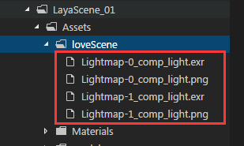
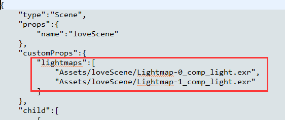

##LayaAir 3 DシーンScene

シーンはLayaAirエンジンの3 D世界コンテナで、ゲームの3 D画面を表示するために使用されるものと、各種の3 D元素をロードするために使用されるもので、ゲーム中のカメラ、照明、人物、物品などはシーンに置いてこそ、画面を表示することができます。ゲームの3 Dプレーヤーまたは3 Dビューに相当します。

Sceneの継承関係を通して、Sprite類に継承されていることが分かります。したがって、簡単に2 Dにおける表示オブジェクトとして扱うことができる。

LayaAirエンジンでは、3 Dと2 Dを混合して使用することができ、作成されたScene 3 DシーンとSprite 2 Dコンテナまたは要素を同時にステージに載せることができます。

「3 Dのクイックオープン」コースでは、基本的な3 Dアプリケーションを確立し、その中に主要な構成要素を追加しました。今回の授業ではシーンの霧効果機能や、unityでLayaAir導出ツールが生成するシーンファイルのロード方法を紹介します。

###シーンリソースをロード

下記のコードの中で「LayaScheneu 01/love Scenee.ls」ファイルはunity 3 D中のlayaAir導出プラグイン選択導出」Scine「カテゴリ生成、ファイルの拡張子は.ls（laya scene略字と理解）です。内部にはシーンに必要なフォトスタンプ、複数または単一のモデルファイルなどが格納されています。Scene 3 D.load（）方法で直接シーンにロードして表示することができます。


```typescript

//初始化引擎
Laya3D.init(0, 0, true);
Laya.stage.scaleMode = Laya.Stage.SCALE_FULL;
Laya.stage.screenMode = Laya.Stage.SCREEN_NONE;
Laya.Stat.show();
//加载插件导出的场景。
Laya.Scene3D.load("LayaScene_01/loveScene.ls",Laya.Handler.create(null,function(scene){
    Laya.stage.addChild(scene);
    //创建摄像机(横纵比，近距裁剪，远距裁剪)
    var camera = new Laya.Camera(0, 0.1, 1000);
    //加载到场景
    scene.addChild(camera);
    //移动摄像机位置
    camera.transform.position = new Laya.Vector3(0, 5, 23);
    //旋转摄像机角度
    camera.transform.rotate(new Laya.Vector3(-17, 0, 0), true, false);
    //设置摄像机视野范围（角度）
    camera.fieldOfView = 35;
    //设置背景颜色
    camera.clearColor = new Laya.Vector4(0, 0, 0.6, 1);
    //加入摄像机移动控制脚本
    camera.addComponent(CameraMoveScript);
    //创建方向光 -------------------
    var light = scene.addChild(new Laya.DirectionLight());
    //移动灯光位置
    light.transform.translate(new Laya.Vector3(0, 2, 5));
    //调整灯光方向
    light.transform.worldMatrix.setForward(new Laya.Vector3(0, -0.5, 0));
    //设置灯光环境色
    light.color = new Laya.Vector3(1, 1, 1);
}));

```


コンパイルデバッグの例コードは、画面上に美しいシーンを表示することができます（図1）。

<br/>(図1)

###シーンリソースプリロード

上記の例はScenee 3 D.load（）方法は資源の非同期的なロードであり、時には3 Dの資源が大きいので、プリロードしてスクリーンの体験を向上させる必要があります。この時に私達はキャリアでプリロードできます。2 DゲームリソースはLaya.loader.load（）方法でプリロードしますが、3 DリソースはLaya.loader.create（）という方法でなければなりません。関連するAPを参照して説明してください。


```typescript

//单个资源
Laya.loader.create("res/Cube.ls",Laya.Handler.create(this,completeHandler));
//批量加载
Laya.loader.create(["res/Cube1.ls","res/Cube2.ls","res/Cube3.ls"],Laya.Handler.create(this,completeHandler));
//批量加载 并创建不同的类型；
Laya.loader.create([{url:"res/Cube1.ls"},{url:"res/Cube2.lh"},{url:"res/Cube3.lm"}],Laya.Handler.create(this,completeHandler));
```


プロジェクトの中では、私たちは通常キャリア方式を採用しています。資源の管理がよくできます。

コードは以下の通りです


```typescript

//初始化引擎
Laya3D.init(0, 0, true);
Laya.stage.scaleMode = Laya.Stage.SCALE_FULL;
Laya.stage.screenMode = Laya.Stage.SCREEN_NONE;
Laya.Stat.show();
//因为只有一个资源 所以我们传进去字符串就可以，队列的话可以传递一个数组队列。
Laya.loader.create("LayaScene_01/loveScene.ls",
    Laya.Handler.create(this, this.completeHandler));
function completeHandler() {
    // 第一种方法 获取场景
    // var scene=Laya.Scene3D.load("LayaScene_01/loveScene.ls");
    // 第二种方法，缓存后加载方式
    var scene = Laya.loader.getRes("LayaScene_01/loveScene.ls");
    Laya.stage.addChild(scene);
}
```


###シーンの霧化

霧化効果はプロジェクトの中で重要な役割を果たしています。霧化効果は大気を開く効果に相当します。おぼろげな感じがして、シーンをよりリアルにします。LayaAir 3 Dエンジンはシーンの霧効果可視距離（濃度に相当）と霧効果の色を設定することができます。ミスト化の適切な使用は、ゲームの性能を向上させるだけでなく、ゲームの体験を増やすことができます。


```typescript

//开启雾化效果
scene.enableFog = true;
//设置雾化的颜色
scene.fogColor = new Laya.Vector3(0,0,0.6);
//设置雾化的起始位置，相对于相机的距离
scene.fogStart = 10;
//设置雾化最浓处的距离。
scene.fogRange = 40;
```


上記の論理コードを追加して上の例にコンパイルして実行してみると、シーンの中には青色の霧効果がかかっています（図2）。遠くに行くほど濃くなり、カメラから40メートル後には全部霧に包まれています。

</br>(图2)


###シーンフォトスタンプ

フォトスタンプはシーン中の3 Dモデルによる投影、陰影遷移、照明雰囲気、モデル材質と材質の色影響などです。

めったにない3 Dゲームのシーンは照明と模型によってリアルタイムでレンダリングして投影と色の影響を生むので、これは非常に性能の方式を消耗するので、特にまた携帯電話のゲーム、携帯電話のグラフィックカードの機能は強大ではありませんて、すべてリアルタイムの光と影のゲームを使ってとてもきつくなることができます。

この問題を解決するために、ゲームシーンの光と影の色をスタンプでシミュレーションし、大量のリアルタイム演算を削減します。

光写真の貼り付けは、unity 3 Dエディタで光の写真を描画してからエクスポートして使用することを提案しています。ロードシーンの場合、エンジンは自動的に光の写真をロードして、より良い効果を達成します。図1と図2はunityで導出した光の写真を使用しています。

unityの中に光の写真を描画していないと、エクスポートしてもエンジンのロードエラーはありませんが、ゲームの効果は大幅に割引されます。図3は光照射効果を使用していないので、図4は光照射スタンプ効果を使用しています。フォトスタンプは、常に太陽の光や夜景、ゲームの雰囲気を再現する効果があり、ゲームの体験性を高めています。

(图3)


（図4）

ここでは光写真の描画方法について多く説明しません。成熟した3 Dゲームの美術デザイナーは基本的に光写真の貼り付けを作ります。

上記の例示的なコードから導出されたリソースツリーディレクトリ（図5）を開きます。

**love Sceneフォルダの名前はunityで作成された光写真スタンプです。そのリソースはシーン名によって生成されます。その中の資源はシーン光スタンプです。オリジナルの光写真はexrフォーマットです。layaAirエンジンで使うjpgまたはpngフォーマットに変換したいです。photoShopで手動で変換したほうがいいです。8ビットカラーに設定して、png形式に保存して、リソースのサイズを効果的に縮小して、ゲームのサイズを減らすことができます。リソースロードの時間。**

unityでフォトスタンプが作成されていないとフォルダは生成されません。

</br/>(図5)

ファイルより小さいjpgピクチャフォーマットをjpgフォーマットに変換する必要がある場合は、修正が必要です。lsプロファイルの中の光照贴图パスは、（図6）のように、シーンから導出したデータファイル「love Scene.ls」を開いて、exr格子を.jpgに修正します。そうでなければ、コンパイル運転時にエンジンが自動的にpngフォーマットのピクチャローディングを行います。

</br/>(図6)