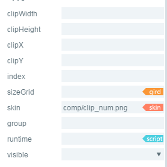

#Clipコンポーネント参照


##一、LayaAirIDEでClipコンポーネントを作成する

###1.1 Clipの作成
Clipコンポーネントはビットマップスライスアニメーションを表示するために使用できます。Clipは、各スライスの幅clipWidth、縦方向に分割し、各スライスの高さclipHeightを横方向に分割し、左から右に、上から下に分割して、一つのスライスアニメーションに結合することができる。

Clipコンポーネントは、スライス動画を再生し、スライス動画のあるフレーム画像を表示するために使用することができる。
リソースパネルのClipコンポーネントをクリックして、ページ編集エリアにドラッグ＆ドロップします。Tabコンポーネントをページに追加できます。
Clipのスクリプトインターフェース参照[Clip API](http://layaair.ldc.layabox.com/api/index.html?category=Core&class=laya.ui.Clip)

Clipコンポーネントのリソース例：

​<br/>
（図1）

clipX属性の値を10に設定した後の表示効果：

​<br/>
（図2）

index属性の値を1に設定した後の表示効果:

​<br/>
（図3）

###1.2 Clipコンポーネントの一般的な属性

​<br/>
（図4）

𞓜**属性**𞓜**機能説明**𞓜
|------|---------------------------------|
現在の切片アニメーションが自動的に再生されるかどうかを示します。𞓜
|clip Width𞓜が画像リソースを横方向に分割する場合、各スライスの幅。𞓜
|clipHeight𞓜が画像リソースを縦に分割する場合、各スライスの高さ。𞓜
|clipX|が画像資源を横に分割する場合、等幅に切断された部数。𞓜
|clipY|が画像リソースを縦に分割する場合など、高カットの部数が求められます。𞓜
アニメーションフレームインデックスは現在表示されています。𞓜
テレビアニメの放送間隔。𞓜
|sizeGrid画像リソースの有効グリッドデータ（ハヤーグデータ）。𞓜
|skin 124;タブボタンの画像リソース。𞓜


##二、コードでClipコンポーネントを作成する

コードを書く時は、コード制御UIを通して作成することが避けられません。`UI_Clip`クラスは、コードでClip関連の属性を設定します。

**実行例の効果:**

​	<br/>
（図5）コードによるカウンタ作成

​<br/>
（図6）

Clipの他の属性もコードで設定でき、上記の例では、各秒ごとにclip.clipXスライスを更新する方法を示しています。デジタルを毎秒更新することにより、タイマの機能が実現されます。興味のある読者は自分でコード設定Clipを通じて、自分のプロジェクトに必要なClipを作成することができます。

**サンプルコード:**


```typescript

(function()
{
	var Stage   = Laya.Stage;
	var Button  = Laya.Button;
	var Clip    = Laya.Clip;
	var Image   = Laya.Image;
	var Handler = Laya.Handler;
	var WebGL   = Laya.WebGL;

	var buttonSkin = "res/ui/button-7.png";
	var clipSkin = "res/ui/num0-9.png";
	var bgSkin = "res/ui/coutDown.png";

	var counter, currFrame, controller;

	(function()
	{
		// 不支持WebGL时自动切换至Canvas
		Laya.init(800, 600, WebGL);

		Laya.stage.alignV = Stage.ALIGN_MIDDLE;
		Laya.stage.alignH = Stage.ALIGN_CENTER;

		Laya.stage.scaleMode = Stage.SCALE_SHOWALL;
		Laya.stage.bgColor = "#232628";
		//预加载资源
		Laya.loader.load([buttonSkin, clipSkin, bgSkin], laya.utils.Handler.create(this, onSkinLoaded));
	})();

	function onSkinLoaded()
	{
		showBg();
		createTimerAnimation();
		showTotalSeconds();
		createController();
	}

	function showBg()
	{
		var bg = new Image(bgSkin);
		bg.size(224, 302);
		bg.pos(Laya.stage.width - bg.width >> 1, Laya.stage.height - bg.height >> 1);
		Laya.stage.addChild(bg);
	}

	function createTimerAnimation()
	{
		counter = new Clip(clipSkin, 10, 1);
		counter.autoPlay = true;
		counter.interval = 1000;

		counter.x = (Laya.stage.width - counter.width) / 2 - 35;
		counter.y = (Laya.stage.height - counter.height) / 2 - 40;

		Laya.stage.addChild(counter);
	}

	function showTotalSeconds()
	{
		var clip = new Clip(clipSkin, 10, 1);
		clip.index = clip.clipX - 1;
		clip.pos(counter.x + 60, counter.y);
		Laya.stage.addChild(clip);
	}

	function createController()
	{
		controller = new Button(buttonSkin, "暂停");
		controller.labelBold = true;
		controller.labelColors = "#FFFFFF,#FFFFFF,#FFFFFF,#FFFFFF";
		controller.size(84, 30);

		controller.on('click', this, onClipSwitchState);

		controller.x = (Laya.stage.width - controller.width) / 2;
		controller.y = (Laya.stage.height - controller.height) / 2 + 110;
		Laya.stage.addChild(controller);
	}

	function onClipSwitchState()
	{
		if (counter.isPlaying)
		{
			counter.stop();
			currFrame = counter.index;
			controller.label = "播放";
		}
		else
		{
			counter.play();
			counter.index = currFrame;
			controller.label = "暂停";
		}
	}
})();
```


 