#時間軸アニメーションエディタの詳細

*【注意】本教程はLayaAirIDE 2.0バージョンを採用しています。文章に違いがあれば最新のLayaAirIDEバージョンに準じてください。*

>時間軸アニメーションエディタは、LayaAirIDEのコアモジュールであり、時間軸上のキーフレームを作成することにより、動き中のアニメーションフレームを自動的に生成し、ゲーム中のalphaの透明度のグラデーション、シフト、回転、スケーリングなどのアニメーション効果を迅速に実現することができます。制作者の大部分の時間を節約し、開発効率を高めました。本編では、時間軸アニメーションの作成からコーディング運用まで、時間軸アニメーションエディタの機能と使用について全面的に紹介します。


#1.時間軸アニメーションの作成

　**時間軸アニメーションは2つの作成方法があります。**。一つは作成です`.ani`ファイルの時間軸アニメーション、もう一つはUIページです。`.ui`ファイル）で時間軸アニメーションを作成します。

二つのファイルの作成時間軸アニメーションの方式は全く同じです。**違います**にほかならない`.ani`ファイル内で作成された時間軸アニメーションは、他のUIページによって使用されてもよく、UIページ内で作成された時間軸アニメーションは、現在のUIページのみで使用されても良い。

一般的な時間軸アニメーションについては、`.ani`ファイル内で作成します。本編では`.ani`ファイル方式は一例です。

**Tips**:

-UIページで時間軸アニメーションを作成する場合は、まず`场景编辑器`編集するアニメーションコンポーネントを選択し、時間軸パネルのチェックをクリックします。`动画编辑模式`を選択して、アニメーション編集の制作操作を行います。

−UIページで時間軸アニメーションを作成し、`动画编辑模式`チェック状態の時は、直接にコンポーネントをドラッグしてはいけません。`场景编辑器`を選択します`动画编辑模式`を選択します。使用するUIコンポーネントを先にドラッグします。`场景编辑器`を選択して、もう一度入力します。`动画编辑模式`編集します。

​

###1.1作成時間軸アニメーションファイルani

**ステップ1**：プロジェクトマネージャでは、`右键`メニューから選択します`新建`->`动画`を選択します。

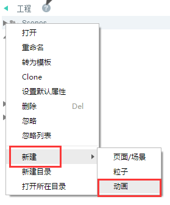<br/>(图1)


**ステップ2**：左クリック`动画`をクリックします。パネル内でGraphic Animationタイプを選択し、入力します。`动画名称`をクリックします`确定`を選択します。

<br/>(図2)

*Tips：パネルの各欄について説明します。文書「UIページ、粒子、アニメーション、スクリプト新規パネル詳細」を参照してください。*

クリックして確認したら完成です。`TimeLine.ani`アニメーションファイルを作成し、自動的に開いてアニメーション編集モードに入ります。図3に示すように。

<br/>(図3)

**Tips**:

-開く`.ani`または`.ui`ファイル`时间轴`パネルと`帧属性`パネルはデフォルトのIDEの下にあります。時間軸アニメーションという2つのパネルを作るには、合わせて使う必要があります。見つけられないか、落としたら、ショートカットキーを押してもいいです。`F3`標準パネルレイアウトに戻ります。

を選択します`.ani`ファイル内のシーン編集エリアの開始座標(`0,0`）2つの赤い線が交差する中心点に位置します。UIファイルの左上とは違いますので、ご注意ください。


  ### 


###1.2シフトを作成する時間軸アニメーション

####1.2.1時間軸の実効名を変更する

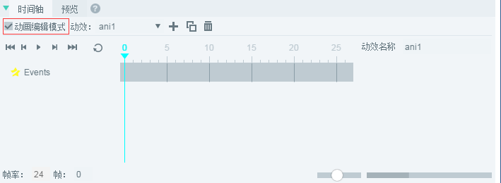<br/>(図4)

時間軸パネルでは複数のアニメーション効果を管理できますが、デフォルトはani 1、ani 2…anixの名前は、記憶の区別を容易にするために、例えばシフトの動効を作成したいです。moveで名前を付けることができます。変更後は更新が必要なく、即時に有効になります。図5に示すように。

<br/>(図5)


####1.2.2アニメーション編集モードに入る

アニメーション編集モードにチェックを入れてから、現在のアニメーション効果を編集できます。編集モードに入ると、デフォルトは0フレームで、図6に示すようになります。(*時間軸アニメーションは0フレームから始まります*)

<br/>(図6)


####1.2.3アニメーションリソースの導入

リソースパネルでは、ビットマップリソース（Imageコンポーネント）をアニメーション編集パネルにドラッグすると、自動的に0フレームでキーフレームを作成します。図7に示すように。

<br/>(図7)

図7において`GraphicNode:2`各アニメーションノードを表します。選択中です。`第0帧`見えます`2`ターゲットの値です。


####1.2.4キーフレームの作成

キーフレームを作成するには3つの方法があります。階層パネルで右クリックして作成し、シーンエディタで右クリックしてコンポーネントの任意の属性値を作成し、変更した後に自動的に作成します。

**第一種類：階層パネルで作成**

あるフレームを選択して、階層パネルのコンポーネントノードを選択します。`右键`-->`创建关键帧`を選択します。
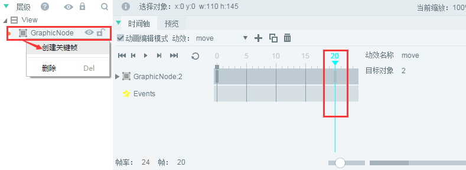<br/>(図8-1)

**第二種類：シーンエディタで右クリックで作成**

シーンエディタで、シーンのセットを選択してから`右键`-->`创建关键帧` 

<br/>(図8-2)


**第三種類：自動作成。**

シーンエディタでコンポーネントを選択し、コンポーネントの任意の属性値を変更すると自動的にキーフレームが作成されます。

この例では、第三の方式で作成します。まずマウスで選択します。`第20帧`を選択し、x軸属性値を`160`このとき、自動的に第20フレームでキーフレームを生成し、x軸を作成しました。`0`はい、`160`の時間軸シフトアニメーションです。図8-3に示すように。

<br/>(図8-3)


####1.2.5時間軸アニメーションを再生する

動画を再生するボタンは左から右に順に、`首帧`ボタン、`上一帧`ボタン、`播放/暂停`ボタン、`下一帧`ボタン、`尾帧`(*最後のキーフレーム*)ボタン、`循环播放`ボタンをクリックします。異なるボタンで動画を再生する効果は、図9に示すようになります。

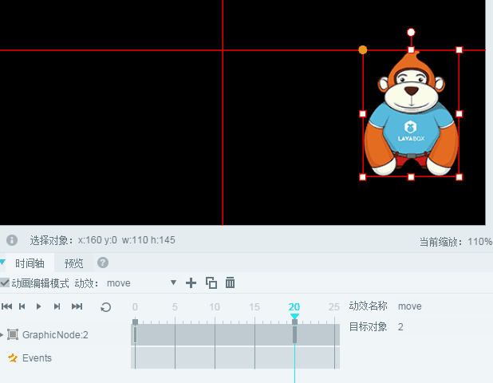<br/>(図9)

**最初のフレームボタン**：クリックした後に、時間軸の最初のフレーム（*第0フレーム*）にポインタを移動します。

**前のフレームボタン**：クリックした後、現在のフレームの前のフレームにポインタを移動します。現在のフレームが最初のフレームである場合、再生ポインタはキーフレームの最後のフレームに移動する。

**再生\一時停止ボタン**：クリックすると、現在のフレームの位置からアニメーション効果が始まり、最後のキーフレームで停止します。再生中はクリックして動画の再生を一時停止し、再度クリックして再生し、一時停止時にあるフレームから再生を継続します。

**次のフレームボタン**：クリックした後、再生ポインタは現在のフレームの次のフレームに移動します。現在のフレームがキーフレームの最後のフレームである場合、再生ポインタは最初のフレームに移動する。

**最後のフレームボタン**：クリックした後に、時間軸キーフレームの最後のフレームにポインタを移動します。

**循環再生ボタン**：選択した後、再生ボタンを押すと、動画が循環して再生されます。再循環ボタンをクリックすると、循環再生状態がキャンセルされます。


　　

###1.3属性パネルによるアニメーション効果の作成

モジュールのプロパティパネルには、アニメーション効果の実現を補助する属性がいくつかありますが、ここではそれぞれ例を挙げて紹介します。

####1.3.1回転動画効果を増加する

例えば、前のシフトの動画をもとに、軸軸点と回転角度を変化させて移動回転のアニメーション効果を作ります。図10に示すように。

<br/>(図10)

**操作手順:**

最後のキーフレーム（20フレーム目）を選択して、コンポーネントを選択して、プロパティパネルの値を変更します。`x`値は235で、`y`値は100で、`pivotX`値は50で、`pivotY`値は100で、`rotation`値は270です。クリックして再生します。

**属性の説明:**

`x`を選択します`y`は、コンポーネントの位置座標です。

`pivotX`を選択します`pivotY`は、セットの軸軸軸点座標xとyです。

`rotation`は、コンポーネントの回転角度です。


####1.3.2拡大縮小動画効果を追加

前のアニメーションに基づいて拡大縮小率を変更することで、図11に示すように時間軸アニメーションのスケーリング効果が見られます。

<br/>(図11)

**操作手順:**

最後のキーフレーム（20フレーム目）を選択して、コンポーネントを選択して、プロパティパネルの値を変更します。`scaleX`を選択します`scaleY`値はいずれも0.3に設定します。将`rotation`360に変更

**属性の説明:**

`scaleX`は、コンポーネントの水平方向のズームです。標準値は1で、ズームしません。

`scaleY`は、コンポーネントの垂直方向のズームです。標準値は1で、ズームしません。


####1.1.3アニメーションの透明なグラデーションの効果を増加します。

透明グラデーション効果もよく使用されているアニメーション効果の一つです。アルファ値を変更することで、フェードアウトなどの透明なグラデーションが簡単に実現できます。私たちは前のアニメーションをベースにして拡大していきます。効果は図12に示すようになります。

<br/>(図12)

**操作手順:**

最後のキーフレーム（20フレーム目）を選択して、コンポーネントを選択して、プロパティパネルの値を変更します。`scaleX`を選択します`scaleY`値はいずれも0.2に変更されました。将`rotation`720に変更します。`alpha`0に設定します。

**属性の説明:**

`alpha`は透明度の属性値で、デフォルトは1で不透明です。0は完全に透明で、属性の取得範囲は0~1です。


####1.3.4軸のアニメーション効果の設定

#####新しい時間軸アニメーションを作成します。

先ほどのシフト効果と区別するために、プラス記号のアイコンをクリックして、図13-1に示すように時間軸アニメーションを作成します。

<br/>(図13-1)

作成後、アニメの名前をpivotに変更します。新しく作成されたものをアニメーションリストから見ることができます。`pivot`アニメとオリジナル`move`動画は、図13-2に示すように、リストの名前をクリックすることで異なる動画の切り替えが可能です。

<br/>(図13-2)


#####中心点を軸にしたアニメを作ります。

軸軸点がセットされていない場合は、デフォルトではコンポーネントの左上隅を軸としていますが、図14-1に示すように回転操作を行います。

<br/>(図14-1)

画像の中心点の回転を実現するにはどうやって操作すればいいですか？

**第一種類：アンカーポイントによる実現**

アンカーポイントはコンポーネントのXまたはY軸の最大長さの割合で設定します。`0-1`例えば、私たちは`anchorX`を選択します`anchorY`の属性値をすべて取ります`0.5`つまり、X軸とY軸の長さの50%の位置で、軸軸点座標が得られます。このように、時間軸の最後のフレームに回転角度値を設定します。`rotation为360`中心点を軸とする回転効果を実現し、図14-2に示すようになります。

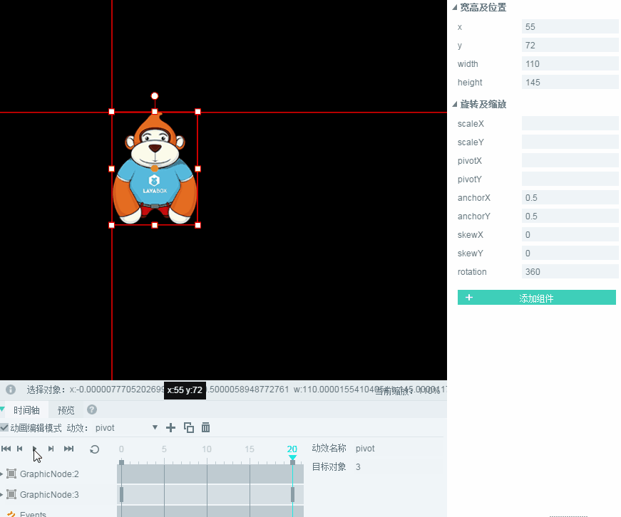<br/>(図14-2)

**Tips**:*アンカーポイントを通過することは、非常に素早く軸軸をセットすることができます。しかし、アンカー方式はUIコンポーネントに対してのみ軸点を設定することができ、graphicsコンポーネントやSpriteなどの2 Dベースコンポーネントの軸点は第2の方法でしか実現できない。*


**第二種類：軸軸軸点の属性により実現する。**

中心点を軸に回転したいですが、軸軸軸の属性によってセットの中心を軸にしてもいいです。`110*145`では、元の幅を2つに割ると中心点の位置が得られます。`pivotX`属性の値は`55`を選択します`pivotY`属性の値は`72.5`。そしてアニメを放送するのは、最初の方法で実現した効果と同じです。図14-3に示すように。

<br/>(図14-3)

**Tips**:*アンカーポイントを通過することは、非常に素早く軸軸をセットすることができます。しかし、アンカー方式はUIコンポーネントに対してのみ軸点を設定することができ、GraphicsコンポーネントおよびSpriteなどの2 Dベースコンポーネントの軸点は第2の方法でしか実現できない。*


####1.3.5傾斜角度のアニメーション効果設定

#####傾斜属性の座標系

傾斜属性skwwexとskwayの座標系は、従来の座標系とは異なり、**水平方向はyで、垂直方向はxです。**。図15に示すように。

<br/>(図15)

skxwとskwayの傾斜角度の変化を知るために。私たちは直接時間軸アニメーションで表現します。

#####skwaxの傾斜変化効果の実証

操作:`第0帧`効果は設定されていません。`第20帧`skyewXを設定します`30`をクリックして再生した後、セットのskwax軸は反時計回りに変形します。図16-1に示すように。

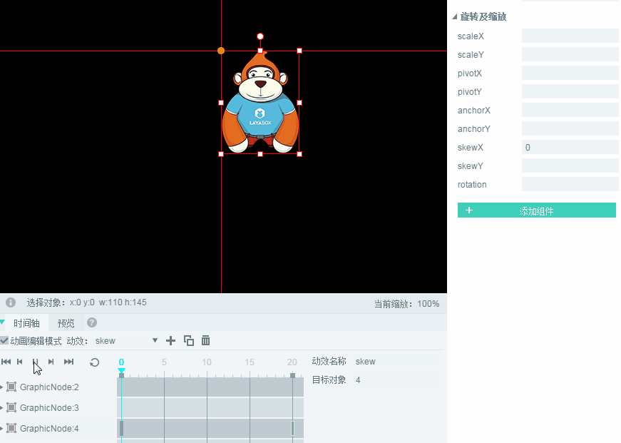<br/>(図16-1)

**Tips**:*SKext値がマイナスの場合、コンポーネントX軸は時計回りに移動して変形します。*

#####skwayの傾斜変化効果の実証

操作:`第0帧`効果は設定されていません。`第20帧`skyewを設定します`30`をクリックして再生します。セットのskway軸は時計回りに変形します。図16-2に示すように。

<br/>(动图16-2)


**Tips**:*skwY値がマイナスの場合、コンポーネントY軸の端が反時計方向に移動して変形します。*

#####skwayとskwayの同時傾斜変化効果の実証

操作:`第0帧`効果は設定されていません。`第20帧`skyewXを設定します`30`を選択します`20`をクリックして再生した後、コンポーネントのskwaxは反時計回りに移動し、skway軸は時計回りに移動して、共にモジュールを押し出して変形が発生します。図16-3に示すように。

<br/>(図16-3)

#####変形しない傾斜動画効果

以前のデモ例はすべてskw属性値が正の値である場合、傾斜角度の変化による変形効果であり、skw属性値が負の値であれば変形の方向は逆の方向である。したがって、skwwexとskwayは同じ数値角度で、一つの属性は正、もう一つの属性は負である。そうすると、傾斜角度と方向が同じになり、変形が発生しなくなります。簡単な振り子効果により変形なしの傾斜アニメーション効果を実証した。

操作:`第0帧`設定`skewX`を選択します`-50`を選択します`skewY`を選択します`50`。第15フレーム`skewX`を選択します`10`を選択します`skewY`を選択します`-10`。30フレーム目`skewX`を選択します`skewY`の値は第0フレームと一致している。設定後にクリックして再生効果を図16-4に示します。

<br/>(动图16-4)


##2.アニメーションエディタの紹介

アニメーションエディタには、ノード層とノード属性層が表示されます。図17に示すように、`GraphicNode`表示ノードのために、後ろの数字は対象オブジェクトのIDであり、アニメーションシーンにアニメーションコンポーネントを追加するごとに、時間軸に対応する表示ノードが追加される。ノード層左側の展開ボタン(*三角*)をクリックすると、そのノードに属するすべてのアニメーション属性が表示されます。`skewY`を選択します`skewX`は、時間軸アニメーションにおいて実現される傾斜アニメーション属性であり、アニメーション属性を追加するごとに、ノード層の下に対応するノード属性層が追加されます。

<br/>(図17)

###2.1アニメーションの追加とアニメーションの削除

前の例はもう通しました。`+号`ボタンは空の時間軸を追加したアニメーション操作を示していますが、動画のボタンをコピーすることで、元のアニメーションと同じ新しいアニメーションを追加できます。新しいアニメーションは元のアニメーションに基づいて拡大と調整を続けています。図18の動画リストから、新規に複製された動画の名前は「`原动画名_0,原动画名_1,.....`例えば、図18では、`skew_0`を選択します`skew_1`は、`skew`を選択します`skew_0_0_0`コピー`skew_0_0`。フレーム属性パネルでデフォルトのアニメーション名を変更することもできます。

<br/>(図18)

削除ボタンをクリックすると、削除するかどうかがヒントになります。クリックして確定すると、現在のアニメーションは図19-1に示すように削除されます。

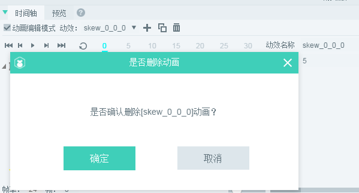<br/>(図19-1)

**Tips**:**ここで注意したいのは、時間軸アニメーションを削除すると、シーン中のアニメーションノードは削除されず、時間軸上のアニメーション効果と属性だけが削除されます。**。特に、最後のアニメーションも削除した後、ノードが削除されていないことがより明らかになります。図19-2に示すように。

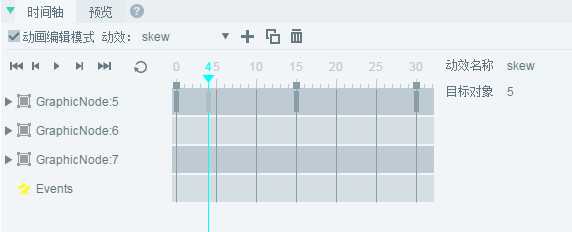<br/>(図19-2)


###2.2マルチノードアニメーションの追加と削除

####2.2.1ノード層とノード名を追加

以前は一つのノードで時間軸アニメーションのデモンストレーションを行いましたが、今はskwアニメーションを新たにコピーして、シーンに新しいコンポーネントをドラッグします。ノード層が自動的に追加されます。

複数のノードが並列して出現する場合は、直感的ではなく、シーンのどのノードが操作されているのか分かりにくい。したがって、ノードを選択して、プロパティマネージャには、図20に示すように、name属性値を設定します。

<br/>(図20)

####2.2.2マルチノードアニメーションを作成する

追加されたノード層では、実際の必要に応じて、前のノード層とは全く異なる位置にあるキーフレームを設定することができます。例えば、私たちのノード層は、往復シフトされたアニメーションを作成して、わざと第二のキーフレームを第13フレームの位置に設定します。アニメーション制作が完了すると、効果は図21に示すようになります。(*前文で実証された基礎操作は詳細には説明しません*)

<br/>(図21)

**Tips**：この例の並進アニメーションは負の座標領域にあるためです。ここでは特に説明が必要です。`时间轴动画的负坐标区域内，无法触发点击事件`イベントをクリックしてインタラクションする必要がある場合、アニメーションのXとYは正の座標領域、つまり十字の赤い線が交差する右下のエリアに位置しなければなりません。

####2.2.3ノードの削除

<br/>(図22-1)

もし私たちが図22-1のようにノード、右ボタンを選択したら`删除`ノード属性を削除するように、現在のノードを削除することはできません。現在のノードで作成されたアニメーション効果とノード属性のみを削除することができます。図22-2に示すように。

<br/>(図22-2)

ノードはどうやって削除しますか？必要です`层级`パネルから削除するノードを選択し、右ボタンを押します。`删除`を選択します。ポップアップヒント`是否删除`をクリックします`确定`いいです。でも、もし**アニメーションリスト内に複数のアニメーションがある場合**削除されたノードは他の動画にも使われていますか？コンポーネントの削除がすべての動画に影響を与えるので、注意してください。**削除されると、他のアニメーション内のノードとアニメーションも消える。**

<br/>(図22-3)


###2.3ノード属性と緩動効果の設定

ノード層の下では、各ノード属性層であり、ノード属性のフレームを選択すると、詳細なフレーム属性が図23に示すように見える。

<br/>(図23)

####ノードのフレーム属性の紹介

`x`：xは属性名であり、−260は現在のフレームの値である。skinを選択すると、skin属性名と対応する値が表示されます。この欄は変更できません。

`标签label`：この欄の設定後、項目でラベル名をコードでフレームを操作することができます。ラベルを設定すると、ラベルを設定するフレームには、図24に示すように、赤い丸が現れます。

<br/>(図24)

`是否缓动`：緩動効果を使うかどうかを選択できます。デフォルトはチェック状態です。

`缓动类型`：デフォルトでは、ラインナップの緩動効果です。他の緩動効果の開発者は自分で体験して使用することができます。

**Tips**:*緩動効果は現在のアニメーションの開始キーフレーム位置に作用します。例えば、緩動タイプを変更する必要がある場合は特に注意してください。*


###2.4フレーム毎のアニメーション制作

コマごとのアニメーションもゲームの中でよく使うアニメーションの一つです。時間軸には2つのフレーム毎のアニメーションの製作方式があります。

#####第1の方法は、キーフレームを連続的に作成することである。

第一ステップ：第一フレームのコンポーネントをシーンエディタにドラッグします。第二のステップ：時間軸において連続的にキーフレームを作成する。図25-1に示すように。

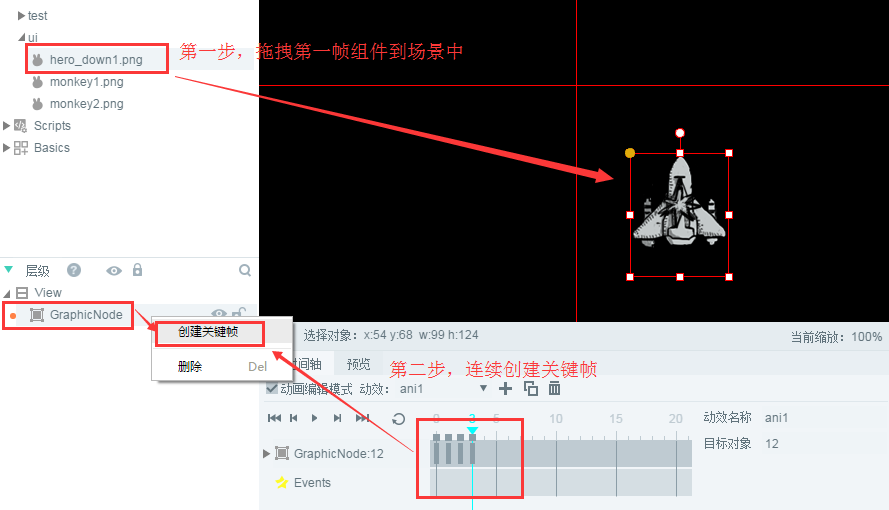<br/>(図25-1)

ステップ3：各フレームのskin属性を置換し、図25-2に示すように。そしてクリックして再生すれば動画効果が見られます。

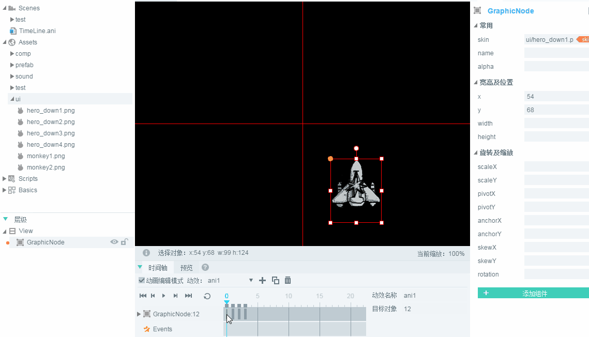<br/>(図25-2)

**Tips**:*コンポーネントを分割して間軸にドラッグすると、シーン中に複数のアニメーションノードが出現する。フレームごとのアニメーション効果を求めていません。*

#####第二の方法：一括作成

一括選択されたコンポーネントは時間軸にドラッグして直接フレームごとのアニメーションを作成します。この方法はより高速です。動画の25-3に示すように。

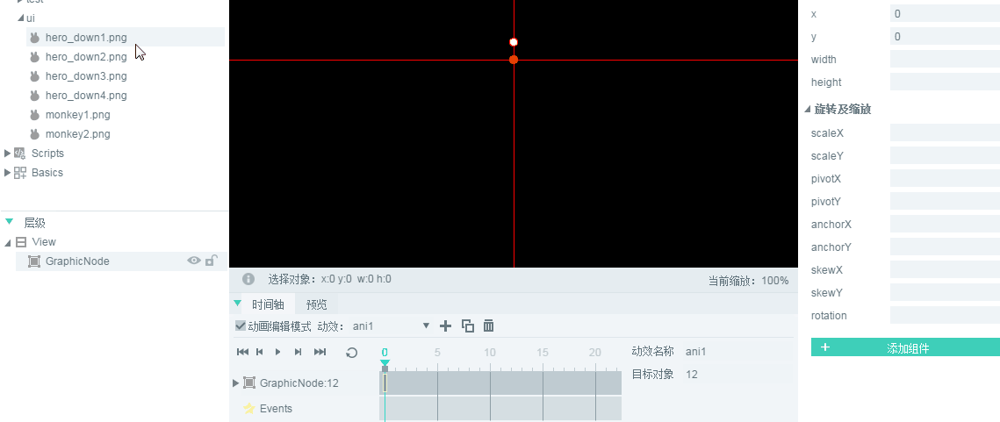<br/>(図25-3)


###2.5底の機能バー

<br/>(図26)

時間軸アニメーションエディタの下部の機能バーでは、以下のように具体的に説明します。

`帧率：`デフォルトは24フレームで、フレームレートを変更することにより、再生のフレームレートを変更することができる。

`加载后：`異なる動作を選択し、読み込み後に対応する操作を行います。それぞれ再生しない、再生しない、循環再生するという3つのオプションがありますが、デフォルトでは再生しないです。

*Tips：この設定はUI中の時間軸においてのみアニメーション編集時に有効であり、aniファイルのアニメーション編集時には無効となります。*

`帧：`デフォルトでは現在のフレームが表示され、目標フレーム数を入力してから車に戻ると、直接目標フレーム数にジャンプします。

`圆形滑动条：`時間軸上のフレームとフレーム間の表示間隔の調整に使用します。図27−1に示すように。

<br/>(図27-1)

`矩形滑动条：`スライダをドラッグして、時間軸のフレームをスライド表示します。図27-2に示すように。

<br/>(図27-2)


##3、時間軸アニメーションを使用する

###3.1時間軸アニメーションのエクスポート

IDE内でショートカットF 12またはCtrl+F 12を押すと時間軸アニメーションがエクスポートされます。`.ani`ファイルは`项目根目录/bin/`目次の下。アニメーションで使用されるリソースマップは、`项目根目录/bin/res/atlas/`ディレクトリでは、図28に示すように。

<br/>(図28)

###3.2プロジェクトに時間軸アニメーションを使用する

プロジェクトで使用する時間軸アニメーションは主に3段階に分けられます。

第一歩：アニメーションを読み込むために必要な図セット。


```javascript

//加载图集成功后，执行onLoaded回调方法
Laya.loader.load("res/atlas/ui.atlas", Laya.Handler.create(this, onLoaded));
```


第二ステップ：アニメーションのインスタンスを作成し、アニメーションファイルをロードする


```javascript

//创建一个Animation实例
var tl = new Laya.Animation();
//加载动画文件
tl.loadAnimation("TimeLine.ani");
```


ステップ3：アニメを舞台に追加し、アニメを放送する


```javascript

//添加到舞台
Laya.stage.addChild(tl);
//播放Animation动画
tl.play();
```


完全な例示コードは以下の通りです。

**入口タイプのGameMain.js**


```javascript

//初始化引擎
Laya.init(600, 400);
//设置舞台背景色
Laya.stage.bgColor = "#ffffff";
//加载图集成功后，执行onLoaded回调方法
Laya.loader.load("res/atlas/ui.atlas", Laya.Handler.create(this, onLoaded));
function onLoaded() {
    //创建一个Animation实例
    var tl = new Laya.Animation();
    //加载动画文件
    tl.loadAnimation("TimeLine.ani");
    //添加到舞台
    Laya.stage.addChild(tl);
    //播放Animation动画
    tl.play();
}
```


コード実行効果は、図29に示すように、

<br/>(図29)

###3.3複数の時間軸アニメーションを使用する

以前はTimeline.aniで複数のアニメを作っていましたが、他のアニメをどうやってロードしますか？この時点でアニメの名前の価値が現れます。デフォルトで再生方法を使う`play()`デフォルト（デフォルト）は最初のアニメーションを再生します。他のアニメーションを使うなら、3番目のパラメータでアニメーション名を設定すればいいです。`play()`方法のapiパラメータを図30に示します。

<br/>(図30)

複数のアニメーションを使用するためのコード例を以下のように修正しました。


```javascript

//初始化引擎
Laya.init(600, 400);
//设置舞台背景色
Laya.stage.bgColor = "#ffffff";
//加载图集成功后，执行onLoaded回调方法
Laya.loader.load("res/atlas/ui.atlas", Laya.Handler.create(this, onLoaded));
function onLoaded() {
    //创建一个Animation实例
    var tl = new Laya.Animation();
    //加载动画文件
    tl.loadAnimation("TimeLine.ani");
    //添加到舞台
    Laya.stage.addChild(tl);
    //播放Animation动画
    tl.play();

    //创建一个新的Animation实例
    var tl2 = new Laya.Animation();
    //加载动画文件
    tl2.loadAnimation("TimeLine.ani");
    //添加到舞台
    Laya.stage.addChild(tl2);
    //播放Animation动画的pivot动画
    tl2.play(0,true,"pivot");
    //动画的显示位置
    tl2.pos(300,0);
}
```


コードの実行例の効果を図31に示します。

<br/>(动图31)


###3.4 UIで時間軸アニメーションを使用し、プロジェクトコードから呼び出します。

####3.4.1 UIページを作成し、アニメーションをシーンに追加します。

まず一つを作成します。`TimeLine.ui`のUIページをクリックし、そのままドラッグします。`planCrashed.ani`シーンにおいては、図32に示すように。

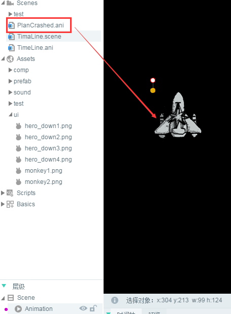<br/>(図32)


####3.4.2アニメーション属性値を設定する

UIシーンのアニメーションを選択すると、多くの属性値が設定できます。ここを先に設置します。`var`の値を設定しなければなりません。アニメーションは起動できません。次に位置属性のx値を500とし、yは0(*はコードの中でpos値*)とし、以前のアニメーションと重複しないように設定します。他の属性値は一つ一つ紹介されていませんが、マウスを属性名に移動すると、対応して紹介されます。図33に示すように。

<br/>(図33)


####3.4.3プロジェクトでUI中のアニメーションを呼び出す

F 12でエクスポートしたら、前の例に直接コードを追加すればいいです。コードの例を以下に示します。

**入口タイプのGameMain.js** 


```javascript

//初始化引擎
Laya.init(600, 400);
//设置舞台背景色
Laya.stage.bgColor = "#ffffff";
//加载图集成功后，执行onLoaded回调方法
Laya.loader.load("res/atlas/ui.atlas", Laya.Handler.create(this, onLoaded));
function onLoaded() {
    //创建一个Animation实例
    var tl = new Laya.Animation();
    //加载动画文件
    tl.loadAnimation("TimeLine.ani");
    //添加到舞台
    Laya.stage.addChild(tl);
    //播放Animation动画
    tl.play();

    //创建一个新的Animation实例
    var tl2 = new Laya.Animation();
    //加载动画文件
    tl2.loadAnimation("TimeLine.ani");
    //添加到舞台
    Laya.stage.addChild(tl2);
    //播放Animation动画的pivot动画
    tl2.play(0,true,"pivot");
    //动画的显示位置
    tl2.pos(300,0);

    //创建一个UI实例
    var plan = new ui.TimeLineUI();
    //添加到舞台
    Laya.stage.addChild(plan);
    //播放UI场景中的动画
    plan.crashed.play();
}
```


動作効果は、図34に示すように、

<br/>(図34)

UIで使用される動画は、UI内の属性マネージャでアニメーション属性を直接制御することができる。例えば、飛行機の爆発速度を下げたいです。私たちは直接UIでアニメーションを選択して、intervalの属性値を設定すればいいです。intervalは、アニメーションの再生間隔を制御する（単位はミリ秒）で、設定しない場合、デフォルトは50ミリ秒です。ここで私達はもっと多く変えたら、飛行機の爆発速度を下げることができます。図35に示すように。

<br/>(図35)

変更後はF 12でエクスポートし、項目コードを変更せずに直接コンパイルし直します。すなわち、図36に示すように、運\動効果が変化していることを確認できます。

<br/>(図36)


ここでは、時間軸アニメーションアニメーションの制作と使用について紹介しました。時間軸アニメーションに関するAPIの使用については、より多くのものを見ることができます。[Animation API文档](http://layaair.ldc.layabox.com/api/index.html?category=Core&class=laya.display.Animation)。