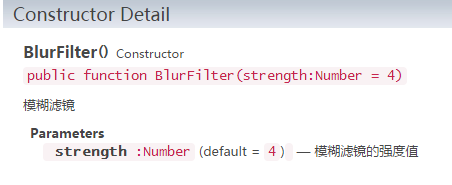
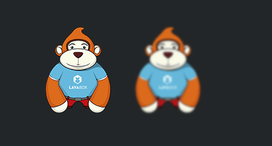

#フィルタ効果の設定

>LayaAirエンジンは、カラーフィルタ、発光（または影）フィルタ、ぼかしフィルタの3つの効果を提供します。カラーフィルタは、CanvasとWebGLモードをサポートしていますが、発光フィルタとボケフィルタは、性能の消耗が大きいため、WebGLモードのみに対応しています。


##1、カラーフィルタの設定

###1.1色フィルタAPIの概要

カラーフィルタ類のColorFilterはlaya.filtersパッケージにあり、指定行列（*4 x 5に配列されたマトリックス*）により各カラーチャンネルを変更します。

クリック[laya.filters.ColorFilter ](http://layaair.ldc.layabox.com/api/index.html?category=Filter&class=laya.filters.ColorFilter)APIの説明を見る。


###1.2カラーフィルタの設定

ビットマップにカラーフィルタを設定するには、まずカラー行列を設定し、次にコードで示すように、ColorFilter方法でカラーフィルタの例を作成します。


```typescript

//颜色滤镜矩阵，红色
var colorMatrix:any = 
  [
  1, 0, 0, 0, 0, //R
  0, 0, 0, 0, 0, //G
  0, 0, 0, 0, 0, //B
  0, 0, 0, 1, 0, //A
];

//创建红色颜色滤镜
var redFilter:Laya.ColorFilter = new Laya.ColorFilter(colorMatrix);
```


最後にSpriterのfilters属性によってカラーフィルタ効果を所定の位置に重ね合わせます。下記のようにMain.ts類を作成します。


```typescript

module laya {
    import Sprite = Laya.Sprite;
    import Stage = Laya.Stage;
    import ColorFilter = Laya.ColorFilter;
    import Texture = Laya.Texture;
    import Browser = Laya.Browser;
    import Handler = Laya.Handler;
    import WebGL = Laya.WebGL;

    export class Main {
        private ApePath: string = "../../res/apes/monkey2.png";

        private apeTexture: Texture;

        constructor() {
            // 不支持WebGL时自动切换至Canvas
            Laya.init(Browser.clientWidth, Browser.clientHeight, WebGL);

            Laya.stage.alignV = Stage.ALIGN_MIDDLE;
            Laya.stage.alignH = Stage.ALIGN_CENTER;

            Laya.stage.scaleMode = "showall";
            Laya.stage.bgColor = "#232628";

            Laya.loader.load(this.ApePath, Handler.create(this, this.setup));
        }

        private setup(): void {
            this.normalizeApe();
            this.makeRedApe();
            this.grayingApe();
        }

        private normalizeApe(): void {
            var originalApe: Sprite = this.createApe();

            this.apeTexture = Laya.loader.getRes(this.ApePath);
            originalApe.x = (Laya.stage.width - this.apeTexture.width * 3) / 2;
            originalApe.y = (Laya.stage.height - this.apeTexture.height) / 2;
        }

        private makeRedApe(): void {
            //由 20 个项目（排列成 4 x 5 矩阵）组成的数组，红色
            var redMat: Array<number> =
                [
                    1, 0, 0, 0, 0, //R
                    0, 0, 0, 0, 0, //G
                    0, 0, 0, 0, 0, //B
                    0, 0, 0, 1, 0, //A
                ];

            //创建一个颜色滤镜对象,红色
            var redFilter: ColorFilter = new ColorFilter(redMat);

            // 赤化猩猩
            var redApe: Sprite = this.createApe();
            redApe.filters = [redFilter];

            var firstChild: any = Laya.stage.getChildAt(0);
            redApe.x = firstChild.x + this.apeTexture.width;
            redApe.y = firstChild.y;
        }

        private grayingApe(): void {
            //由 20 个项目（排列成 4 x 5 矩阵）组成的数组，灰图
            var grayscaleMat: Array<number> = [0.3086, 0.6094, 0.0820, 0, 0, 0.3086, 0.6094, 0.0820, 0, 0, 0.3086, 0.6094, 0.0820, 0, 0, 0, 0, 0, 1, 0];

            //创建一个颜色滤镜对象，灰图
            var grayscaleFilter: ColorFilter = new ColorFilter(grayscaleMat);

            // 灰度猩猩
            var grayApe: Sprite = this.createApe();
            grayApe.filters = [grayscaleFilter];

            var secondChild: any = Laya.stage.getChildAt(1);
            grayApe.x = secondChild.x + this.apeTexture.width;
            grayApe.y = secondChild.y;
        }

        private createApe(): Sprite {
            var ape: Sprite = new Sprite();
            ape.loadImage("../../res/apes/monkey2.png");
            Laya.stage.addChild(ape);

            return ape;
        }
    }
}

new laya.Main();
```


上のコードでは、元のビットマップ、赤フィルタ効果のビットマップ、灰色フィルタ効果のビットマップを作成しました。運転効果は図1に示します。

<br/>(図1)


##2、発光と影フィルタの設定

###2.1発光フィルタAPIについて簡単に説明する。

発光フィルタ類GlowFilterはlaya.filtersパッケージにあり、発光のオフセット角度をシャドウフィルタとしても使用でき、パラメータ説明は図2に示すようになっている。注意：このフィルターはWebGLモードでのみ有効です。

 <br /> (图2)


クリック[laya.filters. GlowFilter](http://layaair.ldc.layabox.com/api/index.html?category=Filter&class=laya.filters.GlowFilter)APIの説明を見る。


###2.2発光フィルタと影フィルタの設定

発光と影フィルタの設定は比較的簡単で、符号化によって直接的に効果の例を確認します。

まずMain.tsクラスを作成し、コードを以下の通り作成します。


```typescript

module laya {
    import Sprite = Laya.Sprite;
    import Stage = Laya.Stage;
    import GlowFilter = Laya.GlowFilter;
    import Browser = Laya.Browser;
    import Handler = Laya.Handler;
    import WebGL = Laya.WebGL;

    export class Main{
        private apePath: string = "../../res/apes/monkey2.png";

        private ape: Sprite;
        private apeGlow:Sprite;
        private apeShadow:Sprite;

        constructor() {
            // 不支持WebGL时自动切换至Canvas
            Laya.init(Browser.clientWidth, Browser.clientHeight, WebGL);

            Laya.stage.alignV = Stage.ALIGN_MIDDLE;
            Laya.stage.alignH = Stage.ALIGN_CENTER;

            Laya.stage.scaleMode = "showall";
            Laya.stage.bgColor = "#aabbcc";

            Laya.loader.load(this.apePath, Handler.create(this, this.setup));
        }

        private setup(): void {
             this.ape=this.createApe();
             this.ape.pos(100,50);
             this.apeGlow = this.createApe();
             this.apeGlow.pos(250,50);
             this.apeShadow = this.createApe();
             this.apeShadow.pos(400,50);
             this.GlowFilter();
             this.ShadowFilter();
        }
 
        private createApe(): Sprite {
            var ape = new Sprite();
            ape.loadImage(this.apePath);
            Laya.stage.addChild(ape);
            return ape;
        }

        private GlowFilter(): void {
            //创建一个发光滤镜
            var glowFilter: GlowFilter = new GlowFilter("#ffff00", 10, 0, 0);
            //设置滤镜集合为发光滤镜
            this.apeGlow.filters = [glowFilter];
        }
        private ShadowFilter(): void {
            //创建一个发光滤镜
            var shadowFilter: GlowFilter = new GlowFilter("#000000", 8, 8, 8);
            //设置滤镜为阴影滤镜
            this.apeShadow.filters = [shadowFilter];
        }
    }
}
new laya.Main();
```


上のコードでは元のビットマップ、発光フィルタ効果のビットマップ、影フィルタ効果のビットマップを作成しました。運転効果は図3に示す通りです。

<br/>(図3)


##3、ぼかしフィルタの設定

###3.1あいまいフィルタAPIの簡単な説明

ぼかしフィルタ類BlurFilterはlaya.filtersパッケージにあり、streengthパラメータを調整することによってぼかしフィルタの強度を設定し、値が大きいほど、ペーストフィルタをかけます。パラメータ説明は図4に示されています。注意：このフィルターはWebGLモードでのみ有効です。

<br/>(図4)

クリック[laya.filters. BlurFilter](http://layaair.ldc.layabox.com/api/index.html?category=Filter&class=laya.filters.BlurFilter)APIの説明を見る。


###3.2ぼかしフィルタの設定

ぼかしフィルタの設定は簡単で、ぼかしフィルタの例を作成し、ぼかし強度を設定してビットマップに重畳すればいいです。私たちは直接に符号化によって効果の例を確認します。

まずMain.tsクラスを作成し、コードを以下の通り作成します。


```typescript

module laya {
    import Sprite = Laya.Sprite;
    import Stage = Laya.Stage;
    import BlurFilter = Laya.BlurFilter;
    import Browser = Laya.Browser;
    import Handler = Laya.Handler;
    import WebGL = Laya.WebGL;

    export class Main {
        private apePath: string = "../../res/apes/monkey2.png";

        constructor() {
            // 不支持WebGL时自动切换至Canvas
            Laya.init(Browser.clientWidth, Browser.clientHeight, WebGL);

            Laya.stage.alignV = Stage.ALIGN_MIDDLE;
            Laya.stage.alignH = Stage.ALIGN_CENTER;

            Laya.stage.scaleMode = "showall";
            Laya.stage.bgColor = "#232628";

            Laya.loader.load(this.apePath, Handler.create(this, this.createApe));
        }

        private createApe(): void {
            var ape: Sprite = new Sprite();
            ape.loadImage(this.apePath);

            ape.pos(100,50);
            
            var apeBlur:Sprite = new Sprite();
            apeBlur.loadImage(this.apePath);
            apeBlur.pos(250,50);

            Laya.stage.addChild(ape);
            Laya.stage.addChild(apeBlur);

            this.applayFilter(apeBlur);
        }

        private applayFilter(ape: Sprite): void {
            var blurFilter: BlurFilter = new BlurFilter();
            blurFilter.strength = 5;
            ape.filters = [blurFilter];
        }
    }
}
new laya.Main();
```


上のコードの中で、オリジナルのビットマップとボケフィルタ効果のビットマップを作成しました。運転効果は図5に示す通りです。

 <br /> (图5)


