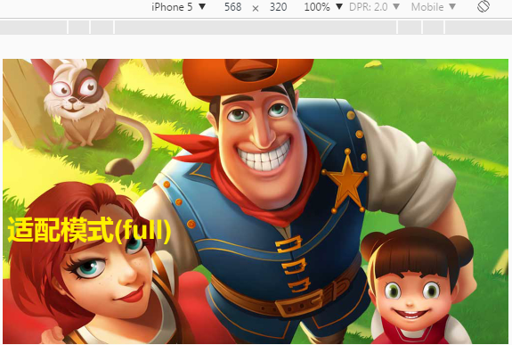
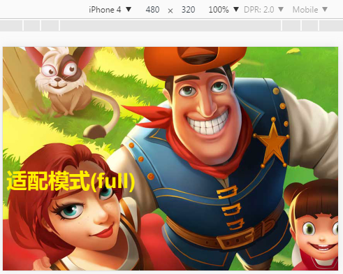

# 屏幕适配的缩放模式详解


スケーリングモードはスクリーン適応の重要な内容であり、本編では基本概念からパラメータの説明まで、コードの実例に合わせてLayaAirエンジンの画面スケーリングモードを理解してくれます。APIドキュメントでは、laya.display.Stageを検索します。スケーリングモードに関する方法scaleModeには7つのパラメータがあり、様々な画面に適応したスケーリングニーズを実現するために使用されています。パラメータの説明は図1に示されています。


  <br/>
（図1）LayaAirエンジンのスケーリングモードscaleModeに関するパラメータ説明


**パラメータの説明を簡単に要約して、まずいくつかの本編に関する基礎概念を理解します。**

**1、デザインの幅の高さ：** 

プロジェクトコードの項目コードにおいて、ステージLaya.init（）で定義されている幅の高さを初期化すると、設計の幅の高さとなります。

**2、ステージ幅の高さ：**

ステージ幅はゲームステージの実際の大きさの幅と高さです。

**3、適応幅の高さ：**

エンジンの適応モードによって、設計の幅が高く、スケーリングされた後の幅が高く、分かりやすいように適合幅が高いと言われています。

**4、キャンバスの幅の高さ：**

キャンバスの幅の高さはHTML 5のcanvasノードの幅の高さで、ゲーム中に見られるすべての内容はキャンバスエリアにあります。

**5、スクリーンの幅の高さ：**

画面の幅の高さとは、携帯ブラウザの画面の幅の高さ、例えば、iPhone 6の縦画面の場合の画面の幅の高さをいう。`375*667`。LayaAirエンジンはlaya.utils.Browser.clientWidthとlaya.utils.Browser.clientHeightを通じてスクリーンの幅と高さを取得することができます。

**6、物理の幅が高い：**

デバイスのスクリーンの物理的な幅の高さについては，まずピクセル密度の概念を理解する必要がある。PCでは、通常画素位置は物理画素である。モバイル機器が急速に発達した今日、携帯電話の画面は通常画素位置に2つまたは3つの画素を持つ。例えばiphone 6縦画面の物理幅は`750*1334`。LayaAirエンジンは、laya.utils.Browser.widthとlaya.utils.Browser.heightを通じてデバイス画面の物理的な幅の高さを取得することができます。

###サンプルコードで使用する背景画像:

[loadingBg.jpg](http://ldc.layabox.com/uploadfile/file/20170223/1487816895380055.jpg)(クリックして開くか、または保存します。`1136×640`ピクセル背景原図）

###一、exactfitモード

exactfitモードは、コンテンツの元の割合を考慮しないで、直接にブラウザ画面全体を非等比スケーリングで満たすモードです。このようなモードでは、画布の幅の高さとstageの幅の高さは、いずれも設計の幅の高さに等しく、変更が発生しない。しかし，このような非等比のスケーリングモードは，物理的幅の高さと設計幅の高さが異なると，元の設計から明らかに変形する可能性がある。効果は図2、図3に示します。

​<br/>
（図2）設計幅の高さは`1136*640`を選択します`1334*750`のexactfixモードの運転効果

​<br/>
（図3）設計の幅の高さは`1136*640`を選択します`750*1334`のexactfitモードの運転効果


**exactfitモードの例コード：**


```typescript

module laya {
    import Text = Laya.Text;
    import Image = Laya.Image;
    import Sprite = Laya.Sprite;
 
    export class SmartScale_T {
 
        //适配模式
        private modes:string = "exactfit";
        //全局文本信息
        private txt: Text;
 
        constructor() {
        //初始化舞台大小
        Laya.init(1136, 640);
 
        //设置适配模式
        Laya.stage.scaleMode = this.modes;
        //设置舞台背景色
        Laya.stage.bgColor  = "#ffff99";
 
 
        //实例一个背景
        var bg = new Image();
        bg.skin = "res/img/loadingBg.jpg";
        Laya.stage.addChild(bg);
 
 
        //实例一个文本
        this.txt = new Text();
        this.txt.text = "适配模式("+this.modes+") ";
        this.txt.bold = true;
        this.txt.pos(10, 350);
        this.txt.fontSize = 60;
        this.txt.color   = "#fff000";
        Laya.stage.addChild(this.txt);
        }
 
    }
}
new laya.SmartScale_T();
```


###二、fixedhtモード

fixedhtモードでは、画布とstageの高さは変わらず、画布とstageの幅は適応幅（適応幅＝設計高さ＊スクリーン幅の高さ比）に等しく、最後にスクリーン幅の高さによってフルスクリーンのスケーリングを行うことが主流の適応モードの一つである。

例えば、iPhone 6の横画面の場合、画面の幅は`667*375`設計の高さは640で、fixedhtモードを採用した後、`适配宽度=(667/375)*640`適合幅計算結果が整理された1138は、キャンバスの幅となります。引張りの例を図4に示します。

​<br/>
（図4）キャンバスの幅の高さは`1067*640`を選択します`1334*750`のfixedhtモードの運行効果

同じ理屈で、iPhone 6縦スクリーンの場合`适配宽度=(375/667)*640`を選択します。適切な幅の計算結果が整理された360はキャンバスの幅です。もし私たちが横画面で設計したら、このモードを使う時、自動横画面に設定してください。でないと、キャンバス以外の部分は表示されません。fixedhtモードの例の引張りはフルスクリーン効果に適合しています。

​<br/>
（図5）キャンバスの幅の高さは`360*640`を選択します`750*1334`のfixedhtモードの運行効果


**fixedhtモードの例コード：**


```typescript

module laya {
    import Text = Laya.Text;
    import Image = Laya.Image;
    import Sprite = Laya.Sprite;
 
    export class SmartScale_T {
 
        //适配模式
        private modes:string = "fixedheight";
        //全局文本信息
        private txt: Text;
 
        constructor() {
        //初始化舞台大小
        Laya.init(0, 640);
 
        //设置适配模式
        Laya.stage.scaleMode = this.modes;
        //设置舞台背景色
        Laya.stage.bgColor  = "#ffff99";
 
 
        //实例一个背景
        var bg = new Image();
        bg.skin = "res/img/loadingBg.jpg";
        Laya.stage.addChild(bg);
 
 
        //实例一个文本
        this.txt = new Text();
        this.txt.text = "适配模式("+this.modes+") ";
        this.txt.bold = true;
        this.txt.pos(10, 350);
        this.txt.fontSize = 60;
        this.txt.color   = "#fff000";
        Laya.stage.addChild(this.txt);
        }
 
    }
}
new laya.SmartScale_T();
```


###三、fixedwidthモード

fixedwidthモードでは、画布とstageの幅は設計幅を変えずに維持し、画布とstageの高さは適応高さに等しい（`适配高度=设计宽度*屏幕高宽比`）最後にスクリーン幅の高さを押してフルスクリーンのスケーリングを行い、このモードは主流の適応モードの一つである。

例えば、iPhone 6の横画面の場合、画面の幅は`667*375`は、設計幅1136であれば、fixedwidthモードを採用した後、`适配高度=(375/667)*1136`を選択します。適切な高さの計算結果が整理された639はキャンバスの高さです。引張りの例を図6に示します。

​<br/>
（図6）キャンバスの幅の高さは`1136*639`を選択します`1334*750`のfixedwidthモードの運行効果

同じように、iPhone 6縦スクリーンの場合の適合高さ=(667/375)*1136は、適合高さ計算結果を整理した2021がキャンバスの高さとなります。もし私たちが横画面で設計するなら、このモードを使う時に、自動横画面に設定する必要があります。そうでないと、適応幅が高くて、スクリーンの幅が高くて、それに比べて拡大縮小して、スクリーンの幅が高くて、フルスクリーン表示を行う場合、通常は私達が欲しい効果ではありません。fixedwidthモード例引張りフルスクリーン効果を図6に示します。

​<br/>
（図6）キャンバスの幅の高さは`1136*2021`を選択します`1334*750`のfixedwidthモードの運行効果


**fixed widthモードの例コード：**


```typescript

module laya {
    import Text = Laya.Text;
    import Image = Laya.Image;
    import Sprite = Laya.Sprite;
 
    export class SmartScale_T {
 
        //适配模式
        private modes:string = "fixedwidth";
        //全局文本信息
        private txt: Text;
 
        constructor() {
        //初始化舞台大小
        Laya.init(1136, 0);
 
        //设置适配模式
        Laya.stage.scaleMode = this.modes;
        //设置舞台背景色
        Laya.stage.bgColor  = "#ffff99";
 
 
        //实例一个背景
        var bg = new Image();
        bg.skin = "res/img/loadingBg.jpg";
        Laya.stage.addChild(bg);
 
 
        //实例一个文本
        this.txt = new Text();
        this.txt.text = "适配模式("+this.modes+") ";
        this.txt.bold = true;
        this.txt.pos(10, 350);
        this.txt.fontSize = 60;
        this.txt.color   = "#fff000";
        Laya.stage.addChild(this.txt);
        }
 
    }
}
new laya.SmartScale_T();
```


###四、フルモード

fullモードでは、stageとキャンバスの幅の高さは、デザインの幅の高さを無視して、直接に物理的な幅の高さに等しいため、ゲームの画質精度が最も高い主流のズームモードです。このモードでは、設計内容はスケーリングされず、1：1のオリジナルの比率を維持した上で、ブラウザ画面の左上隅に舞台を配置し、元の設計内容が画面を超えた部分を裁断する。例の効果を図7、図8に示す。
​
（図8）設計幅の高さは物理幅の高さと同じである。`1136*640`のフルモードの横画面運転効果

​
（図9）設計の幅の高さは`1136*640`を選択します`960*640`のフルモードの横画面運転効果


**fulモードの例コード：**


```typescript

module laya {
    import Text = Laya.Text;
    import Image = Laya.Image;
    import Sprite = Laya.Sprite;
 
    export class SmartScale_T {
 
        //适配模式
        private modes:string = "full";
        //全局文本信息
        private txt: Text;
 
        constructor() {
        //初始化舞台大小
        Laya.init(0, 0);
 
        //设置适配模式
        Laya.stage.scaleMode = this.modes;
        //设置舞台背景色
        Laya.stage.bgColor  = "#ffff99";
 
 
        //实例一个背景
        var bg = new Image();
        bg.skin = "res/img/loadingBg.jpg";
        Laya.stage.addChild(bg);
 
 
        //实例一个文本
        this.txt = new Text();
        this.txt.text = "适配模式("+this.modes+") ";
        this.txt.bold = true;
        this.txt.pos(10, 350);
        this.txt.fontSize = 60;
        this.txt.color   = "#fff000";
        Laya.stage.addChild(this.txt);
        }
 
    }
}
new laya.SmartScale_T();
```


**Tips:**

1、このモードは高精度適応モードであるにもかかわらず、ゲームの性能に対する圧力は他のモードより高く、このモードを選択するかどうかはゲーム全体の状況を考慮しなければならない。

2、キャンバスとstageの幅は直接スクリーンから取った物理幅の高さですので、Laya.init（）の時の幅の高さは直接0に設定できます。


###五、noscaleモード

noscaleモードは拡大縮小しないモードで、画布とstageの幅の高さは設計の幅の高さに等しいです。オリジナルのデザインの比率を1:1に維持し、ステージをブラウザ画面の左上に揃えます。スクリーンの幅がコンテンツより小さい場合は、スクリーンの幅がコンテンツより大きい場合は、黒側が表示されます。このモード運転効果を図9、図10に示します。

​<br/>
（図10）画面の幅の高さは、設計の幅の高さよりも大きい場合の効果です。

​<br/>
（図11）設計内容が画面幅を超えており、設計高さよりも画面高さが大きい効果がある。


**noscaleモードの例コードは以下の通りです。**


```typescript

module laya {
    import Text = Laya.Text;
    import Image = Laya.Image;
    import Sprite = Laya.Sprite;
 
    export class SmartScale_T {
 
        //适配模式
        private modes:string = "noscale";
        //全局文本信息
        private txt: Text;
 
        constructor() {
        //初始化舞台大小
        Laya.init(1136, 640);
 
        //设置适配模式
        Laya.stage.scaleMode = this.modes;
        //设置舞台背景色
        Laya.stage.bgColor  = "#ffff99";
 
 
        //实例一个背景
        var bg = new Image();
        bg.skin = "res/img/loadingBg.jpg";
        Laya.stage.addChild(bg);
 
 
        //实例一个文本
        this.txt = new Text();
        this.txt.text = "适配模式("+this.modes+") ";
        this.txt.bold = true;
        this.txt.pos(10, 350);
        this.txt.fontSize = 60;
        this.txt.color   = "#fff000";
        Laya.stage.addChild(this.txt);
        }
 
    }
}
new laya.SmartScale_T();
```


###六、noborderモード

noborderモードでは、キャンバスの幅の高さは、デザインの幅の高さに等しいです。拡大縮小する時、スクリーンの幅の高さと設計の幅の高さの最大の比率の一方によってスケーリングを行います。`1136*640`を選択します。`750*1334`。広い比率を計算した`（750/1136）`0.66と高い比率です。`（1334/640）`2.08です。noborderモードでスケーリングした場合、最大の比率で一方（高）、適合高さを物理高さの1334に引張り、適応幅等比で引張ります（`1334/640*1136`)は2368です。もちろん、スクリーンの幅を超える部分は裁断されます。効果は図11に示すようになります。


​        <br/>
（図12）キャンバスは幅が高く、デザインサイズを維持しています。`1136*640`を選択します。


**noborderモードの例コードは以下の通りです。**


```typescript

module laya {
    import Text = Laya.Text;
    import Image = Laya.Image;
    import Sprite = Laya.Sprite;
 
    export class SmartScale_T {
 
        //适配模式
        private modes:string = "noborder";
        //全局文本信息
        private txt: Text;
 
        constructor() {
        //初始化舞台大小
        Laya.init(1136, 640);
 
        //设置适配模式
        Laya.stage.scaleMode = this.modes;
        //设置舞台背景色
        Laya.stage.bgColor  = "#ffff99";
 
 
        //实例一个背景
        var bg = new Image();
        bg.skin = "res/img/loadingBg.jpg";
        Laya.stage.addChild(bg);
 
 
        //实例一个文本
        this.txt = new Text();
        this.txt.text = "适配模式("+this.modes+") ";
        this.txt.bold = true;
        this.txt.pos(10, 350);
        this.txt.fontSize = 60;
        this.txt.color   = "#fff000";
        Laya.stage.addChild(this.txt);
        }
 
    }
}
new laya.SmartScale_T();
```


###七、ショベルモード

showllモードでは、stageとキャンバスの幅の高さはスケーリング後の適応幅の高さに等しく、スクリーン幅の高さと設計幅の最小比率の高い方によってスケーリングされます。

例えば、デザインのサイズは`1136*640`を選択します。`750*1334`。広い比率が計算されます。`750/1136`）は0.66で、高い比率（`1334/640`）は2.08です。showwallモードでスケーリングする場合、最小の比率の方（幅）で、キャンバスの幅はスクリーンの物理幅750にスケーリングされ、フィットの高さは等比スケーリングされます（`750/1136*640`）は423です。このとき、423はスクリーン物理高1334よりも遥かに小さいため、大量に暗いスクリーンが残ります。効果は図12に示すとおりです。

​<br/>
（図13）キャンバスの幅の高さは、`750*423`を選択します。`750*423`のスクリーンに大量の黒い空のスクリーンを残します。


**ショベルモードの例コードは以下の通りです。**


```typescript

module laya {
    import Text = Laya.Text;
    import Image = Laya.Image;
    import Sprite = Laya.Sprite;
 
    export class SmartScale_T {
 
        //适配模式
        private modes:string = "showall";
        //全局文本信息
        private txt: Text;
 
        constructor() {
        //初始化舞台大小
        Laya.init(1136, 640);
 
        //设置适配模式
        Laya.stage.scaleMode = this.modes;
        //设置舞台背景色
        Laya.stage.bgColor  = "#ffff99";
 
 
        //实例一个背景
        var bg = new Image();
        bg.skin = "res/img/loadingBg.jpg";
        Laya.stage.addChild(bg);
 
 
        //实例一个文本
        this.txt = new Text();
        this.txt.text = "适配模式("+this.modes+") ";
        this.txt.bold = true;
        this.txt.pos(10, 350);
        this.txt.fontSize = 60;
        this.txt.color   = "#fff000";
        Laya.stage.addChild(this.txt);
        }
 
    }
}
new laya.SmartScale_T();
```


###八、fixedatモード

fixedautモードでは、stageとカンバスの幅はズーム後の適応幅の高さに等しく、ズーム比はフルスクリーンで全コンテンツを表示し、スクリーンのアスペクト比に基づいて自動的にSCALEuFIXEDUWIDHとSCALEuFIXEDUHEIGHTの2つのモードを計算し、スクリーンの幅が設計のアスペクト比に近いモードを選択します。

例えば、iPhone 6の横画面の場合、画面の幅は`667*375`設計幅は1136で、fixedtotモードを採用すると、幅の高さ比によって自動的にSCALEuFIXEDTH方式を選択して、引張適応を行います。`适配高度=(375/667)*1136`を選択します。適切な高さの計算結果が整理された639はキャンバスの高さです。引張りの例を図6に示します。

​<br/>
（図14）キャンバスの幅の高さは`1136*639`を選択します`1334*750`のfixedtotモードの運行効果

同じように、iPhone 6縦スクリーンの場合の適合高さ=(667/375)*1136は、高さ計算結果を調整した2021がキャンバスの高さとなります。アスペクト比によれば、スクリーンのアスペクト比に近いSCALEuFIXEDUHEIGHT適応モードが自動的に選択される。

もし私達が横画面で設計したのなら、このモードを使う時に、自動横スクリーンに設定しなければならないです。そうでなければ、適応幅が高くて、スクリーンの幅が高くて、デザインの高さを基準にして、横方向に裁断する必要があります。これは通常私達が欲しい効果ではありません。fixedautモード例の引張りはフルスクリーン効果に適合する。

​<br/>
（図15）キャンバスの幅の高さは`1136*2021`を選択します`1334*750`のfixedtotモードの運行効果


**fixedatモードの例コードは以下の通りです。**


```javascript

module laya {
    import Text = Laya.Text;
    import Image = Laya.Image;
    import Sprite = Laya.Sprite;
 
    export class SmartScale_T {
 
        //适配模式
        private modes:string = "fixedauto";
        //全局文本信息
        private txt: Text;
 
        constructor() {
        //初始化舞台大小
        Laya.init(1136, 640);
 
        //设置适配模式
        Laya.stage.scaleMode = this.modes;
        //设置舞台背景色
        Laya.stage.bgColor  = "#ffff99";
 
 
        //实例一个背景
        var bg = new Image();
        bg.skin = "res/img/loadingBg.jpg";
        Laya.stage.addChild(bg);
 
 
        //实例一个文本
        this.txt = new Text();
        this.txt.text = "适配模式("+this.modes+") ";
        this.txt.bold = true;
        this.txt.pos(10, 350);
        this.txt.fontSize = 60;
        this.txt.color   = "#fff000";
        Laya.stage.addChild(this.txt);
        }
 
    }
}
new laya.SmartScale_T();
```


**締めくくり:**

フルモードは完全に物理的なピクセルによってレンダリングされ、画面の大きさはどれぐらいですか？適した画面はどれぐらいですか？高画質でよく使われる適応モードですが、サイズの違う画面では、内容の大きさが違ってきます。HTML 5ゲームの性能圧力は他の適応モードより高いです。

showllとnoborderは等比スケーリングモードで、画面が変形しないようにします。ショーホールはスクリーンとデザインの幅の最小比率によって拡大縮小して、画面が完全に現れることができることを保証して、しかし空のスクリーンの暗い辺があることを招きます。noborderはちょうど反対です。スクリーンとデザインの幅の最大比率で拡大縮小します。空のスクリーンの黒い端は現れませんが、幅が広いか高い部分が表示できなくなります。

fixedwidthとfixedhtはshowllとnoborderの変種に似ています。同じようにズームモードですが、動きません。またスケーリングを行います。現在HTML 5のゲームでよく使われている主流適応モードです。fixedtotは、比率に応じて自動的にfixedthとfixedhtモードを切り替える。このいくつかのモデルも私たちがオススメするフルスクリーン適応モードです。

本稿ではズームモードの異なるパラメータの違いを重点的に紹介します。スクリーンの自動回転などの他の画面に合わせて設定していません。開発者は関連する他の技術文書を見ることができます。

適応モードの核心はキャンバス、ステージをスケーリングしたり、直接キャンバスのサイズを変えたりします。ここでは、異なるズームモードのどれをズームしたかを比較して、直感的に理解しやすいです。

|𞓜noscale𞓜exactifit𞓜showll noborder𞓜fixdth𞓜fixedht fixedht
|---------------------------------------------124;-----------------------------------------------------------124--------------------------------|
カンバスのスケーリング
|スケーリングStage 124;𞓜Yes𞓜𞓜124; 124124;
カンバスの大きさを変える

**注意:**物理ピクセル解像度モードが使用されている場合、すなわち`useRetinalCanvas=true`を選択すると、キャンバスのサイズは物理的な解像度に一定であるため、元々のキャンバスのサイズはStageに対してスケーリングされます。


最後に各適応モードの詳細な比較説明図を添付します。みんなは右ボタンを押して新しいページの中で全画面で原図を開けて調べます。

 


