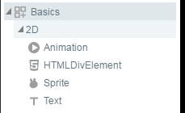

#LayaAir IDEコンポーネントライブラリ

###1、コンポーネントリストの概要

LayaAirIDEのセットボックスにはIDEの常備部品が保管されています。2 Dベースコンポーネント、Graphicsベクトルコンポーネント、UIの一般的なコンポーネントのいくつかの種類があります。図1、図2、図3に示すように。

  

（図1）2 Dベースコンポーネント

 

（図2）Graphicsベクトルコンポーネント

 

（図3）UI一般コンポーネント

###2、コンポーネントライブラリとリソースマネージャの違い

####2.1記憶位置の違い

コンポーネントライブラリのすべてのコンポーネントは、LayaAirIDEが所有するディレクトリに格納され、すべての項目の共通のコンポーネントです。

リソースマネージャのコンポーネントはプロジェクトのディレクトリに保存されています。現在の項目のみ使用します。

####2.2皮膚の違い

コンポーネントライブラリに保存されているコンポーネントは、デフォルトでは肌を持たないです。シーンエディタを入れ、必要に応じて肌を手動で設定します。

リソースマネージャに保存されているのはコンポーネント皮膚資源で、シーンエディタに入れた後、リソースのプレフィクスによって、対応するコンポーネントを識別し、ドラッグしたリソースをコンポーネント皮膚資源として識別します。

####2.3コンポーネントタイプの違い

コンポーネントライブラリには、UIコンポーネント、Graphicsベクトルコンポーネント、2 Dベース（表示オブジェクト）コンポーネントが含まれている。

リソースマネージャにはUIコンポーネントのみが格納されている。

###3、他のコンポーネントに関するドキュメントの参照

コンポーネントライブラリには、カスタムコンポーネントを保存して表示することもできます。カスタムコンポーネントについては、参照できます。`使用IDE创作`カテゴリ`《自定义组件的制作与使用》`。

コンポーネントライブラリの各コンポーネントについての紹介は、`设计模式基础`カテゴリ`《属性设置器文档》`および`IDE组件属性详解`カテゴリに詳しい紹介があります。

`资源管理器`文書には、コンポーネント命名規則などのUIコンポーネントに関する紹介もあります。`设计模式基础`カテゴリ`《资源管理器介绍》`。

