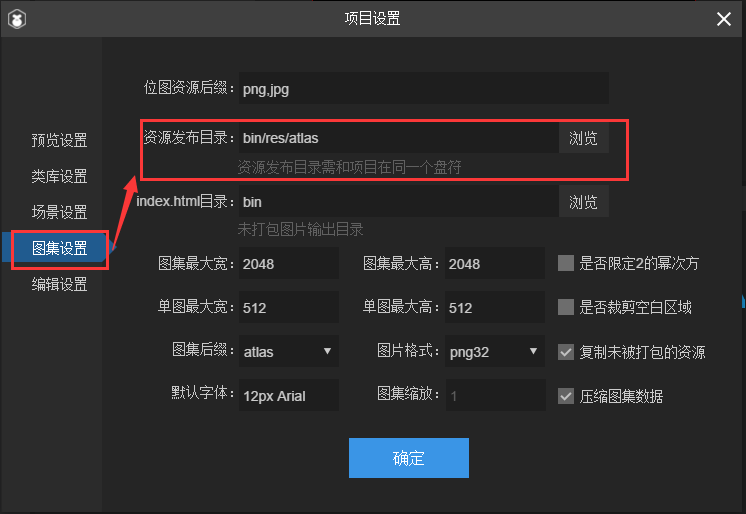

#図集作成と使用の詳細

>author：charley Language：Type Script udate：209.01.11

*【注意】本教程はLayaAirIDE 2..00の正式版を採用しています。文章に違いがあれば最新のLayaAirIDEバージョンに準じてください。*


図集（Atlas）は、ゲーム開発においてよく見られる美術資源であり、ツールを通じて複数の画像を一枚の大図にまとめ、atlasやjsonなどの形式のファイルを通じてオリジナルの画像資源情報を保存する。【図1】LayaAirIDEを用いてパッケージ化されたpngセットリソース。


   


（図1）


##1.なぜ図集資源を使うのですか？

**ゲーム中に複数枚の画像を使って合成した図集資源は美術資源として、以下の利点があります。**

####1.1メモリの最適化

図集を合成する時、各画像の周りの空白領域を取り除きます。加えて、全体的に各種の最適化アルゴリズムを実施できます。図集を合成すると、ゲームパッケージとメモリの占有を大幅に減らすことができます。

####1.2 CPU演算を減らす

複数`Sprite`レンダリングされているのが同じギャラリーからの画像の場合、これらは`Sprite`同一のレンダリングロットを用いて処理することができ、CPUの演算時間を大幅に削減し、運転効率を向上させる。


##2.画集包装のフォーマットに対応しています。

LayaAirIDEは、PNGとJPGの両方のリソースフォーマットを図セットにパッケージ化することをサポートしています。しかし、パッケージ化されたオリジナルのリソースは、JPGのボリュームが大きいので、PNGの使用を推奨します。

*Tips：注意が必要なのは、PNGの元のリソースのビット深度が32を超えてはいけません。そうでなければ、包装された図セットは花スクリーンが現れます。また、PNGとJPGリソースは他のフォーマットのリソースではなく、PNGとJPGフォーマットに改名されました。*


##3.LayaAirIDEで図集を作る方式

LayaAirIDEでは図集を包装する方式は全部で二つあります。

####3.1 IDEのセットを使ってパッケージ化するツール

IDEでナビゲータ`工具`メニューからクリックします`图集打包`図2、図3に示すように、パッケージツールパネルを開きます。

  


（図2）

　　（図3）


**図セット包装ツールパネルの説明**

**`资源根目录`**

`资源根目录`は、図セットが包装される前に、元のリソースディレクトリの親ディレクトリを指します。このディレクトリの下で、各ディレクトリは図セットファイルに対応しています。複数のディレクトリは複数の図セットファイルを生成します。（パッケージされた図セットファイルは、図4、図5に示すように、リソースルートディレクトリのサブディレクトリ名で命名されています。）

 


（図4）

　  


（図5）


####操作ヒント:

ディレクトリを直接ドラッグして`资源根目录`ボックスを入力するか、またはクリックします。`浏览`ディレクトリパスを取得すると、`输出目录`自動記入と`资源根目录`かなりのルートです。

#### **`输出目录`**

`输出目录`パッケージ化された図集資源保存ディレクトリのことです。

デフォルトはリソースのルートディレクトリと同じです。クリックしてもいいです。`浏览`または手動で`输出目录`入力ボックスでパスを変更します。

*Tips：出力ディレクトリの変更はディレクトリのドラッグ操作ではいけません。そうでないとリソースルートディレクトリのパスに影響します。*

#### **`图集最大宽\高度`**

標準値は`2048×2048`を選択します。この値は単一セットの最大サイズを決定します。オリジナルの画像が多すぎて、単一の画集の最大幅の高さを超えた場合、パッケージ化時に新しい画集ファイル（複数の図集）が生成されます。

#### **`单图最大宽\高度`**

標準値は`512×512`このサイズを超えるシングルは図セットに梱包されません。

*Tips：512×512を超える単一図は図セットにパッケージ化することを推奨しないので、単独でこの図をプリロードすることができますが、ロードマップも1024×1024を超えてはいけません。そうでなければ、性能に影響があります。*

#### `缩放系数`

ここでは拡大縮小によって図の集合積を減らすことができます。例えば0.5に変更すると、ツールは原図の幅の高さによってそれぞれ0.5を乗じて図集に生成されます。表示する時はそのまま引張りによって原図の大きさを維持します。このように処理すると、図集のサイズは小さくなりますが、表示の効果にも影響があります。設計時の画像精度を維持するためには、デフォルトの値を調整しないようにします。

#### **`2的整次幂`**

チェックを外すと、生成したギャラリーの幅が2の整数になります。ここでは、美術は設計の際に、2の全乗で設計することを提案しています。図集ツールを通じて、2の全乗を強制的に保持します。きっと図集の体積が大きくなります。したがって、いくつかの強制的な要求に直面していない限り、2の全べき乗最適化されたRuntime環境に応じて、従来の状況ではチェックする必要はなく、できるだけ美術設計者に要求し、32、64、128、256などの2のフルべき乗で画像の幅の高さを設計します。

#### **`空白裁剪`**

チェックを外すと、元の画像の空白領域が自動的にカットされます。デフォルトはチェック状態です。削除しないでください。

#### `数据文件后缀`

データファイルの拡張子はデフォルトではalasです。jsonを選択することもできます。しかし、開発者はLayaAirエンジンを使う時、アトラスを画集のサフィックスとして使うことを提案します。


###3.2リソースマネージャ内で自動的に図セットを包装する

####3.2.1画集包装方式

#### **LayaAirIDEをエクスポートすると自動的にAsetsディレクトリ内のリソースをパッケージ化します。**

リソースマネージャディレクトリ内のすべてのピクチャリソースは、図6−1に示されている。を選択します`F12`または`Ctrl+F12`エクスポート時に**自動的にディレクトリ名で図集に包装されます。**を選択します。

 


（図6-1）

####リソースマネージャのセットからパスをエクスポートします。

UIなどをプロジェクトにエクスポートすると、自動的にパッケージ化された図集はデフォルトで「`项目根目录/bin/res/atlas/`」カタログでは、図セットの名前はパッケージツールの図セットの名前と同じで、図6-2に示すように、Asets内のサブディレクトリ名を図セット名としている。


   


（図6-2）

####デフォルトのギャラリーのエクスポートパスを変更します。

図セットのデフォルトのエクスポートディレクトリを変更するには、設計モードでショートカットキーF 9を介して、`项目设置`パネルの`图集设置`バーの`资源发布目录`で図セットのエクスポートパスを変更します。図6-3に示すように。図集の最大幅の高さ、梱包しないシングルの幅の高さなどを設定することもできます。各パラメータの意味は上記の図セットツールと同じです。

  


（図6-3）

#### **どのように未使用のリソースを図セットに入れないのですか？**

`资源管理器`のリソースがプロジェクトシーンで使用されていない場合は、メニューの`导出`-->`发布（不打包未使用）`機能は、図6-4の通りです。使用されていないリソースを図セットにまとめないで、図セットのサイズを減らすことができます。しかし、このような梱包方式はすべての資源の使用状態を巡回する必要があるため、梱包速度が遅いため、この方式は通常オンラインバージョンをリリースする時だけ使用します。

 


（図6-4）

#### **どのように1枚の資源に対してセットしないで図集の中に持ち帰りますか？**

リソースを選択し、左クリックまたは右クリックで選択します。`设置默认属性`を選択します。リソース属性設定のパネルを開きます。

   


（図6-5）

属性設定パネルで`打包类型`オプションで`不打包`タイプを図6-6に示します。このリソースは図セットに梱包されません。

 


（図6-6）


##4.パッケージ作成の図鑑ファイル紹介

####4.1作成した図面ファイルを包装する

図セットを包装すると、図セット専用リソース（それぞれ同名のもの）が生成されます。`.atlas`ファイル`.json`ファイル`.png`ファイル）、および図集包装プログラム用の`rec`ファイル（*このrecファイルパッケージソフトウェアは、開発者は＊を管理しないでください）を使用しています。上記の図6-2に示されています。

####4.2 alasとjsonの画集拡張子の違い

`.atlas`を選択します`.json`ファイルはすべてpngセットの設定情報ファイルです。初期のLayaAirエンジンはデフォルトではjsonを図集の設定情報として使用していましたが、エンジンの使用を最適化するためにデフォルトでは`.atlas`ただし、古いバージョンに対応するため、図集を生成する際には、長い間IDEバージョンの2つのフォーマットが存在します。現在のLayaAirIDEバージョンは、デフォルトでは生成のみです。`.atlas`を選択します。jsonを生成する場合は、手動で拡張子の設定を変更します。

使う時、この二つの接尾語の違いは以下の通りです。

`.atlas`LayaAirIDE特有の画集形式です。図集のみに使用されますので、読み込み中です。`.atlas`時にタイプを記入する必要はなく、普通の図面をロードするのと同じで、より便利です。アトラス方式で図セットをロードするコードの例は次の通りです。


```typescript

//atlas方式图集使用示例
Laya.loader.load("./res/atlas/test.atlas", Laya.Handler.create(this, this.onLoaded));
```


`.json`は、第三者に対応した画集構成です。`.json`ファイルのアプリケーションは、図セットだけではないので、図セットの設定情報を認識するためにロードされています。`.json`書類の図鑑の場合は、タイプを記入して区分する必要があります。json方式で図セットをロードするコードの例は以下の通りです。


```typescript

//json方式图集使用示例
Laya.loader.load([{url: "res/atlas/test.json", type: Laya.Loader.ATLAS}], Laya.Handler.create(this, this.onLoaded));
```


##5.パッケージ図集によくあるエラー

####図セットファイルを削除した後、再エクスポートできませんでした。

ユーザがマニュアルで図セットファイルを削除したが、recファイルが削除されなかった場合、図7-1に示すように。この場合、**元のリソースが変更されていない場合は、直接F 12を使用してギャラリーファイルを再エクスポートすることはできません。**

ショートカットキーで`Ctrl+F12`整理してエクスポートします。または直接にrecファイルを削除してF 12を使ってエクスポートします。図セットを正常にエクスポートできます。

 


（図7-1）


##6.プロジェクトでどのように図集の中の小図を使うか

プロジェクトで図セットのリソースを使用する場合は、まず図セットのリソースをロードしてから、画像の肌（*skin*）属性値を設定する必要があります。


 

（図6-1）

   


（図1）

####リソースマネージャの

例えば、上記の図6-1のリソースをパッケージ化した後、図1に示すように、図6-1に進みます。`test`ディレクトリの下の図`c1.png`図8に示すように、プロジェクトには図セットで表示されます。

 


（図8）

LayaAir 2.0 IDEはプロジェクトを作成する時、初期化されましたので、図集ロードなどの基礎コードを作成しました。だから、私達は直接に図集の中のc 1.png写真を表示してもいいです。

コアコードは以下の通りです。


```javascript

    //创建Image实例
    var img = new Laya.Image();
    //设置皮肤（取图集中小图的方式就是 原小图目录名/原小图资源名.png）
    img.skin = "test/c1.png";
    //添加到舞台上显示
    Laya.stage.addChild(img);
```


コード実行効果は図9に示す通りです。

（図9）

図9に示すように、図セットから小図リソースを取り出してプロジェクトに適用することに成功しました。コードの中の`sink`値`test/c1.png`は、パッケージ化前に対応するディレクトリとリソース名とパスです。

本編はこれで終わります。もし疑問があれば、コミュニティに提出してください。[https://ask.layabox.com](https://ask.layabox.com/)


##この文章は賞賛します

本論文があなたのために役立つと思ったら、スキャンコードの作者への賞賛を歓迎します。激励は私たちがより多くの優れた文書を書くための動力です。

