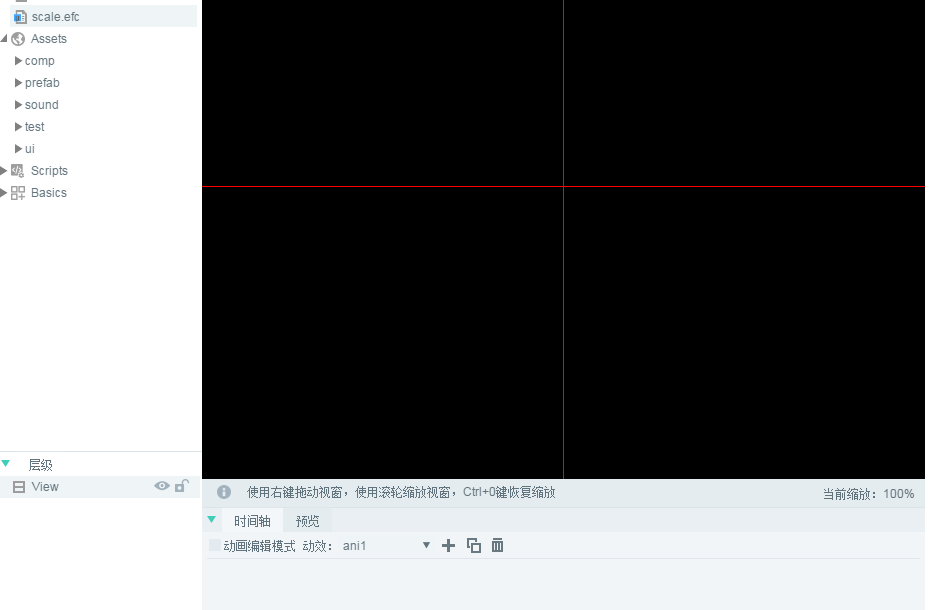

#アニメーションテンプレートを作成します。

###1、何が効果テンプレートですか？

アニメーション効果のテンプレートは、時間軸のアニメーション効果に基づいて、アニメーション効果を設定して、効果をあるコンポーネントに付加します。コンポーネントをエンコードする必要がなくても、エンコードと同じアニメーション効果を簡単に実現できるようにします。アクティブテンプレートは独立して表示できません。アクティブテンプレートとしてUIページのコンポーネントだけがアニメーション効果を得られます。


###2、IDEでアクティブテンプレートを作成して使用する

####2.1 Effect Animationテンプレートファイルを作成する

プロジェクトマネージャでマウス`右键`-->選択`新建`-->`动画`。新しいアニメーションのパネルで、アニメーションタイプを選択します。`EffectAnimation`。私たちはスケーリング効果の動効果テンプレートを作成するため、アニメーション名を図1に示すようにscaleと名づけます。

<br/>(図1)

クリック`确定`を選択します。`scale.efc`のアクティブテンプレートファイルをダブルクリックして、アニメーション編集シーンを図2に示します。

<br/>(図2)


####2.2実効テンプレートの作成

**ターゲット:縮小して復元するアニメーション効果テンプレートを作成します。**

**ステップ1**私たちは資源管理器からImageコンポーネントをドラッグします。`scale.efc`のシーンエディタにあります。図3に示すように。

<br/>(図3)


**ステップ2**:チェック`动画编辑模式`を選択して、`第1帧`和`Image`コンポーネント上で右クリックしてキーフレームを作成します。図4に示すように。

<br/>(図4)


**ステップ3**を選択します`第1帧`を選択します。プロパティマネージャでは、回転とズームの`scaleX`を選択します`scaleY`属性値をすべて`0.2`。図5に示すように。属性値を設定した後、`Image`時間軸に自動的にズームのプロパティが追加されます。`scaleX`を選択します`scaleY`。(*私たちのこの動画テンプレートは変位効果が必要ではないので、キーフレームが自動的に生成された属性Xを作成して直接削除すればいいです*)

<br/>(図5)

**Tips**効果テンプレートと時間軸アニメーションは重要な違いがあります。つまり、現在のアニメーション効果の最初のフレームに対してアニメーション効果を設定するのは無効です。例えば、まず0.2時間まで縮小したいです。時間軸アニメーションでは、第0フレームでアニメーションコンポーネントを直接0.2に縮小することができますが、動画テンプレートでは、第0フレームで直接スケーリング効果を設定することができません。他のフレーム（例えば、第1フレーム）でスケーリング効果を設定しなければなりません。


**ステップ4**：第13フレームでキーフレームを作成し（図4参照）、scaleXとscaleY属性値を1に設定し、クリックして再生すれば動画効果をプレビューできます。

<br/>(図6)


####2.3 IDEにアクティブテンプレートを使用する

**ステップ1**：UIページを作成します。`EffectAnimation.ui`）をクリックして、Buttonのコンポーネントをシーンエディタにドラッグして、図7に示すようにします。

<br/>(図7)


**ステップ2**：作成したスケーリング効果テンプレート（scale.efc）をButtonコンポーネントにドラッグして、図8に示すようにします。

<br/>(図8)


**ステップ3**：中央ズーム効果を実現するために、ボタンをより明確にします。私たちは選択しました`Button`セット、プロパティパネルで、軸軸ポイントのプロパティを設定します。`anchorX`を選択します`anchorY`の値は`0.5`を選択して、`Button`幅の高さと軸点のxy軸位置は、図9に示します。

<br/>(図9)

*Tips：枢軸ポイント効果はUIのコンポーネント属性に設定する必要があり、動効テンプレートに軸軸点効果を設定するとコンポーネントに無効になります。*


**ステップ4**を選択します`Button`コンポーネントの下のアクティブテンプレートは、右側のプロパティパネルに、再生をトリガするイベント属性を設定します。`playEvent`の値は`mousedown`。図10に示すように。

<br/>(図10)

**ステップ5:**これで、アクティブテンプレートの作成が完了しました。ショートカットキーF 9を押して項目設定を開きます。UICCode導入クラスの位置で、アクティブテンプレートに使用されるクラスを導入します。そうでないとエラーが発生します。図11に示すように。その後、F 12（またはCtrl+F 12）でUIページをエクスポートすれば、プロジェクトで使用できます。

<br/>(図11)


###3、プロジェクトに効果テンプレートの効果を示す。

作成`Mian.ts`ファイルは、index.htmlで参照します。以下のコードを作成:


```typescript

class Main {
    constructor() {
        //初始化舞台
        Laya.init(1334,750);
        //设置舞台背景色
        Laya.stage.bgColor = "#ffffff";
		//加载图集资源，加载成功后将UI界面添加到舞台上
        Laya.loader.load("./res/atlas/ui.atlas",Laya.Handler.create(this,this.onLoaded));
    }
    private onLoaded():void{
        //实例化导出的UI类
        var efc:ui.EffectAnimationDemoUI = new ui.EffectAnimationDemoUI();
        //添加到舞台
        Laya.stage.addChild(efc);
    }
}new Main();
```


運転後、ボタンが押されると、動画効果は図12に示すようになります。

<br/>(图12)


###4、複数の動効テンプレートを作成する複雑な動作効果

ボタンを押したばかりで、小さいころから大きなアニメ効果が得られます。もう一つの動画テンプレートを作って、弾み時の縮小効果を実現します。これにより、押したり跳ねたりといった、スピーディな切り替えを実現した連続動画効果のデモンストレーションです。

まず、アクティブテンプレートファイルを作成します。この動的テンプレートは直接的に縮小されているので、2つのキーフレームだけでいいです。図13に示すように、私達は`第12帧`ズームのプロパティ`scaleX`を選択します`scaleY`の値を設定します`0.2`。

<br/>(図13)


その後、UIページでアクティブテンプレートをドラッグします。`Button`セットの下で、設定します。`playEvent`属性は`mouseup`。図14に示すように。

<br/>(図14)


最後に保存し、F 12でUIをエクスポートし、プロジェクトで先ほどのコードを再度コンパイルします。動作効果は、図15に示すように、連続して押したり跳ねたりするイベントで、アニメーション効果は非常に滑らかです。

<br/>(図15)


これでEffect Animationの基礎教程は終了しました。開発者はLayaAirIDEの動画テンプレート機能を使って、様々なコンポーネントのアニメーション効果を迅速に開発することができます。