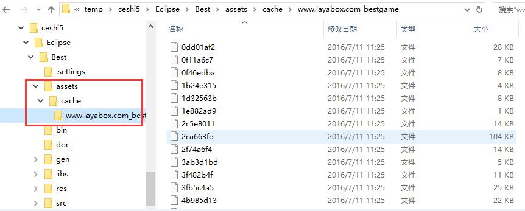

#LayaDCCツール

##紹介する
LayaDCC：Laya-Dynamic Conttent Checkは、LayaPlayerが提供する熱更新ソリューションです。運用時の差異を更新することで、ネットワーク流量を効果的に減らすことができるという利点があります。彼の主なデータはDCCファイルで、DCCファイルはプロジェクト中のすべてのファイルの検証値を記述するために使用されます。DCCファイルはツールlayadccによって生成されます。

layadccはすべてのプロジェクトファイルを巡回し、すべてのファイル検証値を含むバイナリファイルfiletable.binを生成します。LayaPlayerは起動時にサーバからこのファイルを取得してどのようなファイルの更新が必要かを確認します。

layadccはまた、生成した資源パッケージをアプリにパッケージ化するために使用することができます。

##LayaPlayerリソースパックのタイプ
現在の資源パッケージ方式は3つあります。
1.####アプリネットワークパッケージ：

アプリ自体は資源を持たず、体積が一番小さいです。
LayaPlayerが初めて実行する場合、使用するすべてのリソースはサーバーからダウンロードされ、ローカルにキャッシュされます。二回目以降はサーバーからdccファイルを取得し、あるファイルをダウンロードする必要がある場合は、ローカルのリソースの更新が必要かどうかを確認し、更新が必要な時だけ本当にダウンロードします。更新されていないリソースは直接にローカルキャッシュから読み取ります。
ローカルキャッシュは徐々に増加します。

2.####リソースがあるアプリのネットワークパッケージ：

アプリパッケージ自体には一部または全部のゲームリソースが含まれています。パッケージのボリュームが大きいです。
データは相変わらず更新できます。つまり運行毎にサーバーからdccファイルを取って検査します。もしカバンの中のあるファイルが古くなっていると発見されたら、新しいファイルをダウンロードして、ローカルにキャッシュして、後で再起動する時、キャッシュされたファイルが変更されていない限り、依然として保存を遅くします。
何度も更新した後、Appパッケージのファイルはほとんど無効になるかもしれません。毎回はローカルキャッシュを取っています。この時、Appパッケージを新たに更新し、新しいリソースで包装することを提案します。

3.####アプリオフラインバッグ（単独機バッグ）：

直接にすべての資源をAppに梱包します。インターネットでダウンロードする必要は全くありません。体積が一番大きいです。
シングルバージョンなので、urlがないので、リソースの動的な更新ができません。リソースを更新したいなら、アプリを更新するしかないです。

##layadccの設置と使用
layadccはNode.jsに基づいているので、Node.jsの環境が必要です。
###1.Node.jsをインストールする
nodejsに行きます[官网](https://nodejs.org/en/)ダウンロードします。
node.jsは古くて、0.xxのバージョンを支持しないで、命令でnodeバージョンを調べてもいいです。
たとえば:

```bash

$ node -v
v4.2.0
```

このバージョンでいいです。
###2.layadccの設置

```bash

npm install -g layadcc
```

スムーズにインストールが完了すれば、コマンドラインで直接layadccを実行できます。

###3.使い方


```

layadcc 资源目录 [options]
options:
    -cache 生成资源包.
    -lwr 文件路径全部转为小写。（一般不需要）
    -url url 如果要打包资源的话，对应的url.
    -cout outpath 打包资源的输出目录，如果不设置的话，就是在资源目录下。
例如:
   layadcc d:/game/wow -cache -url www.game.com
```

###4.実戦操作
####4.1運行環境
Node.js，npm，layadccを正しく設置していることを確認します。
認証方法:
！[](img/2 png)
図1
layadccを実行すれば、エラーがなければ大丈夫です。

####4.2 httml 5プロジェクト環境
ゲーム項目があると仮定して、F:/work/test/bestgame/ディレクトリの下に置いて、彼のディレクトリ構造は以下の通りです。
！[](img/3 png)
図2
このプロジェクトのリリース後に対応するurlアドレスは以下の通りです。`http://www.layabox.com/bestgame/index.html`  
（単独版はurl住所が必要でない場合）

####4.3包装資源
今はこのhttml 5プロジェクトをパッケージ化してアプリプロジェクトに入れます。

```

 layadcc F:/work/test/bestgame -cache -url http://www.layabox.com/bestgame/index.html
```

単機バッグなら、入力：

```

 layadcc F:/work/test/bestgame -cache -url http://stand.alone.version/index.html
```


次の図のように
！[](img/2 gif)
図3

加えました`-cache`パラメータを指定すると、すべてのリソースファイルを巡回して出力されます。`-cout`指定されたディレクトリの下で、なければ`-cout`パラメータは、作業ディレクトリの下にlayadcceoutディレクトリを作成します。出力ディレクトリのcacheディレクトリは、Appをパッケージ化する際に必要なリソースです。
このディレクトリを構築したプロジェクトの対応するディレクトリにコピーすると、パッケージをコンパイルしてAppを作成することができます。
異なる開発環境では、異なるディレクトリに置く必要があります（LayaAirIDEまたはlayabox命令ツールを使用すれば、自動的にこのステップを完成できます）。

**Android Eclipse:**  
<br/>
（図4）androidのリソースディレクトリはプロジェクトのクラスメイトディレクトリです。

**Android Studio:**  
！[](img/5 png)
（図5）

**iOS XCode:**  
<br/>
（図6）IOSは、レスポンスディレクトリである。

####4.4サーバの更新
これはAppが発表した後に最もよくある操作です。httml 5プロジェクトの内容を更新するたびに、サーバーまたはローカルテストに提出する必要がある場合、クライアントが最新のリソースに更新できるように、新しいdccを生成します。操作手順は以下の図です。
！[](img/1.gif)
図7

layadccを実行した後、指定ディレクトリ（現在のパスです。）の下にudateディレクトリが作成されます。このudateディレクトリをローカルまたはリモートサーバーの同じディレクトリにコピーすればいいです。
**Tips:**   
便利で間違いがないために、直接にサーバーのディレクトリの下でlayadccを実行することを提案します。

**udateカタログ紹介：**   
！[](img/4 png)
図8

allfiles.txtすべてのリソースファイルの相対パス。
asetsid.txt今回dccで統計したリソースパッケージ全体のチェックコードです。
filetable.bin dccの主なファイルで、中はすべてのファイルの検査値です。
filetable.txtテキストフォーマットのdccファイルは、前の3行を除いて、各行は1つのファイルと対応する検査値を表し、allfiles.txtとちょうど対応しています。つまり、4行目に対応するファイルはallfiles.txtの1行目です。
filetable 1.txtこのファイルはもう使いません。

**注意:**  
1.ウェブサーバ上のディレクトリにudateディレクトリがない場合、またはudateディレクトリに内容がない場合、クライアントのdcc更新メカニズムは閉じられます。このようにすべてのリソースは毎回再ダウンロードされます。開発中はこのような方式を提案します。
2.上記の例は、現在のディレクトリの下で、他のパスを実際に指定することもできます。
   `layadcc d:/game/bin/h5`または`layadcc ../bin/h5`


####4.5テスト
1.資源の包装に成功したテスト
まずカバンの中に資源がない場合、このような状況ではすべての資源がネットからダウンロードされます。ログは以下の通りです。
！[](img/7 png)
図9にはたくさんのDownloadが見られます。
   **印刷情報の説明:**  
この中のurlの後に付いている@127..0.1はデバッグ用で、このファイルに対応するサーバーの住所を表しています。s=0はこのファイルにdcc情報がないことを示しています。l=xxxはダウンロードしたファイルの長さを表しています。

リソースパックを打つと、つまりcacheディレクトリの下のものが上の指定されたディレクトリにコピーされます。アプリを実行すると、資源パッケージから資源を読み取るプリントがあります。次のようになります。
！[](img/8 png)
図10
   **印刷情報の説明**  
印刷`found the file in the package:`対応するリソースがカバンから取得されたという意味で、インターネットでダウンロードできませんでした。このログを見ると、パッキングリソースが成功したということです。単一のマシンの場合は、すべてのリソースは、このプリントが必要です。ダウンロードはありません。

2.サービスにdccのテストがあるかどうか：
ブラウザで住所を開きます。http:/www.layabox.com/bestgame/udate/filetable.txt
注意して自分の住所に変えてください。ファイルが存在すれば、dccを打ったと表示します。次の図のように
！[](img/6 png)
図11

3.更新メカニズムが作用するテスト
直観的なテストはリソースを更新しました。アプリは対応の変化が生じました。例えば修正した写真は、アプリで見ることができます。ログから見ると、資源を取得する時、変更していないものはすべて印刷です。`found the file in the package:`変更したのは全部印刷です。`download [ ] xxxurl `。
   **注意**  
1 Downloadは一回だけ実行して、2回目はまたappに入ります。この資源は変えていないなら、直接キャッシュから取ります。
2 DCCのメカニズムは、実行時に更新されるので、このリソースが必要な時だけダウンロードできます。起動時にすべての更新をダウンロードするのではありません。


**締め括りをつける**  
*あるものすべて`download [ ] url `ダウンロードするという意味で、dccやリソースの更新がないということです。
*あるものすべて`found the file in the package:`包装資源が成功しました。dccが効きました。


**注意:**  
*layadcc実行時にはすべてのファイルの修正時間が変更されます。cdnがソースに戻る時にファイルが修正されていないと判断するのを防ぐためです。
*上の住所は架空で、http://www.layabox.com/bestgame/index.が存在しません。


##よくある問題
1.資源を包装した後、速度が速くなるとは感じられませんでした。すべての資源がまだダウンロードされていると思います。
1.本当にダウンロードしているかどうかを確認して、ログを見て上記のDownloadとfindがあるかどうか、キャッシュを読んでもダウンロードしても大丈夫です。本当にダウンロードが遅いだけです。
2.全部Downloadだったら、キャッシュを読みませんでした。
1.dccを打つのを忘れていませんか？ブラウザでサーバーにdccの情報があるかどうかを確認します。
2.パッケージのリソースパスが正しいか確認します。

2.アプリのリリース後、一部のリソースを修正しましたが、Appに更新されませんでした。
1.dccを打つのを忘れましたか？
2.dccを打ったが、サーバーに提出するのを忘れました。
3.dccを打ってサーバにも提出しましたが、cdnがありますので、まだこの変化をあなたのところのノードに配っていません。

3.dccプロセスは正しいと確認しましたが、ある資源は毎回再ダウンロードしてキャッシュに入れません。
1.このリソースがパッケージリソースの中にあるかどうか、すなわちdccリストで、udate/allfiles.txtでこのファイルを検索できます。
2.いるなら。このリソースを要求するurlにsearch部分があるかどうかを確認します。
3.searchがない場合、このファイルの実際の内容と検査値が一致しない可能性があります。dccは間違ったファイルだと思うので、キャッシュしません。可能な理由：
1.dccを打ち終わったら、このファイルの内容をまた変えた人がいます。dccの検査値は実際のファイルの内容と一致しません。解決方法：もう一度dccを打つ。
2.ファイルの内容を変更する人はいませんが、dccはクライアントで打ったもので、ファイルはサーバーにアップロードされた後、アップロードされました。このような状況は普通テキストファイルで発生します。例えば、バージョン管理ツールとftpツールはwindows下のリターンを折り返しunixのリターンに変えます。解決方法：zipでファイルを転送するか、サーバーにdccを打つ。
3.上記の問題がなく、間違ったのは写真です。一部のシステムはhttp要求をグローバルに切り取り、画像を要求する際に、自分のサーバーを通じて圧縮された画像をキャッシュし、いわゆる節約流量を達成することができるからです。この圧縮された画像の検証値はdcc記録とは違います。解決方法：流量節約機能をオフにします。
4.流量の節約がない場合。しかし、cdnを使用すると、cdnの問題かもしれません。例えば、dccファイルが更新されましたが、対応するリソースファイルは更新されていません。確認方法：curlコマンドでノード上のリソースファイルをダウンロードします。（方法は付録を参照してください。）ソース局のリソースファイルと比較します。もし違ったら、確認します。解決方法：強制的にcdnノードを更新したり、cdnカスタマーサービスを探したりします。

4.開発期間中、更新するたびにdccを打つのは面倒くさいです。
layadccでdccを打たないでください。もう打ったら、
udateディレクトリを削除して、再度アプリをインストールして、内部のキャッシュを削除します。このようにdccの仕組みはオフになりました。各ファイルは毎回要求されます。
ある時またdccを打ったら、サーバー側でudateディレクトリを作成したら、またキャッシュが効きます。消したいなら、もう一度上の操作をしてください。

5.カバンの体積を減らすために、一部の資源だけを包装してほしいですが、正しい姿勢は何ですか？
初めてインストールしても、後でアップグレードしても、一部のリソースだけを使うなら、資源の中のdcc情報は完全なデータに基づいて生成されることを保証します。例えば、全部で100個のリソースを持っています。50個をappに持ち帰りたいです。まずフルリソース状態でdccを打って、生成したdcc情報（主にfiletable.txt）を保存して、50個のリソースを削除して、layadccでcacheファイルを生成します。この時cacheディレクトリの下でdcc情報を生成するのは不完全です。だから、前のステップで作成したファイルで彼を上書きします。
不完全なdccを使うと問題になります。appを更新する時、nativeは優先的にappにキャッシュされたdccファイルを使用して、一部のキャッシュ情報をなくしてしまいます。このようにfiletable.txtにないファイルはキャッシュ不要と見なされて、次のサーバーdccに更新するまでダウンロードしています。

##付録
1.LayaDCCの流れ
！[](img/1.png)
図12
対応コードはindex.jsにあります。

2.あるcdnノードのファイルをダウンロードします。

```sh

curl -H "Host:www.layabox.com" http://182.110.238.110/bestgame/index.html >a.html
```

182.10.238.110ノードの上の`http://www.layabox.com/bestgame/index.html`のファイルをダウンロードして、a.1に保存します。
その中のHost：後の内容は自分のドメイン名に変えて、`http://`後のipアドレスをノードサーバのアドレスに変更しましたが、ノードサーバのアドレスはどうやって取得しますか？LayaPlayerでは、ノードサーバは通常変更されないので、任意のDownloadの印刷によってアドレスを取得することができる。

```

Downloaded http://www.layabox.com/bestgame/bestgame.min.js@182.110.238.110 s=44216b56 l=422
```

ノードアドレスは182.10.238.110であることが分かります。