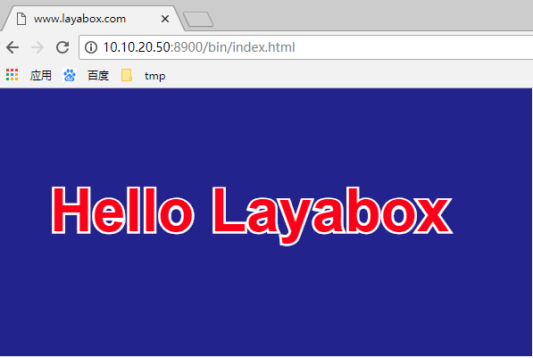
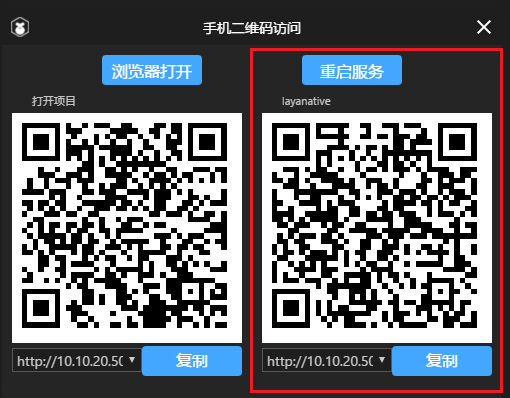

#LayaNativeを使ってLayaAirプロジェクトを実行します。

この文書を見ていると、LayaAirまたはLayaAirについてある程度知っています。LayaAirの文書でLayaIDEを使って最初のプログラム「Hello LayaBox」を作成する方法を詳しく紹介しました。

<！--TODO:リンク先アドレスを変更しました。項目アドレスを入力しても、画面に何も表示されていないことが判明した場合、プロジェクトが正しく横向きスクリーンを設定していない可能性がありますので、ドキュメントを参照してください。

ステップ1：Hello LayaBoxの簡単なプロジェクトを作成しました。図1に示すように、

 
運転効果は図2に示す通りです。

 
図2

ステップ2：LayaIDE右上の「二次元コード」メニューキーをクリックすると、二次元コードの画面が表示され、画面左側の二次元コードの下にhttpアドレスが表示されます。例のアドレスは以下の通りです。`http://10.10.20.50:8900/bin/h5/index.html`を選択します

 
図3

ステップ3：二次元コード画面の「ブラウザ開き」ボタンをクリックすると、ブラウザで`http://10.10.20.50:8900/bin/h5/index.html`モードで開き、開くと図4に示すように、

 

図4

ステップ4：既に携帯電話にインストールされているLayaBoxテストアプリを開き、図5に示すように開く。

 
図5

ステップ5：Appの上の青い二次元コードアイコンをクリックして、二の中右側のlayaNativeの二次元コードをスキャンします。

 
図6

 
図7

ステップ6：コードスキャンが成功したら、テストアプリはハローLayaBoxのプロジェクトのインスタンスをロードして実行します。図7に示すように、

 
図8