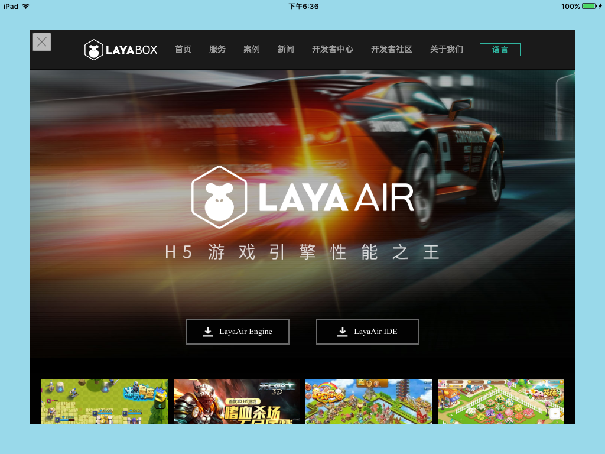

#webview

##紹介します

LayaNativeは標準のhtmlファイルをサポートしていませんので、プロジェクトによっては完全なhtmlページを表示する必要があります。この場合、LayaNativeが提供するwebviewインターフェースを表示することで実現できます。
###1.インターフェース定義


```typescript

    /**
     * 显示一个webview
     * @param url {string} 要显示的url地址。
     * @param posx {number} weview的左上角位置
     * @param posy {number} webivew的左上角位置
     * @param width {number} webview的宽度
     * @param height {number} webview的高度
     * @param canclose {boolean} webview是否可以被关掉。
     */ 
    setExternalLinkEx(url:string,posx:number,posy:number,width:number,height:number,canclose:boolean):void;
```


この関数はキャンバスの一番上に新しいviewを表示します。そこにurlの内容が表示されます。

`canclose`このwebviewがオフになるかどうかはパラメータを制御します。
＊設定`false`時:

コードは以下の通りです


    
```typescript

    document.addEventListener('touchstart',()=>{
        if(conch){
            var l = 50;
            var t = 50;
            var w = window.innerWidth - l * 2;
            var h = window.innerHeight - t * 2;
            conch.setExternalLinkEx('http://www.layabox.com',l,t,w,h,false); // canclose设置为false
            //conch.setExternalLink('http://www.baidu.com');
        }
    });
    ```


webviewが表示されたら閉じられなくなります。効果は以下の通りです。


    

図1

＊設定`true`時:

コードは以下の通りです


    
```typescript

    document.addEventListener('touchstart',()=>{
        if(conch){
            var l = 50;
            var t = 50;
            var w = window.innerWidth - l * 2;
            var h = window.innerHeight - t * 2;
            conch.setExternalLinkEx('http://www.layabox.com',l,t,w,h,true); // canclose设置为true
            //conch.setExternalLink('http://www.baidu.com');
        }
    });
    ```


*iosでは、小さなクローズボタンがあります。このボタンを押すと、webviewを閉じられます。効果は以下の通りです


        

図2

*ボタンを閉じると一部のページの内容が上書きされ、Androidデバイスにはバックボタンが提供されますので、Androidデバイスにはwebviewが表示されていますが、ボタンが閉じられていません。**後退ボタン**webviewを閉じます。次の図のように


        

図3この時後退ボタンをクリックしてwebviewを閉じることができます。

###2.制限
1.現在のwebviewはappとの対話ができません。
2.webviewの実現はシステムに依存しており、低バージョンのandroidは表示できないかもしれない。

**Tips**  
*1、conchはLayaNative環境でしか呼び出しができません。ウェブページのバージョンにはconchの定義がないので、存在するかどうかを判断する必要があります。＊
*2、as言語を使って開発する場合は、`Browser.window['conch'] `このようにしてconchオブジェクトを取得します。*


##二、コードの中でwebviewページを動的に閉じるにはどうすればいいですか？

下記のコードを呼び出してwebviewページを動的に閉じます。


```javascript

conch.closeExternalLink();
```
