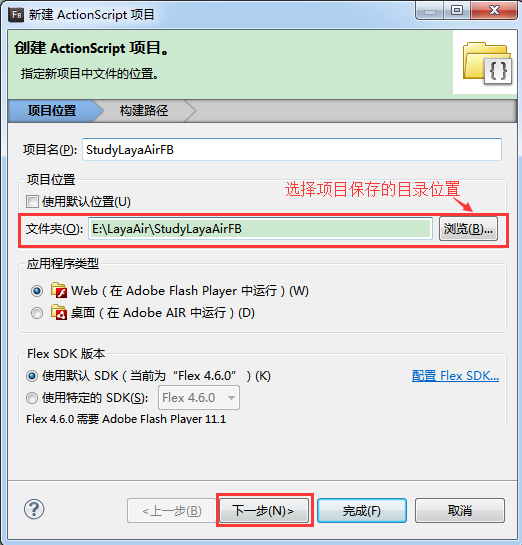
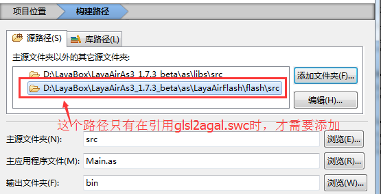
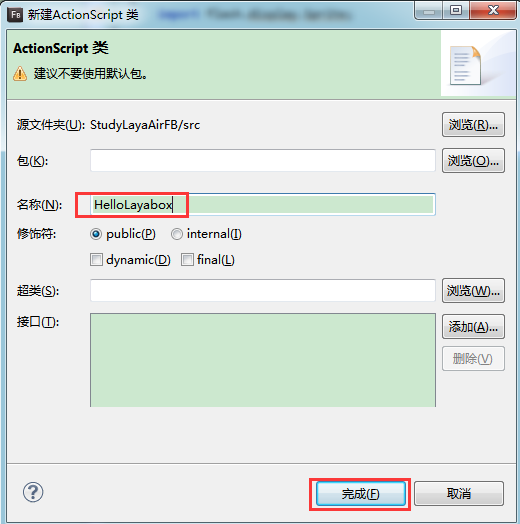
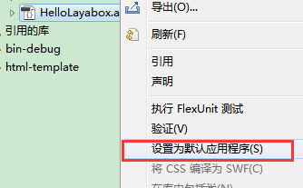
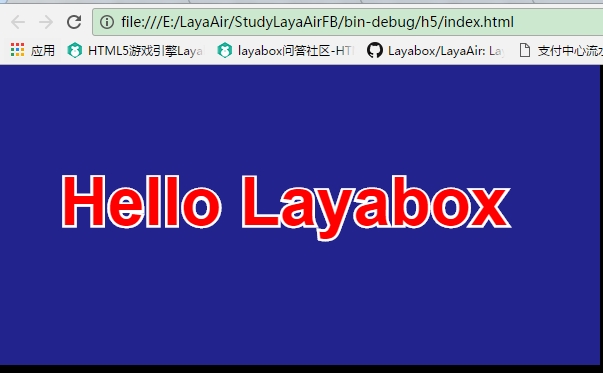

#FlashBuiler 에서 첫 번째 프로그램 "Hello Layabox"

>>**이 편은 AS3 언어를 사용하여 FlashBuilder 환경에서 텍스트 Hello Layabox 를 나타내며 본편을 완성하기 위해 Layair 엔진의 첫 번째 프로그램을 완성합니다.본편을 공부하기 전에 반드시 먼저 읽기: Flash Builder 개발 환경 설정**
>>
><LayairierIDE 로 AS3 프로젝트를 만들고 디렉터리 구조를 상세히 해명하고 프로젝트를 세웠다면 첫 번째 단계를 뛰어넘을 수 있습니다.우리는 모두에게 LayairierIDE 건립 프로젝트를 채택할 것을 건의합니다.
>>


##첫 번째 새 프로젝트

**절차 1**：

Flash Builder 열기, 메뉴 표시줄에 '파일' 을 누르고 '새로 만들기' 를 누르면 "Action Script 프로젝트" 를 클릭하고 항목을 만드는 창구에 들어간다.그림 1

<br />

(그림 1)


**절차 2**：

항목 이름 입력 표시줄에 항목 이름을 입력한 다음 '폴더' 입력 표시줄에 항목 메모리 목록을 입력하거나 '브라우징' 을 클릭해서 저장된 목록을 선택하십시오.다음 엔진 컴파일과 엔진 라이브러리 설정에 들어가는 '구축 경로' 를 누르십시오.그림 2 개

< br />
(2)


**절차 3**：

구성된 경로 '라이브러리 경로' 창 중 시스템 테이프를 먼저 삭제하는 SDK (목적은 가방을 피하기 위해서입니다.

'SWC 추가하기'를 클릭하고 엔진 가방에 있는'playerglobal.swc'를 추가합니다.

프로젝트의 플래쉬 버전의 수요가 있다면 Layair Flash 중'Layair Flash.swc'를 추가합니다.동도 3

< br / > (동영상 3)


***Tips**엔진 가방 디렉토리`LayaAirFlash/flash`폴더의`glsl2agal.swc`Flash 버전의 발표, 하지만 인용`glsl2agal.swc`이후 프로젝트의 원본 경로처에서 플래쉬의 라이브러리를 인용해야 한다.Layair Flash.swc 가 라이브러리를 모아 재활용할 필요가 없다.주의해야 할 건...`LayaAirFlash.swc`과`glsl2agal.swc`서류는 그중 하나밖에 도입할 수 없다.


**순서**：

swc 도입 후 폴더를 기본값으로 출력할 것을 건의합니다`bin-debug`설치하다`bin`시계가 네 개처럼.LayaiairIDE 프로젝트를 작성한 후 기본 발표 디렉터리는 일반적으로 UI, 애니메이션 등 게임디자인이 LayairIDE에 사용되므로, 프로젝트를 만들 때 통일할 것을 건의합니다`bin`.

 <br /> (图4)


**단계 5**：

경로를 구축하는 중 '.`源路径`"창에 클릭".`添加文件夹`"엔진 라이브러리 디렉토리" 또는 "브라우저" 엔진 라이브러리 소재 디렉토리 "을 입력하십시오. (주의: 엔진 라이브러리 디렉터리의 디렉터리가 libs 폴더 아래에 있는 src 파일) 을 입력한 후에 클릭을 클릭하여, 바로 엔진 라이브러리의 도입을 완성했습니다.동도 5 시

< br / > (동영상 5)

만약 우리가 Flash 버전을 발표할 필요가 있다면 이전 라이브러리 경로를 인용하는 것은`glsl2agal.swc`그렇다면 원본 경로 인용할 때는 플래쉬의 원고를 추가하기 (* Layair Flash.swc 인용할 필요가 없습니다 *) flash 라이브러리는 ')`引擎库目录\as\LayaAirFlash\flash\src`"디렉토리 안에는 5-2의 시사와 같다.

< br / > (그림 5-2)


**마지막으로 맨 아래의 '완성' 단추를 누르고 새 항목의 인도를 끝냅니다.**

　　


##2단계 텍스트 보이기 "Hello Layabox"

**절차 1**：

메뉴 표시줄 "파일" 에서 "새로 만들기" 를 선택하면 "Action Script 종류" 를 누르면 새 파일의 창을 엽니다.그림 6 개

< br / > (그림 6)


*Tips: 새로 지은 Action Script 프로젝트 중 프로젝트와 같은 이름의 Action Script 종류가 필요합니다. 이 종류에 쓰려면 안에 있는 Sprite 가방을 삭제해야 합니다. Flash 원생의 가방이기 때문에 삭제하지 않으면 틀립니다.*


**절차 2**：

이름 표시줄에 HelloLayabox 입력, "완성" 을 누르면 Action Script 종류를 만들 수 있습니다.그림 6-1

< br />
（6-1）


**절차 3**：

HelloLayabox.as 를 기본 프로그램으로 설정합니다.그림 7개

< br />
(그림 7)


**순서**：

Hello Layabox.as 를 더블 클릭하여 코드를 작성하기 시작합니다."Hello Layabox"의 텍스트를 무대에 추가하여 코드:


```typescript

package
{
	import laya.display.Text;
	public class HelloLayabox
	{
		public function HelloLayabox()
		{
			//初始化引擎
			Laya.init(600, 300);
			var txt:Text = new Text();
			//设置文本内容
			txt.text = "Hello Layabox";
			//设置文本颜色为白色，默认颜色为黑色
			txt.color = '#ffffff';
			//将文本内容添加到舞台 
			Laya.stage.addChild(txt);
		}
	}
}
```


**단계 5**：

코딩 편집을 마친 후, 기존 글에서 설정된 편집기를 사용하고, 편집 단추를 누르면 자동으로 chrome 실행 코드를 시작할 수 있습니다.그림 8

< br />

(그림 8)


실행 결과는 그림 9의 시사와 같다

< br />
(그림 9)


**단계 6**：

"Hello Layabox"는 이미 드러났지만 너무 누추해, 다음은 "Hello Layabox"를 예쁘게 만들어서 코드가 다음과 같습니다:


```typescript

package
{
	import laya.display.Text;
	public class HelloLayabox
	{
		public function HelloLayabox()
		{
			//初始化引擎
			Laya.init(600, 300);
			var txt:Text = new Text();
			txt.text = "Hello Layabox";
			//设置文本颜色   
			txt.color = '#FF0000';
			//设置文本字体大小，单位是像素   
			txt.fontSize = 66;
			//设置字体描边   
			txt.stroke = 5;
			//描边为5像素   
			txt.strokeColor = '#FFFFFF';
			//设置为粗体   
			txt.bold = true;
			//设置文本的显示起点位置X,Y   
			txt.pos(60, 100);
			//设置舞台背景色   
			Laya.stage.bgColor = '#23238E';
			//将文本内容添加到舞台   
			Laya.stage.addChild(txt);
		}
	}
}
```


실행 결과 10개

< br />
(그림 10)


이로써 당신이 본편 입문 과정을 따라 그림을 완성할 수 있는 디스플레이에 성공한다면, Google은 AS3 언어로 개발한 HTML5 프로그램을 완성할 수 있으며 Layair의 개발 환경설정이 틀림없다.더 많은 Layaiair 엔진이 개발한 API 사용 방법, 홈페이지 Layabox 개발자 센터가 온라인 API 와 온라인 DEME 를 살펴보세요.