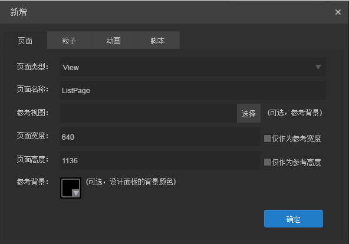
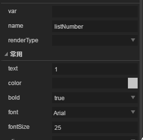
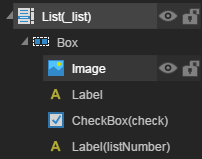
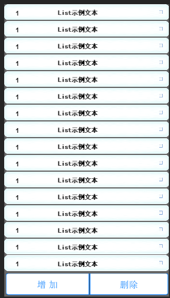
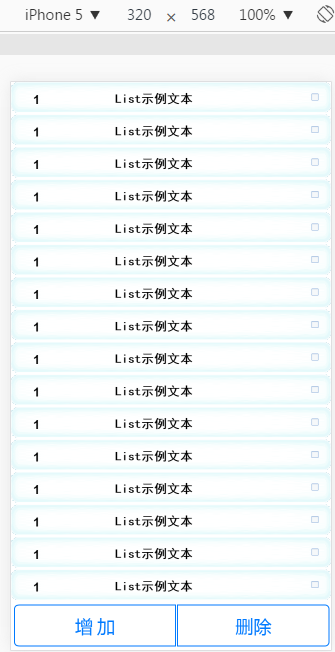
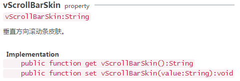
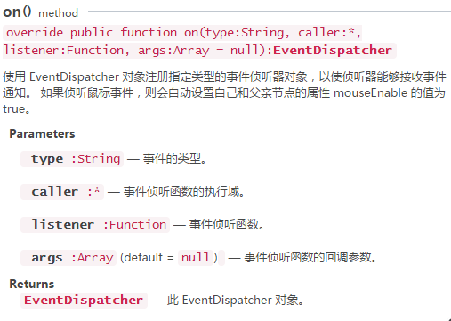

#List 예례: 표시, 증가, 삭제

List (목록) 은 비교적 자주 사용하는 기능이다.이 편은 Layair 엔진과 IDE 는 List 에 대한 List 표시, 증가, 삭제 등 관련 조작을 단계적으로 설명해 개발자 학습엔진과 IDE 실전 참전 참고를 제공한다.(항목 생성 등 기초 조작, 다른 문서, 본 편 건너뛰기)

###하나, 레이어이더로 UI 만들기

#####1.1 View 형식의 UI 페이지 만들기

​
(그림 1) Listepage라는 View 형식 UI 페이지를 만들기

우선 LayairIDE의 프로젝트 관리자 안에서 View 유형의 UI 페이지를 만들기, 폭이 640*1136입니다.페이지는 LisstPage로 이름을 붙였습니다.

#####1.2 UI 자원 가져오기

미술을 잘 만든 UI 페이지 자원 자원 관리자에 가져오기.(구체적으로 LayaiairIDE 자원 가져오는 문서를 참고합니다.)

​
(2)

#####1.3 구궁격으로 List 배경 만들기

**1.3.1 끌어당기고 List 배경을 무대로.**


​      
(그림 3) 그림 배경 bgu list.png 끌어당겨 무대

​**1.3.2 Image 속성에서 sizegrid 속성을 통해 구궁 칸을 설정합니다.**

​
(그림 4) sizegrid 속성 오른쪽 단추를 누르고 구궁 칸 설정 패널 열기

​**1.3.3 속성에서 width 가 640 (전체 화면 폭)**

​
(그림 5)


 #####1.4 List 용기 만들기

**1.4.1을 끌어당겨 checkbox.png 을 무대로, 속성 name 를 check 으로 설정합니다.**

​
(그림 6)

​**1.4.2 label.png 을 끌어당겨 무대에 올라가 속성 name listNumber, 다른 속성 참조도 7.**

​
(7) 번호 사용되는 label 구성 요소

​**1.4.3에서 label.png 을 끌어당겨 무대에 올라가 'List 예례 문본' 을 수정, 속성 설정 참조 8**

​
(그림 8) List 텍스트에 쓰이는 label 구성 요소

​**1.4.4 선택 list 배경 그림, 번호 label, 텍스트 label, checkbox, Ctrl + B 단축키로 박스 용기를 생성합니다.그리고 Box 용기를 선택하여 Box 속성 renderType 를 render 로 설정합니다.그림 9, 도 10.**

​
(그림 9)

​
(그림 10)

​**box 용기를 1.4.5에 클릭하여 다시 Ctrl + B 를 통해 List 용기를 생성하는 것은 그림 11.주의, 모든 List 용기, 반드시 Box 용기에 기반되어 있는 Box 용기에 기반되어 있는 모든 단계를 보면 더욱 또렷하고, list 는 box 순환에 기반되어 생기게 된다.**

​
(도 11)

​
(그림 12)

#####1.5 설정 List 속성

List 용기를 선택하십시오. Lis 속성 var 를 설정합니다. 이 변수를 통해 이 구성의 모든 속성을 호출할 수 있습니다. 그리고 실제에 따라 다른 속성을 설정하고, repetX는 X 축의 목록, repety는 Y 축의 목록, spacex는 X 축 목록, spacex는 Y 축 목록 간격입니다.그림 13개 시:

​
(그림 13)

#####1.6 추가 조작 단추

여기에서 바로 템플릿을 사용한 ButtonTab 을 사용하여 무대에 끌어당겨 올리고 노드를 누르고 var, label 속성 및 구궁칸 등을 설정합니다.그림 14, 그림 15:

​
(그림 14)

​
(도 15)

UI 위치 디테일 조정 후, 그림 16.F12 를 발표하면 코드 단계에 들어갈 수 있다

​
(도 16)

###2, Action Script 언어로 List 코드 논리 실현

#####2.1에서 만든 UI 페이지 보이기

2.1.1 List Demo.as 프로그램 파일을 생성하고 부팅으로 설정합니다.

​
(그림 17)

2.1.2 편집 코드, UI 보이기.

UI 종류를 불러오기, UI 종류를 추가하고, UI 가 사용한 그림 자원을 불러오기, 마지막 UI 인터페이스를 추가합니다.다음은 인코딩을 통해 세 코너를 실현합니다:


```java

  package 
  {
      import laya.display.Stage;
      import laya.net.Loader;
      import laya.utils.Handler;
      import laya.webgl.WebGL;
      import ui.ListPageUI;
   
      public class ListDemo 
      {
   
          public function ListDemo() 
          {
          Laya.init(640,1136,WebGL);
          Laya.stage.bgColor = "#ffffff";
           
          Laya.stage.scaleMode = Stage.SCALE_SHOWALL;
          //预加载资源文件后执行回调
          Laya.loader.load(["res/atlas/ListPage.atlas","res/atlas/template/ButtonTab.atlas"], Handler.create(this, onLoaded));
                   }       
           
           private function onLoaded():void
          {
          //实例UI界面
          var listView:ListPageUI = new ListPageUI();
          Laya.stage.addChild(listView);    
          }
      }
   
  }
```


​*Tips: 코드의 도화 경로는 자신의 항목의 실제 상황에 따라 유연하게 조정해야 한다*

2.1.3 인코딩이 완료된 후 F5 에 따라 18개 시, 페이지 표시와 IDE 제작의 효과가 일치한 후 논리 코드를 편집하기 시작합니다.


​        
(도 18)

#####2.2 코드 논리 작성

​**2.2.1 List 번호 논리 실현**

List 번호 데이터 추가를 하려면 'laya.ui.List' API 의 list 데이터 소스 어댑터 array, 단원격 렌더해진 프로세서 render와 'laya.display.Node' API 하위 노드 (API) 를 통해 차트 노드를 얻는 방법 getChildByNameAPI 를 먼저 살펴보자: 예를 들면 19, 그림 20, 그림 21.

​
(도 19)

​
(그림 20)

​
(도 21)


 **List 번호 추가 코드 다음과 같습니다:**


```java

  package 
  {
      import laya.display.Stage;
      import laya.net.Loader;
      import laya.ui.Box;
      import laya.ui.Label;
      import laya.utils.Handler;
      import laya.webgl.WebGL;
      import ui.ListPageUI;
   
      public class ListDemo 
      {
          private var listView:ListDemoUI;//UI面板
          private var arr:Array;//list数据数组
           
          public function ListDemo() 
          {
          Laya.init(640,1136,WebGL);
          Laya.stage.bgColor = "#ffffff";
           
          Laya.stage.scaleMode = Stage.SCALE_SHOWALL;
        Laya.loader.load(["res/atlas/ListPage.atlas","res/atlas/template/ButtonTab.atlas"], Handler.create(this, onLoaded));
          }
           
           private function onLoaded():void
          {
          //实例UI界面
          listView = new ListPageUI();
          Laya.stage.addChild(listView);    
          //获得List模拟数据，并渲染
          getListData(); 
          }
           
          private function getListData():void 
    {
     //添加list数据
     arr = [];
     for (var i:int = 1; i <= 30; i++) {
      arr.push({listNumber: {text:i}});
     }
     listView._list.vScrollBarSkin='';//添加list滚动条功能（UI不可显示）
     listView._list.array = arr;//数据赋值
     //list渲染函数
     listView._list.renderHandler = new Handler(this, onRender);
    }
               
            
               
               
  private function onRender(cell:Box,index:int):void 
    {
      //如果索引不再可索引范围，则终止该函数
                      if(index > arr.length)return;
                      //获取当前渲染条目的数据
                      var data:Object=arr[index];
                      //根据子节点的名字listNumber，获取子节点对象。         
                      var listNumber:Label=cell.getChildByName("listNumber") as Label;
                      //label渲染列表文本（序号）
                      listNumber.text=data.listNumber.text;
          }
      }
   
  }
```


코드 실행 결과는 그림 22개처럼, 번호 데이터의 도입을 성공적으로 실현하였다.구체적으로 논리와 코드 설명은 코드 및 주석을 직접 살펴본다.

​
(도 22)

2.2.2. List 서열 스크롤
30개의 아날로그 데이터가 위에 있는 예례가 실행된 후 16조밖에 볼 수 없다.따라서 스크롤 효과를 늘려야 한다.laya.ui.List 의 API 중 vScrollBarSkin 은 우리의 수요를 만족시킬 수 있으며 API 설명은 그림 23:

​
(도 23)
이 기능은 한 줄의 코드를 늘리면 모든 코드가 붙지 않고, 다음 코드를 부속 목록 데이터로 넣기 전에 추가합니다.


```javascript

//添加list滚动条功能
listView._list.vScrollBarSkin='';
```


다시 실행 효과

​
(사진 24)

2.2.3 실현 List 증가 기능

List 증가를 실현하려면 Layair 엔진 laya.display.Sprite 의 사건 수사 on()방법은 마우스 클릭 클릭 클릭, laya.ui.List API 에 단원적 데이터를 추가하는 방법 addItem();


​    
(도 25)

​
(그림 26)


 
```java

  package 
  {
      import laya.display.Stage;
      import laya.events.Event;
      import laya.net.Loader;
      import laya.ui.Box;
      import laya.ui.Label;
      import laya.utils.Handler;
      import laya.webgl.WebGL;
      import ui.ListPageUI;
   
      public class ListDemo 
      {
          private var listView:ListDemoUI;//UI面板
          private var arr:Array;//list数据数组
           
          public function ListDemo() 
          {
          Laya.init(640,1136,WebGL);
          Laya.stage.bgColor = "#ffffff";
           
          Laya.stage.scaleMode = Stage.SCALE_SHOWALL;
        Laya.loader.load(["res/atlas/ListPage.atlas","res/atlas/template/ButtonTab.atlas"], Handler.create(this, onLoaded));
          }
           
           private function onLoaded():void
          {
          //实例UI界面
          listView = new ListPageUI();
          Laya.stage.addChild(listView);    
          //获得List模拟数据，并渲染
          getListData(); 
          //侦听增加按钮点击事件
          listView.add.on(Event.CLICK,this, onAddClick);
          }
           
          private function onAddClick():void 
          {
               //添加单元格数据源
               listView._list.addItem({listNumber: {text:arr.length+1}});
          }
           
		private function getListData():void 
    	{
    		//添加list数据
    		arr = [];
    		for (var i:int = 1; i <= 30; i++) {
    		  arr.push({listNumber: {text:i}});
    		}
    		listView._list.vScrollBarSkin='';//添加list滚动条功能（UI不可显示）
    		listView._list.array = arr;//数据赋值
    		//list渲染函数
    		listView._list.renderHandler = new Handler(this, onRender);
    	}
            
               
    	private function onRender(cell:Box,index:int):void 
    	{
    		//如果索引不再可索引范围，则终止该函数
    		if(index > arr.length)return;
    		//获取当前渲染条目的数据
    		var data:Object= arr[index];
    		//根据子节点的名字listNumber，获取子节点对象。         
    		var listNumber:Label=cell.getChildByName("listNumber") as Label;
    		//label渲染列表文本（序号）
    		listNumber.text=data.listNumber.text;
    	}
}
   
 ```


자세한 상황은 코드 및 주석을 직접 보기:


코드 실행 효과

​
(그림 27) 목록 증가 효과 실현

2.2.3 List 증가 기능 삭제 기능

List 삭제 기능을 실현하려면 다선 상자 checkbox 기능, 삭제 버튼의 마우스 탐색, 삭제 후 데이터가 다시 과장된다.자세한 상황은 코드 및 주석을 직접 보기:


 
```java

  package 
  {
   import laya.display.Stage;
   import laya.events.Event;
   import laya.net.Loader;
   import laya.ui.Box;
   import laya.ui.CheckBox;
   import laya.ui.Label;
   import laya.utils.Handler;
   import laya.webgl.WebGL;
   import ui.ListPageUI;
   public class ListDemo 
   {
    private var listView:ListDemoUI;//UI面板
    private var arr:Array;//list数据数组
     
    public function ListDemo() 
    {
    Laya.init(640,1136,WebGL);
    Laya.stage.bgColor = "#ffffff";
     
    Laya.stage.scaleMode = Stage.SCALE_SHOWALL;
        Laya.loader.load(["res/atlas/ListPage.atlas","res/atlas/template/ButtonTab.atlas"], Handler.create(this, onLoaded));
    }
     
     private function onLoaded():void
    {
    //实例UI界面
    listView = new ListPageUI();
    Laya.stage.addChild(listView);    
    //获得List模拟数据，并渲染
          getListData(); 
    //侦听增加按钮点击事件
          listView.add.on(Event.CLICK, this, onAddClick);
    //侦听删除按钮点击事件
    listView.del.on(Event.CLICK,this,onRemoveClick);
          }
     
    private function onRemoveClick():void 
    {
     //创建一个新的数组，存放移除条目后的数据
     var temp:Array = [];
     for(var i:Number=0;i<arr.length;i++)
     {
      //将非选中状态的条目数据存储起来
      if(!arr[i].isCheck)
      {
       temp.push(arr[i]);
      }
     }
 
     arr = temp;
     //将新的数组赋值给list
     listView._list.array = arr;
    }
     
    private function onAddClick():void 
    {
      //添加单元格数据源
               listView._list.addItem({listNumber: {text:arr.length+1}});
    }
     
    private function getListData():void 
    {
     //添加list数据
     arr = [];
     for (var i:int = 1; i <= 30; i++) {
      arr.push({listNumber: {text:i}});
     }
     listView._list.vScrollBarSkin='';//添加list滚动条功能（UI不可显示）
     listView._list.array = arr;//数据赋值
     //list渲染函数
     listView._list.renderHandler = new Handler(this, onRender);
     //mouseHandler: list单元格鼠标事件处理器
              listView._list.mouseHandler = new Handler(this,onMouse);
    }
     
     
     
    private function onMouse(e:Event,index:Number):void 
    {
     //鼠标单击事件触发
     if(e.type == Event.CLICK)
     {
      //判断点击事件类型,如果点中的是checkBox组件执行
      if((e.target) instanceof CheckBox)
      {
       //记录当前条目所包含组件的数据信息(避免后续删除条目后数据结构显示错误)
       var tempObj:Object = arr[index];
        
       //根据check的选中状态，设置条目的数据信息
       if(((e.target) as CheckBox).selected)
       {
        listView._list.setItem(index,{listNumber:{text:tempObj.listNumber.text} ,isCheck:true});
       }
       else
       {
        listView._list.setItem(index,{listNumber:{text:tempObj.listNumber.text},isCheck:false});
       }
      }
     }
    }
     
    private function onRender(cell:Box,index:int):void 
    {
        //如果索引不再可索引范围，则终止该函数
         if(index > arr.length)return;
         //获取当前渲染条目的数据
        var data:Object= arr[index];
        //根据子节点的名字listNumber，获取子节点对象。         
        var listNumber:Label=cell.getChildByName("listNumber") as Label;
        //label渲染列表文本（序号）
        listNumber.text = data.listNumber.text;
       //获取当前渲染条目的check组件
       var check:CheckBox=cell.getChildByName("check") as CheckBox;
       //根据isCheck的值，确定当前check组件是否为勾选状态（可以避免出现其他多余的选中状态）
       if(data.isCheck)
       {
         check.selected=true;
       }
       else
       {
         check.selected=false;
       }
    }
   }
  }
 ```


실행 효과는 그림 28 시:

​
(사진 28) 2, 3, 4조 후 효과 삭제
​

이로써 우리는 목록의 UI 제작, 그리고 새로 증가, 삭제된 코드 논리를 완성했습니다.궁금한 점이 있으면 커뮤니티에 가서 "ask.layabox.com"을 제시해 주세요.


