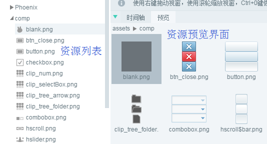
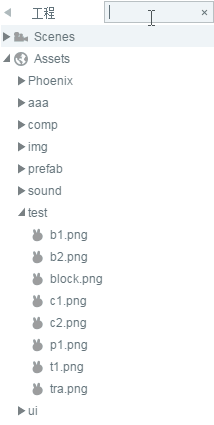
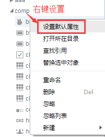
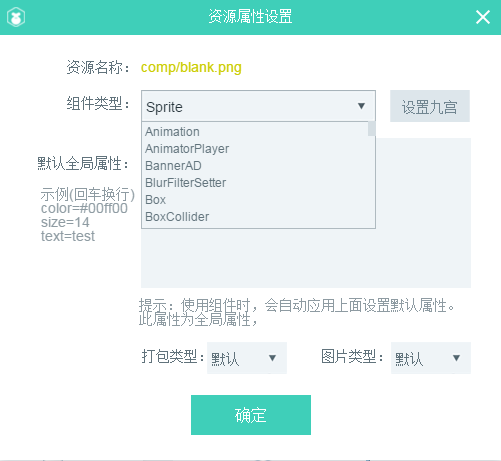
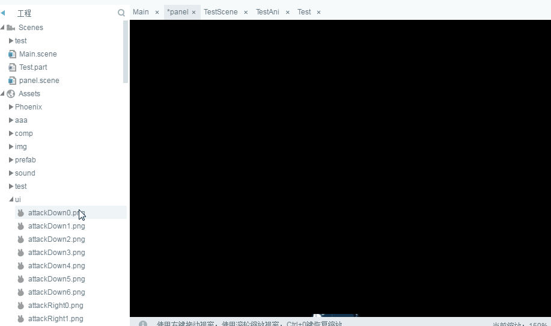
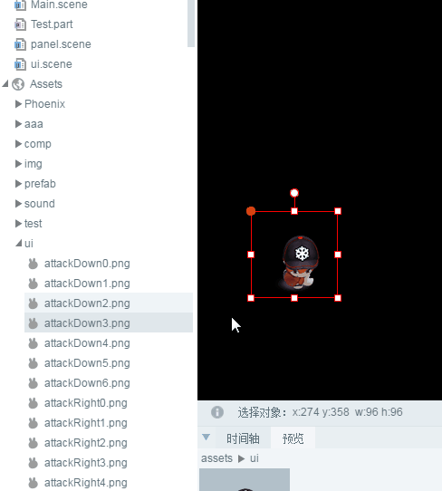
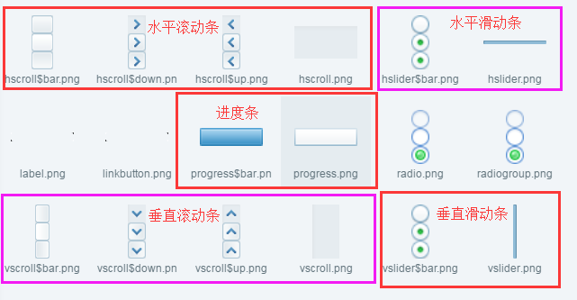

#자원 관리자 소개

자원관리자는 우리가 프로젝트 자원을 방문하고 관리하는 데 쓰이는 작업 영역이다.작업을 시작할 때 자원을 추가하는 것은 필수적인 절차이다.이 편은 자원 관리자의 기능 사용 및 자원 이름 규칙을 소개할 것이다.

##1、인터페이스 소개

자원 관리자는 프로젝트 자원 폴더의 내용은 나무 모양으로 전시되어 있으며, 그림 1개와 같이, 각 인터페이스 요소를 소개합니다.

< br / > (그림 1)

​`资源预览界面`자원 목록에서 선택한 자원은 바로`资源预览界面`드러나다

​`资源列表`있다`项目根目录/laya/assets/`디렉터리에 있는 자원이 다 있습니다.`资源列表`가운데 보이기.디렉터리나 디렉토리의 자원, 오른쪽 단추 선택`打开所在目录`운영 시스템의 디렉토리를 직접 열게 됩니다.

##2、기능 소개

###2.1 소재 디렉토리 열기

자원 관리자 중 모든 자원은 IDE 에서 관리할 수 있고 시스템 중 직접 관리할 수 있다.그러므로`选中`디렉터리나 자원 시`右键菜单`리드 클릭`打开所在目录`목록 열기를 직접 누르거나`功能按钮`직접 열다.조작은 그림 2 개처럼 보여 준다.

< br / > (그림 2)

###2.2 생성, 삭제, 새로 고침

####자원과 디렉터리 만들기

목록을 열 때 자원과 디렉토리를 만들 수 있습니다.예를 들어 필요한 자원이나 디렉토리를 자원 관리자 루트 디렉토리에 직접 붙여 (* 프로젝트 루트 목록 / laya / assets / *) 로 F5 를 새로 고친 후 자원은 IDE 에 사용할 수 있습니다.

####삭제

디렉터리나 자원을 삭제할 때 두 가지 방식이 있다.첫 번째는 IDE 에서 삭제할 자원이나 디렉터리를 선택하거나 오른쪽 단추를 누르거나 직접 Delete 키를 누르십시오.두 번째는 디렉토리를 열고 시스템 디렉토리에서 직접 삭제합니다.둘 다 삭제하면 자동으로 새로 고칠 수 있다.

*Tips: F5 단축키는 자원 관리자뿐 아니라 항목 관리자도 새로 고칠 수 있으며, 만약 수정된 자원이 UI 프로젝트에서 사용된다면 F5 단축키를 눌러야 한다.*

자원과 디렉토리에 대한 생성, 삭제, 새로 고침 동작 등을 참고할 수 있습니다.

< br / > (동영상 3)

###2.3 필터 자원

자원이 많을 때 자원 관리자 검색 상자에 텍스트 키워드를 입력해서 필터 자원을 빠르게 찾을 수 있습니다.동작이 동영상 4개와 같다.

< br / > (동영상 4)

###기본 속성 설정

자원이나 디렉터리를 선택하면 기본 속성을 오른쪽 단추를 설정하거나 자원 관리자 최하층의 기능을 클릭할 수 있습니다.

< br / > (그림 5)

클릭`设置默认属性`뒤 면 자원 속성 패널 설치, 그림 6 개처럼.

< br / > (그림 6)

**패널 소개 설정**

`资源名称`자원 관리자의 자원 이름과 경로를 표시합니다.

`组件类型`구성 요소 종류의 하위 옵션은 모든 구성 요소 종류 (* 모든 구성 요소 형식을 볼 수 있으며, 문서 'IDE 구성 요소 상세 해제 *) 를 변경하려면 IDE 기본 인식 요소 형식을 변경하려면 다른 구성 요소 형식으로 설정할 수 있습니다.

`设置九宫`구궁격 속성을 자원으로 설정하기 위해 이 기능의 효과와 속성 설정기 중 구궁격의 구궁 칸 설정이 같은 구체적인 조작 참조 참조 장치 중 구궁격 설정 설명입니다.

`默认全局属性`이 칼럼도 대응`属性设置器`속성 설정, 예를 들어 구성 요소의 속성 width 가 800으로 설정하려면 이 표시줄에 'width = 800' 을 설정하면 됩니다.여러 개의 속성을 미리 설정하려면, 직접 스트라이크에 여러 개의 속성값을 설정하면 된다.그림 7개

< br / > (7)

**Tips:`设置九宫`과`默认全局属性`설정, 구성 요소 속성에 속한 미리 설정합니다.같은 구성 요소 자원이 여러 곳에서 사용되며 같은 속성을 설정할 때 많은 중복성을 줄일 수 있습니다.**

`打包类型`：`默认`항목 설정 (F9) 의 포장 규칙을 적용합니다.이 외에도, 이런 기능을 통해 자원에 수동적으로 설정할 수 있다`打包`혹은`不打包`.비기본 옵션으로 설정된 다음 지정한 패키지 유형의 우선순위가 프로젝트 설정보다 높습니다.

`图片类型`아이디에서 두 장의 이웃 사진 맞춤이 완료되었지만 브라우저가 실행할 때 맞춤형 빈틈이 존재합니다`Repeat`바로 해결할 수 있다.

###2.5 사용 자원

선택한 자원을 선택하면 마우스를 스크린으로 끌어당기면 이 자원 구성 요소를 사용할 수 있습니다.

< br / > (동영상 8)

###2.6 인용과 텍스트 바꾸기

####인용을 찾다

자원 구성 요소를 선택하면`右键`클릭`查找引用`클릭`查找`현재 선택한 구성 요소를 찾을 수 있습니다.동작은 동도 9가 제시한 것과 같다.

< br / > (동영상 9)

####텍스트 바꾸기

… 에`查找替换`클릭`替换`모든 것을 바꿀 수 있다`查找文本`중 은 같다`skin属性`내용.동도 10개와 같이.

< br / > (동영상 10)

###2.7 키 바꾸기 장면 편집기 중 선택된 구성 요소

선출`场景编辑器`그 다음`右键`뽑다`资源管理器`변경할 자원, 오른쪽 단추 메뉴를 누르십시오`替换选中对象`스크린 편집기 중 구성 요소를 하나로 바꾸면 동영상 11시에 보여 줍니다.위치를 조정하였을 때, 다른 자원을 바꾸려고 할 때, 이 기능은 비교적 실용적이다.

< br / > (동영상 11)

 *Tips: 하나의 키를 바꾸는 것은 같은 종류의 구성 요소를 바꿀 수 있을 뿐만 아니라, 키를 하나하나 다른 유형의 구성 요소를 바꿀 수 있다.*

##3, 자원 이름 규칙

자원 관리자의 자원은 장면 편집기에서 구성 요소로 인식하고, 구성 요소 형식의 기본 방식은 자원의 이름의 접두사입니다.예를 들어 btnxxxxx 이름이 버튼으로 인식됩니다. tabu xxx xxx 이름이 Tab 구성 요소로 인식됩니다.다음은 자원 명명의 자세한 규칙에 대해 소개하고 개발자는 반드시 기억을 숙련시켜야 한다.구성 요소에 대한 이해가 안 되는 개발자라면 'IDE 구성 요소 상세' 문서를 먼저 읽으십시오.

###3.1 기초 구성 요소의 명명 규칙

LayairIDE 기초 구성 요소 기본 자원 이름 규칙을 열거합니다:

1244 기초 구성 요소 이름 124테오 중국어 이름 (하) 1244 자원 접두사 (전 (하) 대문자 (하) 124구 (하) 대문자 (하) 대문자
----------------------------------------------------------------------------------------------------------------------------------------------------------------------------------------------------------------------------------------------------------------------------------------------------------------------------
일렉트론
테xtInput
테xtArea
테두리 버튼
테크박스
테라다이오
테라테타
테두리 단선틀 버튼
일렉트릭
하이라이트
테크닉
일렉트릭
1244코스 프로그레르
comboboboboox
1244대 VScrollbar 수직 롤러
12414 HScrollbar 수평 롤러
이메이지
1244사 프릴라

**Tips**자원은 접두사 이름의 전사나 약자를 직접 쓸 수 있으며 하선을 넣지 않는다.예컨대`textinput.png`과`input.png`.하지만 다른 문자를 따라다니면 반드시 밑줄을 쳐야 한다`inputAAA.png`입력 상자 구성 요소로 인식되지 않고,`input_AAA.png`입력 상자 (TextInput) 구성 요소를 인식합니다.

###특수 구성 요소

IDE 셀프 테이프의 특수 구성 요소는 각각 수직 슬라이드 VSlider, 수평 슬라이드, 수평 슬라이드, 연결 요소 Progressbar, 수직 구르기 구성 요소 VScrollbar, 수평 스크롤 요소 HScrollbar.

####특수 구성

특수 구성 요소는 싱글 사진이 아니라 여러 장의 그림으로 구성된다.주 자원 사진 의 명명 규칙 은 기초 구성 요소 의 명명 규칙 을 준수 하고 부가자원 은 두 부분 으로 구성되어 있다`$`부호와 연결되어,`$`이전에는 주자원의 명칭이다.`$`다음은 관련 상태의 명칭이다.

`bar`가리키다`滑动\移动`상태.예컨대`ProgressBa$bar.png`이름 에서 알 수 있 는 것 을 알 수 있 는 Progressbar 구성 요소 에서 진도 가 발생 했 다`bar`사용`ProgressBa$bar.png`자원.

`down`가리키다`向下`상태.가로로 스크롤`down`보통`向右`기본 상태나 클릭 상태입니다.

`up`가리키다`向上`상태.가로로 스크롤`up`보통`向左`기본 상태나 클릭 상태입니다.

특수 구성품의 명명과 구성은 더 직관적인 이해를 하고 싶다면 그림 12중의 자원 이름을 비교할 수 있다.

< br / > (그림 12)

**Tips**：*때문`资源管理器`특수 구성 요소에 대한 부가자원을 단독으로 표시하지 않습니다. 목록에서 메인 자원 구성 요소만 나타납니다.특수 구성 요소 자원을 조작하려면 통과해야 한다`打开所在目录`기능은 시스템의 파일 디렉토리에서 관리를 합니다.*

###3.3 용기 구성 요소

용기 구성 요소는 Box, List, Tab, Radiogroup, Viewstack, Panel, HBox, VBox, Tree, Sprite 등이 포함되어 있다.Tab 외에 자원 목록에서 나타날 수 없는 것이 아니라`场景编辑器`중간에 바꾸어 오다`场景编辑器`내선 단일 또는 여러 구성 요소를 선택할 때 단축키를 통과합니다`Ctrl + B`용기로 변환할 수 있는 여러 종류는 하라 목록에서 볼 수 있으며, 그림 13개가 보여 준다.

< br / > (그림 13)

###3.4 사용자 정의 구성 요소 인식 접두사

IDE 기본 구성 요소 접두사를 사용하지 않으려면 어떻게 수정해야 합니까?고치다`laya.editorUI.xml`파일에 대한 구성 요소 설정이 가능합니다. 모든 IDE 테이프 구성 요소 관련 정보를 저장합니다.

`laya.editorUI.xml`에 자리잡다,...`LayaAirIDE根目录\resources\app\out\vs\layaEditor\renders\`목록 아래.

`resName`중 값 은 구성 요소 의 접두사 약자 이름 (구성 요소 의 접두사 전칭 불가 수정), 수정`resName`값이면 된다.예컨대 우리 장수`Button`구성 요소의 식별 접두사 유래`resName="btn"`resName = "bt" 로 변경잘 저장하고 IDE 편집기를 새로 고침 하고, btn 접두사를 이름한 Button 자원을 Image 자원으로 인식하고, bt 접두사에서 이름한 자원은 Button 구성 요소로 인식된다.그림 14개.

< br / > (그림 14)

*Tips: 특수 수요가 없는 상황에서 기본 접두사를 수정하지 않기 건의합니다.*

###3.5 식별할 수 있는 자원 종류 (자원 접미사)

Layaiair IDE 식별된 이미지 자원 형식은 표준 png 과 jpg 이미지 형식입니다.다른 형식의 그림 자원이나 다른 형식의 자원을 사용하지 마십시오. png 과 jpg 의 그림 자원으로 바꾸십시오.

