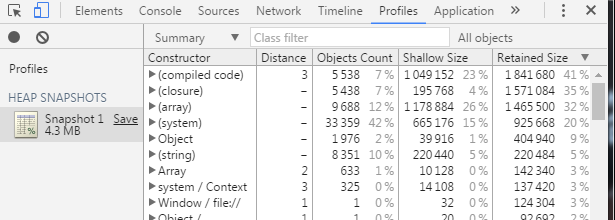

#크로미의 성능 분석기를 사용하다

>성능 분석기 (Profiles) 는 크로미 개발자 도구의 일부이며 페이지 오른쪽 키를 통해 심사원소를 선택하거나 구글 브라우저 페이지 페이지를 F12 로 누르면 chrome 개발자 도구를 열 수 있습니다.그리고 Profiles 를 클릭하여 성능 분석기 (Profiles) 패널로 전환합니다.
>>

 

###1, CPU 점용 분석

####1.1 CPU 성능 분석기 시작

뽑다`Record JavaScript CPU Profile`Start 단추나 왼쪽 각의 솔직한 원점을 누르면 바로 현재 홈페이지의 방법을 기록하기 시작한다.1-1의 지시대로.

< br / > (그림 1-1)

####1.2 CPU 성능 분석기 감시

이 성능 분석기의 CCTV 기록을 끝내려면 Stop 단추를 눌러야 한다.1-2의 지시대로.

< br / > (그림 1-2)

###1.3 CPU 성능 분석기 기록 보기

CCTV 종료 후 왼쪽 Profiles 아래에서 CCTV 결과 파일을 열 수 있으며, 이 모니터 결과를 열 수 있는 파일을 누르십시오.그림 1-3

 （图1-3）

모니터 결과는 데이터 표 형식으로 드러났다.우리는 소모 순위에 따라 Function 에서 제공한 함수명을 찾을 수 있으며 성능 소모가 비교적 큰 곳에 대해 최적화할 수 있다.

###2、메모리 점용 분석

####2.1 메모리 분석 시작

뽑다`Take Heap Snapshot`클릭`Take Snapshot`버튼(왼쪽의 검은색 동그라미를 클릭할 수 있다), 예를 들어 2-1의 시사하고,

< br / > (2-1)

생성된 메모리 스냅샷 파일은 데이터 양식의 형식으로 현재 웹 페이지 대상의 개수, 차지하는 메모리 크기 등입니다.

####2.2 메모리 스냅샷 기록

메모리 분석을 시작하면 왼쪽에 있는 Profiles 코너에서 현재 웹 페이지의 메모리 스냅샷 파일을 생성할 수 있습니다.그림 2-2의 시사와 같은 데이터를 볼 수 있습니다.

< br /> (2-2)

####2.3 메모리 스냅샷 분석

첫 메모리 스냅샷을 찍은 후 왼쪽의 도트점을 누르면 새 메모리 스냅샷을 기록할 수 있습니다.두 번째 메모리 스냅샷을 선택하면 Comparrison 모드를 선택할 수 있습니다.분석을 통해 홈페이지를 최적화하다.

​< br >>
(2-3)

​< br >>
(그림 6)