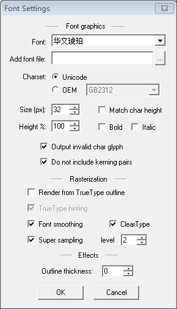
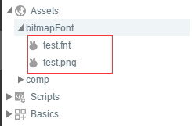

#비디오 글꼴 제작 및 사용

Starling 또는 Cococos, 심지어 유니티의 글꼴은 분명 낯설지 않고 간단한 그림을 넣고 사용자 정의 텍스트를 넣으면 항목에서 보기 좋은 텍스트를 표시할 수 있다.레이어에서도 비디오 글꼴 사용과 디스플레이를 지원합니다.다음은 비디오 글꼴 레이어에서 사용하는 효과입니다.

###비디오 글꼴 만들기

1. 내보내는 텍스트를 txt 텍스트에 쓰십시오.

</br>>

2. 파일 선택-> 유니코드 인코딩으로 다른 이름으로 저장된 txt 파일입니다.

</br>>

3. windows 아래 무료 비디오 글꼴 제작 도구 Bitmap Font Generator 다운로드.
다운로드 주소:[http://www.angelcode.com/products/bmfont/](http://www.angelcode.com/products/bmfont/install_bmfont_1.13.exe)

4. 소프트웨어를 켜고 Opotion-> FontSetting, 내보내야 할 글꼴의 일반 설정을 설정하고 오케이 단추를 누르십시오.

</br>>

**중요 인자 설명:**

Font: 내보내는 비디오 글꼴입니다.
Size: 내보내는 비디오 글꼴 크기를 설정합니다.사용할 때 얼마나 큰 글자가 필요한지 여기에 같은 크기의 글자를 설정할 것을 건의합니다.
Height: 글꼴의 스트레칭 높이를 설정하고 기본 100% 유지하면 됩니다.
 *주의: Charset 값은 유니코드를 선택합니다.*

</br>>

5. 메뉴 표시줄 Edit-> Select chars from file, 방금 만든 txt 파일을 선택합니다. 힌트를 사용하지 않으면 txt 파일은 유니코드 파일과 글꼴이 포함된 글꼴을 체크하십시오.

</br>>

6. 내보내기 스타일을 설정하고 메뉴 표시줄의 Options - > Export Options, Export Options 설정 내보내기 옵션 설정을 완료하고 오케이 단추를 누르십시오.

Padding: 텍스트 안에 테두리나 문자의 주변에 비워두면 얼마나 큽니까.후기 스타일을 할 때 이 속성은 매우 중요합니다. 테두리, 발광 등 특효로 사용해야 합니다.예를 들어 2px 테두리를 추가하고 오른쪽 아래쪽 2px 투샷을 추가해 패ding: 2px 4px 2px 2px 2px 2px 2px
Bit depth: 32명, 그렇지 않으면 투명층이 없다.
Presets: 글꼴 초기화된 색상 채널 설정, 즉 글꼴 초기 색상 설정이 어떤 것인지, 화이트 글자를 사용하면 화이트 글자로 직접 설정할 수 있습니다.
Font descriptor: 글꼴 설명 파일, xml 선택
Textures: 텍스처 그림 형식, png 선택

</br>>

7. 비디오 글꼴 내보내기.메뉴 표시줄의 Options -> Save bitmap font as...글꼴 묘사 파일 (. fnt 형식) 과 글꼴 무늬도 파일 (.


###레이어 항목에서 비디오 글꼴 사용

1. 프로젝트의 출력 목록에 자원을 넣어라.
내보내는 비디오 파일을 같은 이름으로 바꾸어 (.fnt 파일과 png 파일로 변경한 다음 레이야아 프로젝트의 bin/ res 디렉터리에 넣습니다.

</br>>

그림: testu 0.png 이름을 test.png 으로 바꾸어 fnt 파일과 동명이라고 보증합니다.test.png 과 test.fnt 파일을 bin/res 디렉토리에 넣어두세요.

**비디오 글꼴이 Layair 항목에서 일반적인 사용 방법:**

1. 비디오 글꼴 개체 생성.

2. 비트맵 글꼴을 탑재해 완성 여부를 탐색한다.

3. 비디오 글꼴 등록.

4. 글꼴 사용.

다음은 완전한 예례가 실행되는 효과가 있다.

</br>>

완전한 코드 다음과 같이:


```typescript

//初始化引擎
Laya.init(550,400);
//自定义文件名称
var mFontName = "diyFont";
var mBitmapFont = new Laya.BitmapFont();
//这里不需要扩展名，外部保证fnt与png文件同名
mBitmapFont.loadFont("res/test.fnt",new Laya.Handler(this,onLoaded));
function onLoaded(){
init();
}
function init(){
//如果位图字体中，没放空格，最好设置一个空格宽度
mBitmapFont.setSpaceWidth(10);
Laya.Text.registerBitmapFont(mFontName,mBitmapFont);
var txt = new Laya.Text();
txt.text = "asdfghjk";
//设置宽度，高度自动匹配
txt.width = 250;
//自动换行
txt.wordWrap = true;
txt.align = "center";
txt.color = "ff00ff";
//使用我们注册的字体
txt.font = mFontName;
txt.fontSize = 50;
txt.leading = 5;
Laya.stage.addChild(txt);
}
```


### **Text 종류 관련 인터페이스:**

**regiter Bitmapfont() 방법**

public stattic function regiterBitmapFont (name: Stmapfont: Bitmapfont: void

비디오 글꼴 등록.

인자

name: String — 비디오 글꼴의 이름입니다.
bitmapfont:Bitmapfont — 비트맵 글꼴 파일입니다.

**unregiser Bitmapfont() 방법**

public stattic function unregiserbitmapfont (name: String, destory: boolean = true: void

등록된 비디오 글꼴 파일을 삭제합니다.

인자

name: String — 비디오 글꼴의 이름입니다.
destory:boolean(default=true)—현재 글꼴 파일을 없애지 않았는지.

###BitmapFont 종류 관련 인터페이스:

**loadFont() 방법**

public function loadFont (path: String, complete: Handler):void

지정한 비트맵 글꼴 파일 경로를 통해 비트맵 글꼴 파일을 불러옵니다.

인자
path:String—비디오 글꼴 파일의 경로.
complete: Handler — 가재 완료된 반전을 알립니다. 상층 글꼴 파일은 이미 불러오기 및 해상을 알립니다.

**parseFont() 방법**

public function parseFont (xml: XmlDom, texture: Texture: void

글꼴 파일을 분석하다.

인자

xml: XmlDom — 글꼴 파일 XML.
texture: Texture — 글꼴 텍스처.

**destory() 방법**

public function destory ():void

비트맵 글꼴을 없애고 Text.unregiser Bitmapont을 호출할 때 기본값으로 소각됩니다.

**setSpacewidth () 방법**

public function setSpacewidth (spaceWidth: Number):void

빈칸의 넓이를 설정합니다 (글꼴이 빈칸이 있으면 여기에는 설정할 수 있습니다.

인자

spacewidth:Number-너비 단위


###Layair IDE 에서 비디오 글꼴 사용하기

1. 글꼴 파일을 Layair IDE 프로젝트의 자원 디렉터리에서 (laya / asets /), 두 파일의 이름이 같을 경우 test.fnt, test.png, 이렇게 자동으로 test 의 비트맵 글꼴을 등록합니다.

</br>


2. 비트맵 글꼴의 텍스트 구성 요소를 설정하는 font 속성치를 편집기 위젯 글꼴의 이름으로 설정합니다.

</br>>

3. 프로그램 코드에서 비디오 글꼴의 페이지를 실제 사용하기 전에 페이지를 생성하고 등록 페이지에 사용한 비디오 글꼴을 생성해야 합니다.