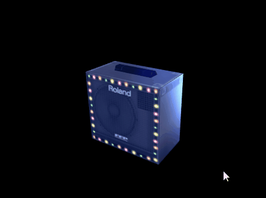
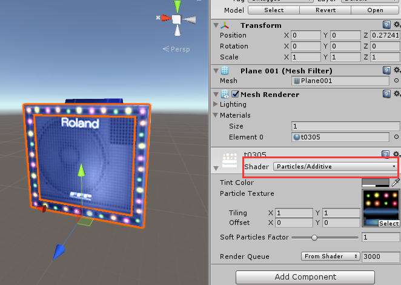

#Layair3D 애니메이션 2

지난 장절 과정에서 뼈 애니메이션의 유닛 처리와 내보내는 것을 알게 되었고, 이번 축제에서 재질 애니메이션과 강체 애니메이션 제작과 사용을 계속 소개할 것입니다. 3D 게임의 특효에서 매우 광범위하게 운용됩니다.

###재질 애니메이션

골격 애니메이션은 주로 모형 정점을 바꾸는 방식으로 애니메이션이 생기고, 재질 애니메이션은 소재의 색깔과 스티커를 바꾸는 방식으로 애니메이션이다.

3차원 소프트웨어에서는 3ds max 중에서 재질 관련 애니메이션을 만들 수 있지만 FBX 형식으로 내보내면 유닛은 인식할 수 없고 Layair 3D 엔진이 식별된 소재 애니메이션이 나올 수 없다.따라서 게임 모형 소재 애니메이션은 유닛에서 제작해야 일부 설정을 내보내야 Layair 3D 엔진을 사용할 수 있다.

다음은 네온사인 소재 애니메이션(도1)효과로 유네티에서 애니메이션 만들기 및 사용법을 작성하고 단계는 다음과 같다.

(1)</br>>


###모델 가져오기, 재질 종류 수정

3ds max 에서 제작한 에어컨 박스, 네온사인 테이프를 FBX 로 내보내면 유닛(개발자들)에서 3ds max 에서 소재 애니메이션 을 만들어 내며 사용하면 유닛에서 방송이 불가능하다는 것을 발견할 수 있다.

작업할 애니메이션 모형을 끌어당겨 오른쪽 인터페이스에서 소재를 수정하고, Shader 유형으로 입자 가색 타입 Particles/Adddive (현재 이 소재의 애니메이션 형식만 지원하고 있으며 다른 shader 유형 내보내면 틀립니다.

(2)</br>>


###재질 애니메이션 만들기

1. 소재 유형을 수정한 뒤 애니메이션 모델을 만들어 메뉴 표시줄 윈도우 하에 애니메이션 편집 인터페이스를 열어 단축키 Ctrl+6.

2, create 단추를 누르고 애니메이션 만들기를 누르고 이름을 지었습니다. 이 경우 UvAnimation으로 이름하여 저장한 후 자원 관리자에서 애니메이션 파일을 생성합니다.

3. 시간 축의 시간, 재질 수정 UV 속성 Ofset X 방향, 0.05초당 UV 위치0.25(스티커가 왼쪽으로 25% 정도 이동, 네온사인 모델 소재 변화를 볼 수 있어 시간별로 조정, 애니메이션 순환을 형성한다.

4, 애니메이션 프레임 수정 곡선 변화, 기본 선형 슬라이드 애니메이션, 우리의 애니메이션 수요에 부합되지 않고, 변량 변화, 재질 애니메이션 수요에 따라 완성.물론 흐르는 물과 구름이 떠다니는 애니메이션을 만들어야 선형 변화 방식을 만들 수 있다.

**tips: standard 표준 Shader 타입 소재 애니메이션 편집 인터페이스 왼쪽 상자에 Layair가 지원하지 않는 속성이 나타났습니다. 예를 들어 재질 Emisssion 속성이 있으며 자원 내보내면 오류가 발생할 수 있습니다. 오른쪽 키를 제거하면 정상적으로 내보낼 수 있습니다.**

이 제작 애니메이션 방식은 3ds max 에서 프로젝트를 기본적으로 제작할 수 있으며 미술 디자이너는 유닛에서 직접 편집할 수 있다.

(2)</br>>


###애니메이션 컨트롤러 만들기

이전 애니메이션 컨트롤러와 같이 자원 관리자의 오른쪽 단추를 누르고 애니메이션 컨트롤러로 이름을 지어 UvAction, 더블 클릭을 열어 만든 애니메이션 파일 uvAnimmation을 애니메이션 컨트롤에 끌어 넣었다.

모형을 선택하면 애니메이션 컨트롤러를 모형으로 끌어들이는 애니메이션 구성 요소에서 유닛을 누르면 애니메이션이 우리의 수요에 따라 방영되는 것을 볼 수 있다.

(사진 4)</br>>


###애니메이션 자원 내보내기

유닛에서 애니메이션 편집을 잘 하고, 레이레이레이어 플러그인으로 Sprite3D 형식을 내보내며 lh 자원을 내보내지 않았다면, 자원을 프로젝트에 복사하는 h5 디렉터리에 직접 사용할 수 있습니다.

이하 코드 참조, 애니메이션 2000밀리초 후 애니메이션 정지


```typescript

//创建加载材质动画模型
Laya.Sprite3D.load("LayaScene_CeShiDemo/Cube.lh",Laya.Handler.create(this,function(sp){
  var box = scene.addChild(sp);
  //获取模型上的动画组件
  var ani = sp.getChildAt(0).getComponent(Laya.Animator);
  //动画2000毫秒后停止
  Laya.timer.once(2000,this,this.onLoop);
}));
}
var _proto = Main.prototype;
_proto.onLoop = function(){
  //动画暂停（把动画的播放帧速改为零）
  this.ani.speed = 0;
}
```


###강체 애니메이션 (애니메이션 변환)

강체 애니메이션은 모형 정점, 소재의 기초를 바꾸지 않고 모형만 회전, 축소, 위축된 애니메이션, 이런 애니메이션은 게임에서도 자주 사용한다. 예를 들어 발바닥 광선, 칼빛 등을 말한다.물론 강체 애니메이션과 소재 애니메이션도 자주 결합되어 사용된다.

강체 애니메이션과 재질 애니메이션은 제작에도 차이가 있다. 재질 애니메이션은 유닛에서 만들어야 한다. 그렇지 않으면 애니메이션은 식별할 수 없고, 강체 애니메이션은 3D 소프트웨어에서 유닛 프로그램을 제작한 뒤 유닛을 도입할 수 있다.

untiy 에서 애니메이션 편집, 강체 애니메이션 및 재질 애니메이션 결합 사용, 입자 특효 애니메이션, 효과는 더 좋고, 3차원 소프트웨어는 기본 모형 도입만 제공합니다!

이하 제작된 강체 애니메이션 효과(도 5)는 네개의 모듈에 각각 다른 소재를 사용한 뒤 모형에 대해 회전 및 축소 수정을 위해 애니메이션을 사용했다.

(图5)</br>


###카메라 애니메이션

Layaiair 카메라는 아직 내보낼 수 없습니다. 미래 버전에서 카메라가 엔진에 사용될 수 있으므로 유닛에서 카메라 애니메이션을 제작한 후 게임에서도 통제할 수 있습니다.

유닛의 애니메이션 제작 방법과 강체 애니메이션이 일치하면 속성 애니메이션 수정을 할 수 있다.가재 방식도 일치한다.