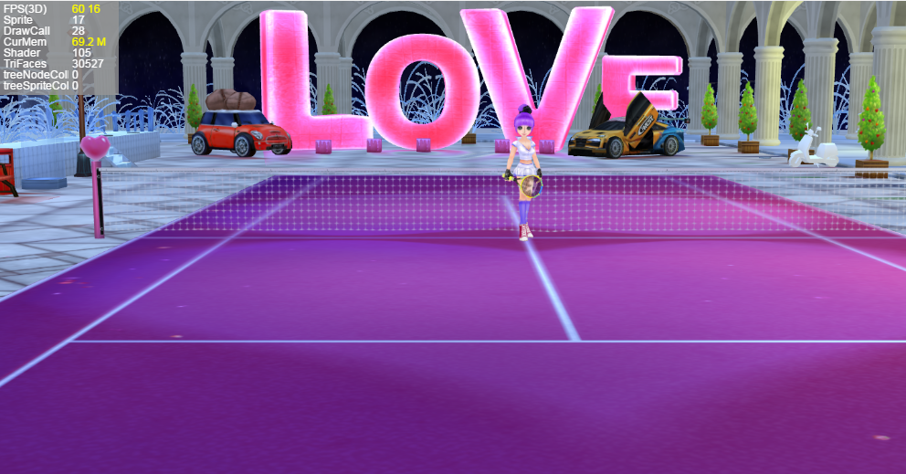
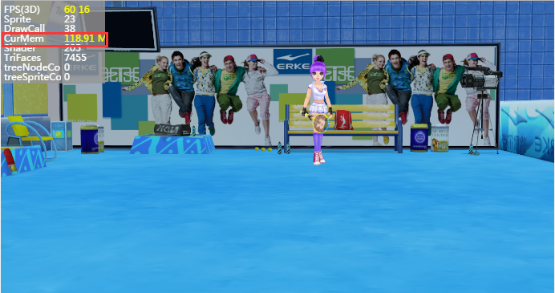

#Layaiar3D 자원 석방

###### 修改时间:2019-4-24,version:2.0.1

###왜 자원을 석방합니까

Layaiar3D 게임 개발에서 자원 석방이 중요하다.3D 자원은 모형, 스티커, 재질, 애니메이션 등을 포함해 좋은 화면 효과를 위해 파일이 2D보다 많을 것이며, 3D 엔진은 기본적으로 GPU 에 넣어서 렌더를 계산하기 때문에 많은 현존을 점용한다.게임의 관람카드가 계속 가재되고, 게임이 끊임없이 깊숙이 들어가 있는 자원이 갈수록 늘어나고, 자원을 방출하지 않으면 게임이 결국 무너진다.

메모리 같지 않고 메모리 쓰레기 회수 메커니즘이 있으며, 현존이 다르므로 수동적으로 석방되어야 하기 때문에 현존하는 자원 석방은 중요시되어야 합니다!

관찰도 1, 도 2중 통계 도구 중 현존 크기

1 게임이 시작된 후 가재된 첫 장면은 30527으로 69.2m를 점용한다.

(图1)</br>


2 게임에 게재된 2장면, 면수는 7455 정도였지만 재재 후 현존자원은 118.91m이다.이게 무슨 이유죠?낯이 적고, 장면이 작고, 스티커도 사실 1 중 장면이 적고, 사진만 찍는 것만으로도 작지만, 자원이 더 커졌다!

첫 번째 장면의 자원이 석방되지 않았기 때문에 자원이 아직 남아 있어 현존점용이 커졌다.만약 수동적으로 제거하지 않으면, 게임은 다른 장면을 계속 전환하고 일정량에 이르렀을 때 휴대폰의 현존이 소모된다. 게임카드사, 드라이브, 발열 등의 현상이 빈번하게 나타날 것이다.

(图2)</br>


###자원 재생 시 처리 원칙

Google은 Layaiar3D 엔진을 통해 자원과 현존하는 관계를 볼 수 있습니다. 게임 성능 최적화 목적을 달성하기 위해 자원을 가재할 때도 원칙에 주의해야 합니다.

1. 자원을 연산할 때 모든 자원을 한꺼번에 모두 가재 하지 말고 필요한 자원 (분대화 모드)3D 자원을 다운로드하면 자원 접미사 이름에 따라 3D 디스플레이를 직접 생성할 수 있으며, 예를 들어 ls 는 Sprite3D 대상 등을 생성할 것이며, 좋은 대상 자원을 생성할 것이고, 무대에 놓지 않았더라도 직접 보관 중 자원이 많이 남아 있다.

2, 합리적 관리 현존, 자주 사용하는 자원은 현존에 석방할 필요가 없으며, 반복하지 않는 자원은 사용이 완료되고 즉시 성능을 절약합니다.예를 들어 주역 자원, 3D 소품 자원, 게이머들이 자주 사용하여 항상 메모 중, 추출 속도가 빠르고, 일부 대형 장면은 교환할 때 자원을 방출할 수 있으며, 장면 관경 체크 스티커, 모형 자원이 커서, 석방 후 수십 조 크기의 현존 비용을 절약할 수 있다.


###현존 자원 방출 방법

재고자원을 방출하는 방법은 두 가지 방법이다. 일종의 대상을 통해 현존자원을 풀려나지만 자원 대상이 너무 귀찮아서 추천하지 않는다.또 한 가지 자원 주소를 통해 현존자원을 풀고 자원 관리 차원에서 자원 주소를 통해 더 유연해 JSON 데이터 리스트를 설정할 수 있다.

####광경과 자원의 과도 인터페이스를 전환합니다.

자원과 화면 전환을 가재할 때, IDE 에서 디스플레이 인터페이스를 설정할 때, 그림 3에 표시하는 것처럼

(2)</br>>

IDE 발표 후 제어 종류를 작성하고 논리적 코드 참조:


```typescript

export default Progress = (function(_super){
    var scene1;
    function Progress(){
        Progress.super(this);
    }
    Laya.class(Progress,"Progress",_super);
    //初始化，进度计时
    Progress.prototype.init = function(){
        //JS加载IDE生成页面场景JOSN文件获取场景
        Laya.Scene.load("ProgressBar.scene",Laya.Handler.create(this,function(s){
            this.scene1　= Laya.stage.addChild(s);
            //调整场景层级
            this.scene1.zOrder = 1;
            //设置进度条进度为0
            this.scene1.pro.value = 0;
            //进度增加的帧循环
            Laya.timer.loop(20,this,this.onLoop);
        }));
    }
    Progress.prototype.onLoop = function(){
        //进度增加
        this.scene1.pro.value +=0.01;
        //最高进度100%
        if(this.scene1.pro.value>=1){
            this.scene1.pro.value = 1;
            Laya.timer.clearAll(this);
            //移除自己
            this.scene1.removeSelf();
        }
    }
    return Progress;
}(Laya.Scene));

```


####자원 주소 표 를 통해 현존 자원 을 방출 하다

주류에서 우리는 마우스 복식 무대 방식으로 장소를 바꾸고 자원 주소를 사용하여 현존자원을 풀고 새로운 장면을 가재합니다.

자원 경로 목록을 통해 유연하게 설정된 방식을 통해 표에서 자원을 삭제하는 것도 편리하다.예를 들어 미술을 내보내면 JSON 시계를 새로 지어서 이 장면을 바꿀 때 필요한 자원 경로를 J 시계에 넣어두면 유용한 자원 자원이 불입되지 않으면 자원이 풀리지 않는다. 예를 들어 일부 공용된 NPC, 도구, 특효 등 게임 원소 자원을 사용한다.

Tips: 광경 사진 스티커 lightmap, 소재, lmat, 모형, 다양한 유형 스티커, png, jpg, 애니메이션, 골격.

다음은 자원 리스트 방법을 소개합니다. 우선 자원 파일 목록에서 json 파일을 만들고, 석방할 경로자원을 편집하고, Json 디지털, 이름은 ls 파일과 일치하여 논리적 호출, 이 예를 들어 loveScen.json 입니다.그림 5, 6.

(도 5)</br>>

(도 6)</br>>

Json 이 편집한 후 도구 검출 형식이 올바르지 여부를 검사할 수 있습니다.다음 주 코드 만들기:


```typescript

import Progress from "./Progress";
var Main = (function () {
  var scene;
  var load;
  function Main() {

    //初始化引擎
    Laya3D.init(0, 0);

    //适配模式
    Laya.stage.scaleMode = Laya.Stage.SCALE_FULL;
    Laya.stage.screenMode = Laya.Stage.SCREEN_NONE;

    //开启统计信息
    Laya.Stat.show();
    Laya.loader.load("res/atlas/comp.atlas",Laya.Handler.create(this,on2DComplete));
  }

  /*加载2D资源完成回调*/
  function on2DComplete(){
    this.load = new Progress();
    this.load.init();
    //加载第一关场景角色3D资源（不能全部加载，否则太占显存）
    Laya.loader.create(["LayaScene_test/test.ls","LayaScene_twonScene/twonScene.ls"],Laya.Handler.create(this,this.on3DComplete));
  }

  var _proto = Main.prototype; 
  /*加载3D资源完成回调*/
  _proto.on3DComplete = function(){
    //实例化场景
    this.scene = Laya.loader.getRes("LayaScene_test/test.ls");
    this.scene.enableFog = true;
    this.scene.fogColor = new Laya.Vector3(0,0,0.6);
    this.scene.fogStart= 2;
    this.scene.fogRange = 4;
    Laya.stage.addChild(this.scene);
    Laya.stage.setChildIndex(this.scene,0);
    //监听屏幕的鼠标事件切换场景
    Laya.stage.on(Laya.Event.MOUSE_DOWN,this,this.ChangeScene);
  }
  _proto.ChangeScene = function(){
    //关闭鼠标事件的监听
    Laya.stage.off(Laya.Event.MOUSE_DOWN,this,this.ChangeScene);
    //删除第一个场景
    this.scene.removeSelf();
    this.load.init();
    //加载第二个场景
    this.scene = Laya.loader.getRes("LayaScene_twonScene/twonScene.ls");
    Laya.stage.addChild(this.scene);
    Laya.stage.setChildIndex(this.scene,0);
    this.assetsDispose();
  }
  _proto.assetsDispose = function(){
    Laya.loader.load("loveScene.json",Laya.Handler.create(this,this.onAssetOK));//,null,null,1,true,"Scene1");
  }
  _proto.onAssetOK = function(){

    console.log("现有显存中的资源：",Laya.Loader.loadedMap);
    //获取加载的数据（Json数据转换成数组）
    var arr=new Array()
    this.arr = Laya.loader.getRes("loveScene.json");
    for(var i = this.arr.length-1;i>-1;i--)
    {
      var resource = Laya.loader.getRes(this.arr[i].url)
      if (resource)
      {
        //按路径销毁资源
        resource.destroy();
      }
      else {
        console.log(this.arr[i].url);
      }
    }
  }
  return Main;
})();
new Main();

```


이 같은 코드의 asetsdispose (asetsul:String) 방법을 살펴 설정표를 다운로드한 후 우리는 Laya.loader.getRes(arr[i].url) 방법으로 자원을 직접 취득한 대상(창건할 때 url 후두에 따라 다른 유형 대상, getRes 방법은 직접 읽을 수 있다.Layaiar2.0 공식 버전 이후 이미 resource.destroy () 방법으로 통일된 후 자원을 방출할 수 있다.

자원을 풀고 나면 Loader.loade Map 속성을 통해 기존 캐시 중인 자원을 볼 수 있다.

상술한 코드를 번역하는 것은 그림 4 효과를 볼 수 있고, 석방되어 새로운 장면을 가재할 때, 명존은 이전보다 많이 작았다.이전에 자원을 석방하지 않았을 때 118.91m로 석방된 뒤 현존은 59.68m에 불과했다.


###자원 자동 석방

Layaiar2.0은 개발자를 위한 3D 자원 석방에 더욱 편리한 석방 방식을 개발했다.

장면 (또는 요정) 소각 (destory 이곳 은 본체 소각체 가 아닌 복제체 소각 후 호출`Laya.Resource.destroyUnusedResources()`사용하지 않은 자원을 자동으로 석방할 수 있다.


```typescript

//自动释放没有被使用的资源
Laya.Resource.destroyUnusedResources();
```


