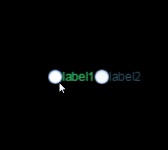
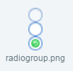
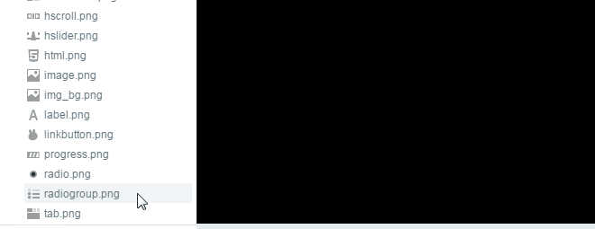
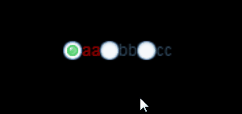
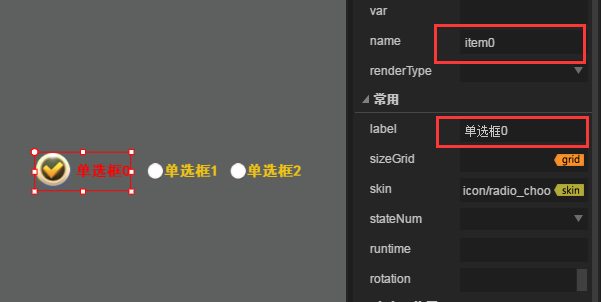
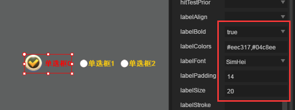

#Radiogroup 구성 요소 설명

>> 많은 구성 속성은 통용적이기 때문에 상용 및 통용 구성 요소 속성이 있습니다.`属性设置器`문서 중 이미 소개되었습니다.본 내용을 읽기 전에 우선 속성 설정기를 읽으십시오.

##1, Radiogroup 구성 요소 알아보기

###1.1 Radiogroup 구성 요소 역할

Radiogroup은 단선 상자 단추 그룹, 단추 그룹 내 구성 요소를 서로 배척하고, 사용자는 매번 단선 상자를 선택할 수 있습니다.동도 1개.
< br / > (동영상 1)

###1.2 Radiogroup 구성의 피부(skin)규범

Radiogroup 구성 요소는 피부입니다.`RadioGroup`혹은`RadioGroup_`접두사를 위해 명명하여 피부 설계 규범에 따라 세로 등분한 2태도 또는 3태도, 그림이 2개처럼 보인다.

< br / > 2) 3태 라디오그로프 피부

*Tips:Radiogroup 구성의 피부는 구궁격 속성을 사용할 수 없기 때문에 자원 설계를 할 때 실제 응용시 크기를 확인할 수 있다.*

###1.3 Radiogroup 구성 요소 API 소개

Radiogroup API 소개 참고해주세요.[ http://layaair.ldc.layabox.com/api/index.html?category=Core&class=laya.ui.RadioGroup](http://layaair.ldc.layabox.com/api/index.html?category=Core&class=laya.ui.RadioGroup).

##2, LayairID를 통해 Radiogroup 구성 요소 만들기

###2.1 Radiogroup 만들기

자원 관리자를 선택하는 Radiogroup 구성 요소 자원 자원 자원 자원 자원 자원 자원 자원 자원 구성 요소를 클릭하고, 즉 페이지에서 성공적으로 Radiogroup 구성 요소를 만들었습니다.동도 3 개처럼.
​< br / > (동영상 3)

###2.2 labels 를 통해 단선 상자 증가

동영상 3중 제시된 기본 단선 상자 그룹 중 두 개의 단선 상자만 있습니다.단선 상자를 늘리려면 labels 속성에만 새 탭을 추가하면 됩니다. 탭 내용을 수정하는 것도 이 속성에서 설정합니다. 동작 4-1이 제시할 수 있습니다.

​< br / > (동영상 4-1)

###2.3 모듈 Radiogroup 레이아웃 방향과 간격

Radiogroup 기본은 수평 레이아웃 (* horizontal *) 을 통해 direction 속성을 변경하여 수직 레이아웃 (* vertical *)간격 설정은 스페이스 속성을 통해 이루어질 수 있습니다.동도 4-2가 제시한 것처럼.
< br / > (동영상 4-2)

###2.4 설정 단선 상자 그룹 Radiogroup 기본 옵션

selectedIndIndex 속성은 단선 상자의 색인값을 바꾸는 데 사용됩니다. 기본값은 설정하지 않습니다. Radiogroup의 기본 설정을 설정하려면 selectedIndIndIndIndIndIndex 속성치를 설정할 수 있습니다. 0은 1번째 단선 상자를 설정할 수 있습니다.이것으로 유추하다.

만약 우리가 속성치를 0 시 설정할 때 실행 효과는 동영상 4-3의 보여 준다.
< br / > (동영상 4-3)

### 

##3, 사용자 정의 Radiogroup 구성 요소 만들기

상례에서 우리는 같은 단선 상자를 사용하여 labels 를 설치하여 세 개의 항목의 단선 상자그룹으로 생성했습니다.하지만 실제 게임에서 같은 Radiogroup 구성 요소에서 단칸 프레임 스타일에 다른 수요를 가지고 있다면 라벨스 설정을 통해 효과를 얻을 수 없는 방식으로 설정할 수 있는 경우, 이럴 때는 라디오그로프 구성 요소를 사용자로 정의해야 한다.

###3.1 미술자원 준비

우리 두 장 다른 걸로.`radio单选框`미술 자원을 구성하다`自定义RadioGroup组件`자원이 5개처럼 보이다.

​< br / > (그림 5)

**Tips**：

이 곳 은 피부 사진 의 명명 규칙 을 특히 주의해야 한다. 사용자 정의 Radiogroup 구성 요소 에서 사용할 수 없다`RadioGroup`혹은`RadioGroup_`접두사에 이름을 붙이다.Radio 단선 상자 구성 요소를 사용하기 때문에, 이 상자의 그림 자원 이름 사용하기`radio_`접두사.

###3.2 IDE 에서 Radio 구성 요소 만들기

자원 관리자 폴더를 항목의 자원 관리자 폴더로, IDE 에서 만든 라디오 구성품은 자원 관리자에서 한 명씩 끌어당기고, 왼쪽에서 오른쪽(또는 아래까지) 모든 Radio 구성 요소의 name 속성, 선착순으로 순차적으로'item0, item1, item1, item2..."(이름의 속성을 높이지 않고 생성된 Radiogroup 구성 요소를 추가합니다.잘못된 구성 요소를 위해서 정상적으로 실행할 수 없습니다.

label 속성을 설정한 텍스트, label 태그 글꼴 색상, 크기, 위치 관계 등을 설정한 후, 효과도 6, 그림 7에 표시됩니다.

​< br / > (그림 6)< br / > (7)

​**Tips: 사용자 정의 Radiogroup 구성 요소 name 속성에서 영문 문자 + 숫자 + 숫자, 영문 문자 다음으로 선을 그릴 수 없고, 숫자는 선착순으로 0 부터 시작합니다.**.

###3.3 Radiogroup 용기로 전환

하위 항목 속성을 수정한 후 전체 구성 요소는 단축키 Ctrl + B 를 컨테이너로 바꾸고, Radiogroup 용기 형식으로 변환하고, 그림 8개의 표시 방식을 선택하십시오.

​< br / > (그림 8)

기본 색인 selectedIndIndiex 0 (첫 번째 Radio) 가 성공한 후, 그림 9개 디스플레이, 방향 direction 을 조절할 수 있으며, 장면 편집기에서 마우스 조정도 가능하다.

​< br / > (그림 9)

이상의 몇 단계를 통해 라디오그룹의 구성 요소를 사용자 정의 성공적으로 볼 수 있다.기본값은 첫 번째 상자를 선택하고 세 번째 프레임 선택 상태로 전환하고 다른 상자는 첫 프레임을 선택하지 않았습니다.