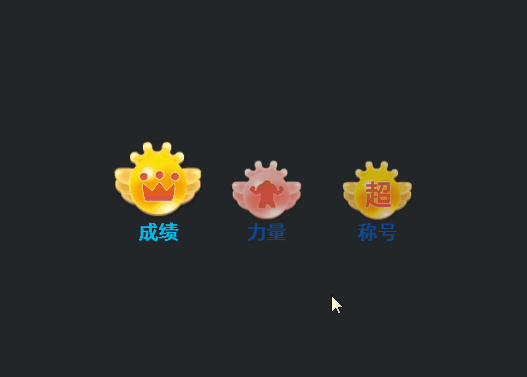

#Tab 구성 요소 설명

>> 많은 구성 속성은 통용적이기 때문에 상용 및 통용 구성 요소 속성이 있습니다.`属性设置器`문서 중 이미 소개되었습니다.본 내용을 읽기 전에 우선 속성 설정기를 읽으십시오.

##1. Tab 구성 요소 알아보기

###1.1 Tab 구성 요소 역할

Tab 구성 요소는 선택한 목걸이 단추 그룹을 정의하기 위해, 예를 들어 여러 페이지 전환 디스플레이를 사용합니다.동도 1개.

 （动图1）

###1.2 Tab 구성 요소 피부(skin)규범

Tab 구성 요소는 피부입니다.`tab`혹은`tab_`접두사를 위해 명명하여 피부 설계 규범에 따라 세로 등분한 2태도 또는 3태도, 그림이 2개처럼 보인다.

< br / > 2) 3태 Tab 피부

*Tips:Tab 구성의 피부는 구궁격 속성을 사용할 수 없으니 자원 디자인을 할 때 실제 응용시 크기를 확인하는 것이다.*

###1.3 Tab 구성 요소 API 소개

Tab 구성 요소 API 소개 참고해주세요.[http://layaair.ldc.layabox.com/api/index.html?category=Core&class=laya.ui.Tab](http://layaair.ldc.layabox.com/api/index.html?category=Core&class=laya.ui.Tab)

##2, LayairIDE 를 통해 Tab 구성 요소 만들기

###2.1 Tab 만들기

클릭 선택`资源管理器`Tab 구성 요소 자원을 끌어당겨 장면 편집기 즉 페이지에서 성공적으로 Tab 구성 요소를 만들었습니다.동도 3 개처럼.

​< br / > (동영상 3)

###2.2 labels 로 탭 추가

동영상 3중 제시된 기본 Tab 구성 요소 중 두 개의 탭이 있다.라벨을 늘리고 싶다면 라벨스 속성에만 새 탭을 추가하면 됩니다. 탭 내용도 이 속성에서 설정하고, 동작 4-1의 표시 같은 동작을 적용합니다.

< br / > (동영상 4-1)

###2.3 Tab 구성의 레이아웃 방향과 간격 변경

Tab 구성 요소는 기본 수평 레이아웃 (* horizontal *) 입니다. direction 속성을 변경하여 수직 레이아웃을 실현합니다.**간격 설정**스페이스 속성을 통해 이루어질 수 있습니다.동도 4-2가 제시한 것처럼.
 

(동영상 4-2)

###2.4 설정 단선 상자 그룹 Tab 기본 옵션

selectedIndIndex 속성은 Tab 구성 요소를 바꾸는 색인값을 바꾸는데 기본값은 설정하지 않습니다. Tab 구성의 기본 탭 옵션을 설정하려면 selectedIndIndIndIndIndIndex 속성 값을 설정할 수 있으며, 0은 1번째 태그, 1의 두 번째 탭...이것으로 유추하다.실행 효과는 동도 4-3의 시사와 같다.

 

(동영상 4-3)

##3, 사용자 정의 Tab 구성 요소

상례에서 우리는 같은 Tab 자원을 사용하여 labels 설정을 통해 세 개의 탭을 생성했다.하지만 실제 게임에서 같은 Tab 구성 요소에서 탭 스타일에 다른 수요가 있다면 라벨스 설정을 통해 효과를 얻을 수 없는 방식으로 사용자 정의 Tab 구성 요소를 사용해야 합니다.예를 들어 동도 5의 효과.

​< br / > (그림 5)

###3.1 미술자원 준비

다음은 다른 두 가지 미술자원 세 장으로 Tab 구성 요소를 정의합니다. 그림 자원은 그림 6개처럼 보여 줍니다.

    （图6）

**Tips**：

특히 그림의 명명 규칙을 주의해야 합니다. 사용자 정의 Tab 구성 요소 중, 여러 단추 구성 그룹을 사용합니다. 직접 사용할 수 없습니다.`Tab`구성 요소의 명명 규칙.사용 가능`Button`구성 요소`CheckBox`구성 요소`Radio`구성 요소의 명명 규칙.그림 6에서 사용하는 btn 접두사는 Button 구성 요소의 명명 규칙이다.

​

###3.2 IDE 에서 버튼 만들기

자원 관리자 폴더를 항목의 자원 관리자 폴더로, IDE 에서 만들어진 Button 구성 요소를 자원 관리자에서 한 명씩 끌어당기고, 왼쪽에서 오른쪽으로 Radio 구성 요소의 name 속성, 선착순 순서에 따라 "item0, item1, item2..." (이 규칙에 따라 이름의 속성을 높이지 않고 생성된 Tab 구성 요소를 무효 구성 요소로 수정할 수 없습니다.상행.또 자원이 두 상태이기 때문에 statteNum 속성치를 2로 설정해야 한다.label 속성 텍스트 설정이 완료되면, 효과가 7개와 같다.

< br / > (7)

###3.3 Tab 용기 구성 요소로 변환

속성 조절 후 세 개의 단추 구성 요소, 단축키 누르기`Ctrl+B`선택`Tab`컨테이너 구성 요소`确定`전환을 완료하다.

​< br / > (그림 8)

기본 선택의 색인 selectedIndIndidIndex 0 (첫 Tab 탭), 단선 상자의 간격 스파스는 4, 방향 direction, 가로로 설정하거나 가로로 설정할 수 있습니다.

​< br / > (그림 9)

이상의 절차를 통해 사용자 정의 Tab 구성 요소 제작에 성공했다.기본값은 첫 번째 상자를 선택하고 세 번째 프레임 선택 상태로 전환하고 다른 상자는 첫 프레임을 선택하지 않았습니다.

