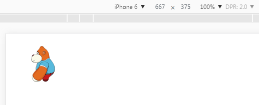

#그림 보이기

>> 그림은 게임 개발 기반이며, 이 편은 API 에서 예례로 Sprite.loadImage 와 Graphics.drawTexture 두 가지 그림을 소개하는 방법입니다.

##1, loadImage 방법으로 그림 전환

###1.1 loadImage API 개요

API 문서에서 laya.display.Sprite 를 검색하면 loadImage () 방법을 찾을 수 있으며, 그림 1에 제시한 대로 이 방법의 인자를 먼저 익혀보자.

< br / > (그림 1)

###1.2 loadImage 로 그림 표시

Sprite u DisplayImage.ts 종류 만들기, 코드:


```typescript

module laya {
    import Sprite = Laya.Sprite;
    import Stage = Laya.Stage;
    import Texture = Laya.Texture;
    import Browser = Laya.Browser;
    import Handler = Laya.Handler;
    import WebGL = Laya.WebGL;

    export class Sprite_DisplayImage {
        constructor() {
            // 不支持WebGL时自动切换至Canvas
            Laya.init(Browser.clientWidth, Browser.clientHeight, WebGL);
            Laya.stage.alignV = Stage.ALIGN_MIDDLE;
            Laya.stage.alignH = Stage.ALIGN_CENTER;
            Laya.stage.scaleMode = "showall";
            Laya.stage.bgColor = "#ffffff";
            this.showApe();
        }
         private showApe(): void {
            // 方法1：使用loadImage
            var ape: Sprite = new Sprite();
    	    ape.pos(100,50);
            Laya.stage.addChild(ape);
            ape.loadImage("../../res/apes/monkey3.png");
        }
    }
}
new laya.Sprite_DisplayImage();
```


예시 코드에서 '(예)`100,50`"그림의 좌표 정보 표시입니다.예시 코드 실행 효과 2-1 시:

< br / > (2-1)

###1.3 loadImage 이미지 전환

그림 전환은 그림의 기초를 나타내는 데 비워진 그림을 추가한 다음 코드 논리를 통해 새로운 그림 자원을 다시 그립니다.구체적인 코드 설명은 코드 주석 및 API, 결합 실행 체험을 참고할 수 있다.

다음은 Spriteu Switch Texture.ts 종류에서 코드 수정을 다음과 같습니다:


```typescript

module laya {
    import Sprite = Laya.Sprite;
    import Stage = Laya.Stage;
    import Texture = Laya.Texture;
    import Handler = Laya.Handler;
    import Browser= Laya.Browser;
    import WebGL = Laya.WebGL;

    export class Sprite_SwitchTexture {
        private texture1: string = "../../res/apes/monkey2.png";
        private texture2: string = "../../res/apes/monkey3.png";
        private flag: boolean = false;
        private ape: Sprite;

        constructor() {
            // 不支持WebGL时自动切换至Canvas
            Laya.init(Browser.clientWidth, Browser.clientHeight, WebGL);

            Laya.stage.alignV = Stage.ALIGN_MIDDLE;
            Laya.stage.alignH = Stage.ALIGN_CENTER; 
            Laya.stage.scaleMode = "showall";
            Laya.stage.bgColor = "#ffffff";

            Laya.loader.load([this.texture1, this.texture2], Handler.create(this, this.onAssetsLoaded));
        }
        private onAssetsLoaded(): void {
            this.ape = new Sprite();
            Laya.stage.addChild(this.ape);
            this.ape.pivot(55, 72);
            this.ape.pos(100,50);

            // 显示默认纹理
            this.switchTexture();

            this.ape.on("click", this, this.switchTexture);
        }

        private switchTexture(): void {
            var textureUrl: string = (this.flag = !this.flag) ? this.texture1 : this.texture2;

            // 更换纹理
            this.ape.graphics.clear();
            var texture: Texture = Laya.loader.getRes(textureUrl);
            this.ape.loadImage(textureUrl);

            // 设置交互区域
            this.ape.size(texture.width, texture.height);
        }
    }
}

new laya.Sprite_SwitchTexture();
```


실행 코드 효과는 동도 2-2의 표시:

< br / > (동영상 2-2)


##2, drawTexture 방법으로 그림 전환

###2.1 drawTexture API 개요

API 문서에서 laya.display.Graphics 검색하면 drawTexture() 방법을 찾을 수 있습니다. 이 외에도 laya.net.LoaderManager 의 load() 방법과 getRes() 방법, 그리고 laya.utils.Handler 속의 create() 방법을 찾을 수 있습니다. 각 방법의 참수 2, 그림 4, 5, 그림 6 에 제시한:

< br / > (그림 3)

< br / > (그림 4)

< br / > (그림 5)

< br / > (그림 6)


###2.2 drawTexture 불러오기 그림 표시

loadImage () 방법은 외부 그림 자원을 즉석으로 불러올 수 있으며, 완충구에서 그림 자원을 읽을 수도 있고, drawTexture () 방법은 그림을 먼저 다운로드한 후 무대에 첨가해야 하기 때문에, 예시 코드 중 부호화에 사용해야 합니다.`Laya.loader.load()`답조`Handler.create()`# 방법, 간단한 사례 코드를 통해 한 장의 그림을 불러오기, 코드의 주석 부분과 관련 API 설명을 확인하십시오.

Sprite u DisplayImage.ts 종류 만들기, 코드:


```typescript


module laya {
    import Sprite = Laya.Sprite;
    import Stage = Laya.Stage;
    import Texture = Laya.Texture;
    import Browser = Laya.Browser;
    import Handler = Laya.Handler;
    import WebGL = Laya.WebGL;

    export class Sprite_DisplayImage {
        constructor() {
            // 不支持WebGL时自动切换至Canvas
            Laya.init(Browser.clientWidth, Browser.clientHeight, WebGL);

            Laya.stage.alignV = Stage.ALIGN_MIDDLE;
            Laya.stage.alignH = Stage.ALIGN_CENTER;

            Laya.stage.scaleMode = "showall";
            Laya.stage.bgColor = "#ffffff";

            this.showApe();
        }
 
        private showApe(): void {
        
            // 方法2：使用drawTexture
            Laya.loader.load("../../res/apes/monkey2.png", Handler.create(this, function(): void {
                var t: Texture = Laya.loader.getRes("../../res/apes/monkey2.png");
                var ape: Sprite = new Sprite();
                ape.graphics.drawTexture(t, 0, 0);
                Laya.stage.addChild(ape);
                ape.pos(100, 50);
            }));
        }
    }
}
new laya.Sprite_DisplayImage();
```


코드 실행 효과는 7-1의 시사와 같다.

< br / > (7-1)


###2.3 drawTexture 그림 전환

그림 전환은 그림의 기초를 나타내는 데 비워진 그림을 추가한 다음 코드 논리를 통해 새로운 그림 자원을 다시 그립니다.구체적인 코드 설명은 코드 주석 및 API, 결합 실행 체험을 참고할 수 있다.

다음과 같습니다:


```typescript

module laya {
    import Sprite = Laya.Sprite;
    import Stage = Laya.Stage;
    import Texture = Laya.Texture;
    import Handler = Laya.Handler;
    import Browser= Laya.Browser;
    import WebGL = Laya.WebGL;

    export class Sprite_SwitchTexture {
        private texture1: string = "../../res/apes/monkey2.png";
        private texture2: string = "../../res/apes/monkey3.png";
        private flag: boolean = false;

        private ape: Sprite;

        constructor() {
            // 不支持WebGL时自动切换至Canvas
            Laya.init(Browser.clientWidth, Browser.clientHeight, WebGL);
            Laya.stage.alignV = Stage.ALIGN_MIDDLE;
            Laya.stage.alignH = Stage.ALIGN_CENTER;
            Laya.stage.scaleMode = "showall";
            Laya.stage.bgColor = "#232628";
            Laya.loader.load([this.texture1, this.texture2], Handler.create(this, this.onAssetsLoaded));
        }
        private onAssetsLoaded(): void {
            this.ape = new Sprite();
            Laya.stage.addChild(this.ape);
            this.ape.pivot(55, 72);
            this.ape.pos(100,50);
            // 显示默认纹理
            this.switchTexture();
            this.ape.on("click", this, this.switchTexture);
        }
        private switchTexture(): void {
            var textureUrl: string = (this.flag = !this.flag) ? this.texture1 : this.texture2;
            // 更换纹理
            this.ape.graphics.clear();
            var texture: Texture = Laya.loader.getRes(textureUrl);
            this.ape.graphics.drawTexture(texture, 0, 0);
            // 设置交互区域
            this.ape.size(texture.width, texture.height);
        }
    }
}
new laya.Sprite_SwitchTexture();
```


코드 실행 효과는 7-2의 시사와 같다.

< br / > (동영상 7-2)


