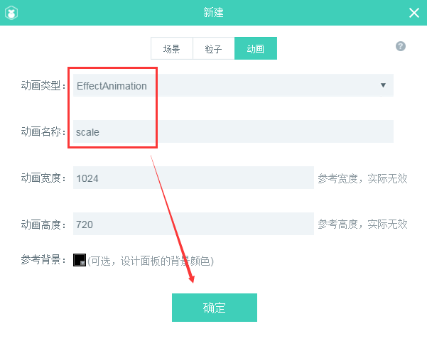
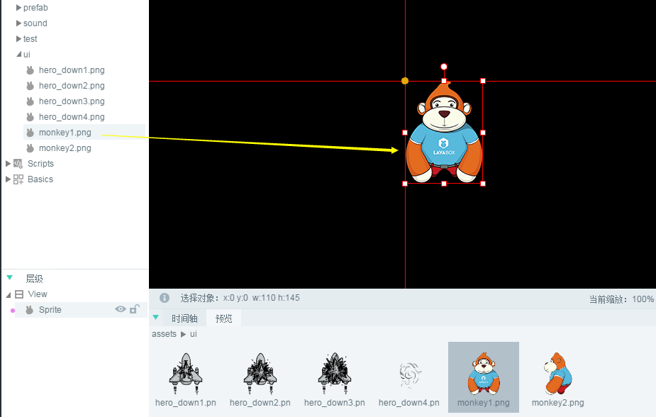
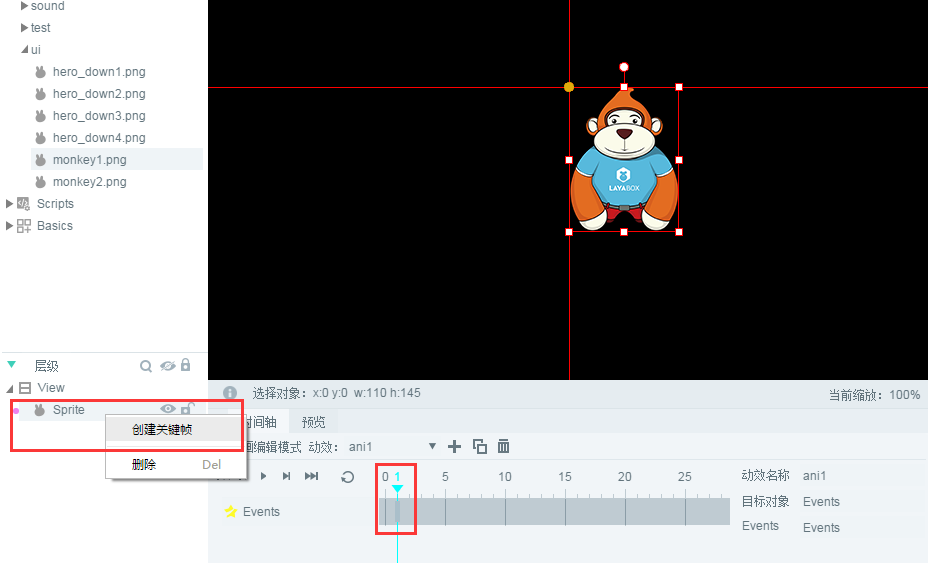
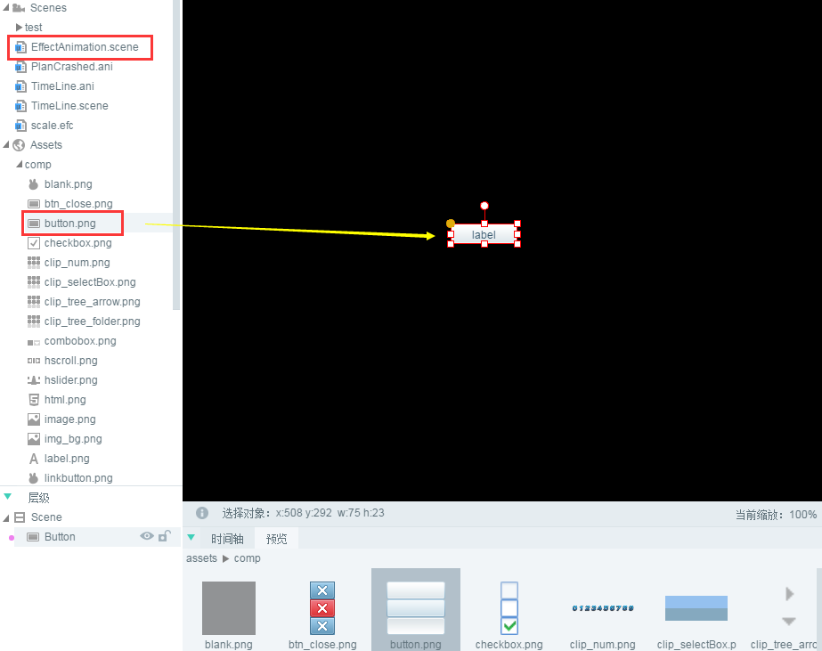

#활성 효과 템플릿 만들기 (Effectimation)

###1、무엇이 동효 템플릿

동효 템플릿은 시간축에 기반된 애니메이션 효과를 미리 설정한 후 어떤 구성 요소에 부가한다.구성 요소가 필요 없이 인코딩과 같은 애니메이션 효과를 쉽게 실현할 수 있다.동효 템플릿을 독립적으로 표시할 수 없습니다. UI 페이지의 구성 요소로 애니메이션 효과를 얻을 수 있습니다.


###2, IDE 에서 제작 및 사용 동효 템플릿

####2.1 Effection 템플릿 파일 만들기

프로젝트 관리자 중 마우스`右键`-> 선택`新建`->`动画`.새 애니메이션 패널 중에서 애니메이션 형식으로 선택하십시오`EffectAnimation`.크기 조정 효과의 동효 템플릿을 생성하기 때문에 애니메이션의 이름이 scale 입니다.

< br / > (그림 1)

클릭`确定`나중에 하나 만들기`scale.efc`템플릿 파일을 더블 클릭하여 애니메이션 편집 장면은 그림 2의 보여 줍니다.

< br / >2)


####2.2 활성 템플릿 만들기

**목표: 미리 축소한 후 복구된 애니메이션 효과 템플릿 만들기.**

**절차 1**자원 관리자에서 Image 구성 요소를 끌어당긴다`scale.efc`장면 편집기 중.제시한 대로.

< br / > (그림 3)


**절차 2**뽑다`动画编辑模式`그 다음 선택`第1帧`과`Image`구성 요소, 구성 요소에 오른쪽 단추를 생성합니다.시계가 네 개처럼 보이다.

< br / > (그림 4)


**절차 3**선택`第1帧`속성 관리자 중 회전 및 축소`scaleX`과`scaleY`속성 값 설정`0.2`.제시한 대로.속성값 설정 후`Image`시간축 중 자동으로 축소 속성 증가`scaleX`과`scaleY`.(* 이 동효 템플릿은 변위 효과를 필요로 하지 않기 때문에, 이전 관전 프레임 자동으로 생성된 속성 X 를 직접 삭제하면 됩니다 *)

< br / > (그림 5)

**Tips**효과는 템플릿과 시간축 애니메이션에 중요한 차이가 있음을 주의해야 한다. 바로 효과의 애니메이션 효과에 대한 첫 프레임은 애니메이션 효과를 설정하는 것이 잘못된 것이다.예를 들어 우리는 0.2 시간까지 줄이고, 시간축 애니메이션에서 0프레임에서 애니메이션 구성 요소를 0.2로 직접 축소할 수 있고, 유효템플릿에는 0 프레임에 직접 설치할 수 없고 다른 프레임 (예를 들어 1프레임) 에 목표 조정 효과 (0.2) 를 설정해야 한다.


**순서**13프레임에 키 프레임 (참조 그림 4) 을 설정합니다. scaleX 와 scaleY 속성값을 1, 재생 클릭하면 애니메이션 효과를 미리 볼 수 있습니다.

< br / > (그림 6)


####2.3 IDE 에서 동효 템플릿 사용하기

**절차 1**UI 페이지 생성`EffectAnimation.ui`) 그리고 Button 구성 요소를 스크린으로 끌어당기는 중 7개의 지시 (* 주의: 본 예의 Button 구성은 유i 디렉토리 *) 에 있다.

< br / > (7)


**절차 2**제작된 크기 조정 효과 템플릿 (scale.efc) 를 Button 구성 요소에 끌어당겨 그림을 8개처럼 보여줍니다.

< br / > (그림 8)


**절차 3**거중 축소 효과를 실현하기 위해 버튼을 더 잘 보게 한다.저희가 뽑습니다.`Button`구성 요소, 속성 패널, 축심점 속성 설정`anchorX`과`anchorY`가치`0.5`그리고 설치`Button`넓고 축심점의 xy 축 위치는 그림 9개처럼 보인다.

< br / > (그림 9)

*Tips: 축심점 효과는 UI 구성 요소 속성에서 설정해야 하며, 활성 템플릿에 축심점 설정을 하면 구성 요소에 효과가 없습니다.*


**순서**선택`Button`구성 요소 아래의 동효 템플릿, 오른쪽 속성 패널에서 터치 재생 이벤트 속성 설정`playEvent`가치`mousedown`.그림 10개처럼 보이다.

< br / > (그림 10)

**단계 5:**여기에 올바른 템플릿의 제작은 이미 완성되었다.단축키 F9를 누르고 프로젝트 설정을 엽니다.UICode 에서 가져오는 위치는 활성 템플릿을 사용하여 가져오고, 그렇지 않으면 틀립니다.동도 11개.그리고 F12 (또는 Ctrl + F12) 로 UI 페이지를 내보내면 항목에서 사용할 수 있습니다.

< br / > (그림 11)


###3. 프로젝트에서 유효템플릿 효과를 보여주기

하나 만들기`Mian.ts`파일, index.html 중에서 인용합니다.다음 코드 작성:


```typescript

class Main {
    constructor() {
        //初始化舞台
        Laya.init(1334,750);
        //设置舞台背景色
        Laya.stage.bgColor = "#ffffff";
		//加载图集资源，加载成功后将UI界面添加到舞台上
        Laya.loader.load("./res/atlas/ui.atlas",Laya.Handler.create(this,this.onLoaded));
    }
    private onLoaded():void{
        //实例化导出的UI类
        var efc:ui.EffectAnimationDemoUI = new ui.EffectAnimationDemoUI();
        //添加到舞台
        Laya.stage.addChild(efc);
    }
}new Main();
```


실행 후 단추가 눌렸을 때 애니메이션 효과는 동영상 12개와 같이 보여 줍니다:

< br / > (그림 12)


###4, 다동 효과 템플릿 생성 복잡한 효과

방금 버튼을 완료한 후, 어려서부터 커진 애니메이션 효과 를 다시 만들 수 있습니다. 템플릿 을 다시 만들 수 있습니다.이를 누르고 빠르게 토글 상태를 전환하는 연속애니메이션 효과가 이뤄진다.

우선, Google 템플릿 파일을 다시 생성합니다.이 동작 템플릿은 직접적으로 축소되었기 때문에, 단지 두 개의 관건 프레임 하나만 있으면, 만약 13개에 제시할 수 있다`第12帧`속성 크기 조정`scaleX`과`scaleY`값 설정`0.2`.

< br / > (그림 13)


그리고 UI 페이지에서 템플릿으로 이동`Button`구성 요소 아래 설정`playEvent`속성`mouseup`.그림 14개.

< br / > (그림 14)


마지막으로 저장하고 F12 로 UI 내보내는 다음 항목에서 방금 코드를 다시 번역합니다.실행 효과는 동영상 15개처럼, 연속 누르고 탄기 사건 아래에서 애니메이션 효과가 매우 평탄하다.

< br / > (그림 15)


이로써 Effection 기초 교정은 끝났고 개발자는 LayairIDE의 동동 템플릿 기능을 사용하여 빠르게 개발하는 구성 요소의 애니메이션 효과를 낼 수 있다.