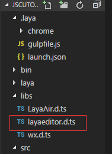
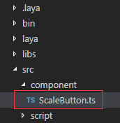
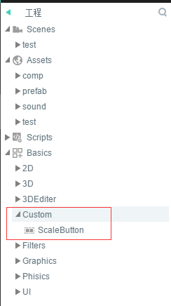
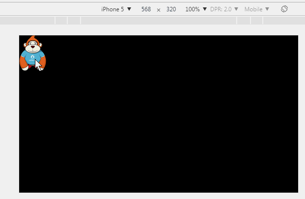
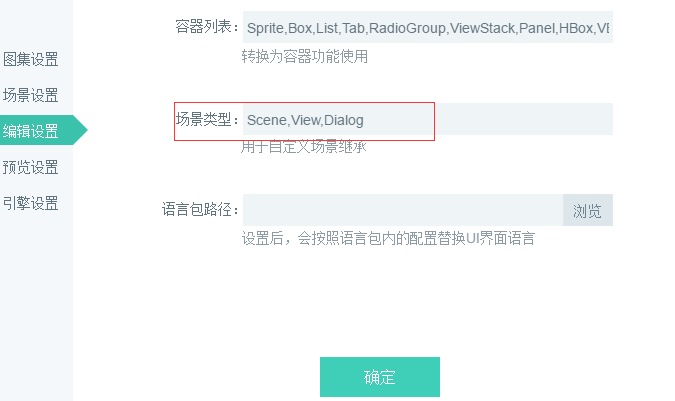

#사용자 정의 구성 요소 제작 및 사용
Layaiair IDE 는 다양한 상용 UI 구성 요소를 제공하고 기본적인 수요를 충족시키지만 실제 개발에서 개발자가 사용자 정의를 필요로 하는 UI 구성 요소는 특수 수요를 충족시킨다.Layaiar가 사용자 정의 구성 요소를 제공하는 인터페이스, 개발자는 변경 또는 구성 요소를 추가할 수 있으며, 새로운 구성 요소는 LayairIDE 식별, 사용할 수 있습니다.이 편은 축소 단추를 예를 들어 새로운 구성 요소를 추가하고, LayairIDE에서 이 구성 요소를 어떻게 사용할지 소개합니다.

##1. 구성 구조와 규칙을 이해하다

###1.1 구성 요소 디렉토리 구조

구성 디렉터리는 LayairIDE 루트 디렉터리에 위치한 'resources  appp  out  vs  layaeditor 디렉터리에 위치합니다.그림 1의 보여 주기:

< br />
(그림 1)

**구성 요소 목록 구조 소개**：

"custom": 사용자 정의 요소를 저장하는 js 및 xml 파일;

"laya.editoruI.js": LayaiaiaiairIDE 자체 구성 요소 기능 코드;

"laya.editoruI.xml": Layairide 자체 구성 요소 설정 정보;

###1.2 구성 요소의 xml 설정 정보 설명

완전한 구성 요소는 js 와 xml 두 부분으로 구성되어 있으며, 이 중 js는 구성 요소의 기능이 이루어졌으며, xml 은 IDE 내 구성 요소와 호출 부분에 표시되어 있으며, 구성 요소 그림 자원 이름 (크기 구분), 속성 패널의 옵션과 기본값 등이 포함되어 있습니다.

다음은 laya.editoruI.xml 중 TextArea 구성 요소를 예를 들어 소개합니다:


```xml

<TextArea className="laya.editorUI.TextArea" inherit="TextInput" defaultValue="text='TextArea'" skinLabel="skin" resName="area" icon="TextArea" groups="公用,常用,宽高及位置,旋转及缩放" drag="3">
	<prop name="vScrollBarSkin" tips="垂直滚动条皮肤" type="string" default="" accept="res" group="常用" />
	<prop name="hScrollBarSkin" tips="水平滚动条皮肤" type="string" default="" accept="res" group="常用" />
</TextArea>
```

**구성 요소 XML 설명**：

"TextArea": TextArea 태그 구성의 시작과 끝.TextArea 의 이름은 유별과 다르지만 기억을 이해하기 쉽고 IDE 구성 요소 이름을 표시합니다.

"classsName": 이 구성의 완전한 경로: laya.editoruI.TextArea;

"inherit": 상속된 부류;

"defaultValue": 구성 요소 속성의 기본 값;

'스킨라벨': 속성 패널에 쓰이는 skin 관련 설정입니다.skinLabel 의 값은 prop name 필드 및 관련 설정을 사용하지 않으면 설정을 하지 않습니다. TextArea 구성 요소에는 이 설정이 없습니다.

"resName": 구성 요소 자원 접두사 (크기 구분) 이 접두된 자원이 이 이 구성 요소로 인식되어 있으며, TextArea 설정area 는 TextArea 의 약자 모드 모드로 IDE 구성 패널에 TextArea 를 표시합니다.구성 요소 이름 방면에 대한 IDE 구성 요소 기반 '구성 자원 이름 규칙' 문서를 볼 수 있습니다.

IDE 구성 요소는 IDE 아이콘 이름 (크기 구분), 아이콘의 디렉터리가 LayairIDE 뿌리 디렉터리에 위치한 'resources  out  vs  layaeditor  layaya  compons' 디렉토리 목록에 위치해 새로운 icon 아이콘을 만들 수 있으며, 여러 개의 구성 요소를 함께 사용할 수 있습니다.TextArea compont 디렉토리에 대한 TextArea.png

"groups": 속성 패널에 사용할 그룹에 표시, 쉼표 구분;

"drag": 크기 변수: 1: 두 개의 점, 세로로 늘어날 수 있습니다. hscroll 구성 요소, 2: 두 개, 세로로 세로로 늘어날 수 있습니다. vscroll 구성 요소, 3: 8개, 세로, 세로, 확대, 축소

"prop": prop 속성 패널 속성 설정으로 모든 prop 표시 요소 속성

"name": 속성 이름으로 속성 패널에 나타납니다;

"tips": 마우스가 속성 이름에 표시된 tips 팁 정보;

"type": 상자 속의 속성 값 형식 입력

"default": 이 속성의 기본 값;

"accept": 이 속성 접수 res 와 files 두 개의 값입니다.res 는 이 속성 표시줄에 단일 자원을 끌어올 수 있습니다. files 는 이 속성 표시줄에 여러 자원을 끌어들일 수 있습니다.

"group": 이 속성 소유 그룹, groups 그룹에 대한 그룹은 존재하지 않는 다른 그룹에 속한다;


###2, LayaiairIDE 구성 요소 가져오기

####2.1 LayaiarIDE 구성 요소 다운로드 (TS 버전)

TS 버전 다운로드 주소:[https://layabox.github.io/layaair-doc/resources/2D/Component/layaeditor.d.zip](https://layabox.github.io/layaair-doc/resources/2D/Component/layaeditor.d.zip)

####2.2 프로젝트 생성 및 프로젝트의 디렉터리에 가져오기

LayaiarIDE로 TS 항목을 만들기 (프로젝트를 만들기 (프로젝트를 만들려면, 이 편은 더 이상 설명이 없습니다.다음으로 다운로드된 zip 패키지를 해제시켜 레이디tor.d.ts 파일을 libs 디렉토리에 저장합니다.그림 2 개 시:

< br />
(2)


###3. 사용자 정의 구성 요소 만들기

####3.1 구성 요소 종류 만들기

우선 구성 요소 디렉토리 (가방) 'compont', 미래 다른 구성 요소의 분류를 만들기 위해 compont 디렉토리 아래에 크기 조정 단추를 생성하는 ScaleButton.ts, 그림 3의 지시:

< br />
(그림 3)

구성된 구성 요소를 작성하기 시작하면 다음과 같습니다:


```typescript

import Button = laya.editorUI.Button;
//缩放时间，单位为
var scaleTime:number = 100;
module component{
    //继承editorUI.Button
    export class ScaleButton extends Button {
        constructor(skin:string=null,label:string=""){
            super(skin, label);
            /* 设置按钮为单态按钮
			** 取值：
			** 1：单态。图片不做切割，按钮的皮肤状态只有一种。
			** 2：两态。图片将以竖直方向被等比切割为2部分，从上向下，依次为弹起状态皮肤、按下和经过及选中状态皮肤。
			** 3：三态。图片将以竖直方向被等比切割为2部分，从上向下，依次为弹起状态皮肤、经过状态皮肤、按下和选中状态皮肤
			*/
            this.stateNum = 1;
            //添加鼠标按下事件侦听。按时时缩小按钮。
            this.on(Laya.Event.MOUSE_DOWN, this, this.scaleSmall);
            //添加鼠标抬起事件侦听。抬起时还原按钮。
            this.on(Laya.Event.MOUSE_UP, this, this.scaleBig);
            //添加鼠标离开事件侦听。离开时还原按钮。
            this.on(Laya.Event.MOUSE_OUT, this, this.scaleBig);
        }
        private scaleSmall():void{
            //缩小至0.8的缓动效果
            Laya.Tween.to(this, {scaleX:0.8, scaleY: 0.8}, scaleTime);
        }
        private scaleBig():void{
            //变大还原的缓动效果
            Laya.Tween.to(this, {scaleX:1, scaleY:1}, scaleTime);
        }
    }
}
```


####3.2 구성 요소의 xml 설정 파일

이 크기의 xml 프로필 설명에 따라 이 축소 단추를 완성하는 xml 설정을 완성합니다. 이 사용자 정의 구성 요소는 제작이 완성되었습니다.축소 단추의 xml 프로필 메시지가 다음과 같습니다:


```xml

<?xml version="1.0" encoding="utf-8" ?>
<uiComp>
	<ScaleButton className="component.ScaleButton" runClass="component.ScaleButton"  inherit="Button" skinLabel="skin" 
	defaultValue="label=''" resName="sButton" icon="Box" groups="公用, 常用, 宽高及位置" drag="3">
		<prop name="scaleTime" tips="缩放使用的时间" type="number" default="100" group="常用" />
	</ScaleButton>
</uiComp>
```


Tips:xml 프로필 정보 내용 해석 윗글 구성 요소 xml 설명.


###4, 추가 사용자 정의 구성 요소

####4.1 구성 요소를 IDE 사용자 정의 구성 요소 목록에 추가합니다

xml 프로필 작성이 완료된 후 사용자 정의 구성 요소에 직접 저장하는 디렉터리 (LayayairIDE 뿌리 디렉터리에 있는 'resources out  vs  layaeditor  renders  custom > 의 구성 요소 xml 명칭은 구성 요소와 일치할 필요가 있으며, ScaleButton.xml.다음으로 패키지가 생성된 ScaleButton.js (# 항목 루트 / bin/ js' 디렉토리 아래, 참조 4) 를 사용자 정의 구성 목록으로 복사합니다.그림 5개처럼 보이기:

< br />
(그림 5)

####4.2 IDE 구성 패널에서 보이기

IDE 구성 디렉토리 열기 (LayaiarIDE 뿌리 디렉토리  resources  apps  out  layaeditor  laya  basics  basics) 를 새로 만들기 위한 모듈을 저장하고, 정의된 구성 요소를 저장하는데, 그림 6에 표시됩니다.

< br />
(그림 6)


그리고 Custom 디렉터리에 ScaleButton 이름을 붙인 png 아이콘 (건의 크기 16 *16) 을 포함해 7에 제시한 이 단계를 완성하면 IDE 구성 패널에서 우리가 만든 축소 단추 요소를 찾을 수 있으며, 그림 8에 제시할 수 있습니다.


< br />
(그림 7) 아이콘 이름 구성 요소 xml 중 resName


< br />
(그림 8) IDE 구성 요소 대응 구성 요소 xml 표시 이름

**Tips:**추가 알림은 구성 요소의 icon 아이콘이 'LayaiairIDE 뿌리 디렉토리' resources  apps out  vs  layaeditor  laya  basistom  Custom > 목록에 있는 sButton.png.icon 아이콘은 LayairIDE 뿌리 디렉터리에 위치한'resourcesapppoutvslayaeditorlayaiconscomponscomponts'디렉토리 안에 해당 xml 속성치, 윗글의 xml 설명이 이미 소개되었습니다.자신의 icon 아이콘을 생성하면 componts 디렉토리 안에 있는 icon 사이즈 표시를 참조하여 componts 디렉토리에 포함한 후 xml 안에 대응하는 파일 이름을 설정하면 됩니다.


####4.3 IDE 자원 패널에서 보이기

자원 패널에는 기본적으로 comp 파일에 UI 구성 요소를 사용하는 skin 자원을 저장하고, 구성 요소를 사용하기 편리하게 skin 자원을 구성 요소로 사용하기 (자원 루트 디렉토리) 에 저장해야 합니다.구성 패널의 구성 요소 속성 skin 값과 달리 자원 패널의 구성 요소 속성 skin 기본값은 'laya  assets' 디렉토리에서 상대적인 경로입니다.

Skin 자원의 구성 요소를 편리하게 사용하기 위해 자원 패널에 구성 요소를 계속 소개합니다.우선 Skin 자원을 준비하고 있습니다. 이 글의 예를 들어 사용자 정의 구성 요소는 축소 단추입니다. 직접 복사 임의의 그림은 축소 단추 요소의 축소 효과를 체험할 수 있습니다.그림 자원은 '항목 루트 디렉토리  laya  asets' 디렉토리로 복사하면, 그림 자원은 xml 속의 resName 속성값 sButton 또는 sButton, SButton 등 접두사, 그림 9에 표시됩니다.

< br />
(그림 9)


자원 복사가 완료된 후, 우리는 리야아이드의 자원 관리 패널을 다시 열고 자원 트리 버튼을 누르면 방금 복사한 ScaleButtonu monkey.png, 이 그림을 누르면 그림을 볼 수 있습니다.Skin 기본값의 사용자 정의 구성 요소가 프로젝트에 추가된 자원 관리 패널에 대한 설명입니다.


< br />
(그림 10)

Tips: 자원 패널에 표시된 구성 요소는 현재 프로젝트에 사용되며 구성 패널에 추가하는 모든 항목의 공통 구성 요소입니다.


####4.4 사용자 정의 구성 요소 사용

프로젝트 관리 패널에 디스플레이 페이지를 만들기 (이 페이지는 구성 요소의 효과만 보여, 조작 절차를 진행하지 않는 자세한 소개) 를 사용하여 사용자 정의 축소 단추 구성 요소를 사용합니다.

#####4.4.1 자원 판넬에서 사용

자원 관리 패널에서 SButton이 접두사를 위한 구성 요소를 찾았고, 직접 끌어당겨 페이지를 누르면 확대 효과를 볼 수 있으며, 그림 11.

< br />
(도 11)

#####4.4.2 구성 패널에서 사용

구성 패널에서 ScaleButton 구성 요소를 찾았고, 직접 페이지로 끌어당겨 누르면 확대 효과를 볼 수 있으며, 그림 12.

< br />
(그림 12) 구성 패널에 그림 자원이 포함되지 않으니 속성 skin 설정


###5, 구성 요소 디버그

위 내용에 따르면 우리는 레이어이더의 구성 요소를 작성하고 모든 프로세스를 사용했다.하지만 본격적인 사용자 정의 구성 요소 중 한 단계 중요한 코너를 간소화하기 위해 조속히 구성 요소의 목표를 달성하기 위해 뛰어넘었다. 이 단계는 구성 요소의 디버깅이다.

문서를 따라 조작하는 것이 순조롭고, 디버깅 순서가 없어도 문제가 없지만, 실제 개발 과정에서 대부분의 사람들은 인코딩을 보장할 수 없다.잘못된 구성 요소를 IDE 에 추가해 본 문서처럼 순조롭지 않고 IDE 구성 요소에 맞추기 어렵다.이에 따라 이 작은 절에 우리는 분실된 절차를 덧붙여 구성을 작성한 후 디버깅을 하고 다시 편집했다.

####5.1 그림 복사 프로젝트 자원 경로

항목의 자원 경로 '항목 루트 디렉터리 / res / img' 디렉토리를 복사하는 중 13개 디렉터리입니다.

< br />
(그림 13)

####5.2 구성 요소 인용

웹 글의 축소 단추 크기 ScaleButton.ts 를 열 때 'import Button = laya.edittorUI.Button;' 엔진 UI 라이브러리로 바꾸는 UI 라이브러리에서 'import Button = laya.ui.Button; 다른 것은 변함이 없다.laya.editorui는 LayairiDE에 사용되며, 항목은 엔진 라이브러리 레이어로 실행해야 하기 때문이다.그림 14개 시:

< br />
(그림 14)

####5.3 입구 종류 만들기

항목 루트 디렉토리 / src "다음 입구 종류 Main.ts, 인코딩은 다음과 같습니다:


```typescript

import GameConfig from "./GameConfig";
import ScaleButton from"./component/ScaleButton";
class Main {
	constructor() {
		//根据IDE设置初始化引擎		
		if (window["Laya3D"]) Laya3D.init(GameConfig.width, GameConfig.height);
		else Laya.init(GameConfig.width, GameConfig.height, Laya["WebGL"]);
		Laya["Physics"] && Laya["Physics"].enable();
		Laya["DebugPanel"] && Laya["DebugPanel"].enable();
		Laya.stage.scaleMode = GameConfig.scaleMode;
		Laya.stage.screenMode = GameConfig.screenMode;

		//打开调试面板（通过IDE设置调试模式，或者url地址增加debug=true参数，均可打开调试面板）
		if (GameConfig.debug || Laya.Utils.getQueryString("debug") == "true") Laya.enableDebugPanel();
		if (GameConfig.stat) Laya.Stat.show();
		Laya.alertGlobalError = true;

		//激活资源版本控制，version.json由IDE发布功能自动生成，如果没有也不影响后续流程
		Laya.ResourceVersion.enable("version.json", Laya.Handler.create(this, this.onVersionLoaded), Laya.ResourceVersion.FILENAME_VERSION);
	}

	onVersionLoaded(): void {
		//激活大小图映射，加载小图的时候，如果发现小图在大图合集里面，则优先加载大图合集，而不是小图
		Laya.AtlasInfoManager.enable("fileconfig.json", Laya.Handler.create(this, this.onConfigLoaded));
	}

	onConfigLoaded(): void {
		//加载IDE指定的场景
		//GameConfig.startScene && Laya.Scene.open(GameConfig.startScene);
		Laya.loader.load("res/img/monkey.png",Laya.Handler.create(this,this.onLoaded),null,Laya.Loader.IMAGE)
	}

	onLoaded():void{
		var scaleButton:ScaleButton = new ScaleButton();
		scaleButton.skin = "res/img/monkey.png";
		Laya.stage.addChild(scaleButton);

	}
}
//激活启动类
new Main();

```


Main 을 laya/gulpfile.js 파일에 시동 종류로 설정합니다.그리고 브라우저에서 조정 효과를 실현할 때, 그림 16개처럼 보여 줍니다.유효한 사용자 정의 구성 요소로 안심하고 IDE 에 첨가할 수 있다는 뜻이다.(주의자: 정상적인 절차는 분백을 하기 전에, 본편에서 먼저 소개한 분포 조작을 하고, 직접 디버깅을 하면 오류가 발생할 수 있기 때문에 편집을 시작하기 전에 패키지 설정 파일 module.def 개명 또는 삭제)

< br />
(도 15)

< br />
(그림 16) Tips: 디버그 성공을 위해 배포 요소를 준비할 때, 패키지 설정 파일 모둘레.def 복구를 잊지 마세요.또한 포털 JS 코드를 배포할 때 임포트의 laya.ui 도 laya.editor 로 복구해야 한다.


###6, 구성 요소의 등록

구성 요소 등록은 사용자 정의 구성 요소와 어떤 유명 관련, 표시할 때 등록 맵에 따라 실시됩니다.새로 증가한 사용자 정의 구성 요소는 등록해야 사용할 수 있다.

구성 요소 ScaleButton 등록 예제:


```typescript

View.regComponent("ScaleButton",component.ScaleButton);//注册组件
```


###7, 기타 설명

사용자 정의 구성 요소는 용기 종류 구성 요소입니다. 항목에서 사용하려면 Layair IDE 항목의 편집기 모드에 따라 F9 프로젝트 설정 패널을 열 때 '컨테이너 목록' 에 사용자 정의 용기 구성 요소 종류 (쉼표 간격), 그림 17개

< br />
(그림 17)

사용자 정의 구성 요소가 페이지 구성 요소라면 항목에서 사용하려면 이 곳에서 Layair IDE 항목의 편집기 모드에서 패널 열기, "페이지 목록" 에 사용자 정의 페이지 구성 요소 (쉼표 간격) 을 추가합니다.

< br />
(도 18)

이 글이 끝나면, 질문이 있으면 커뮤니케이션:http:/ ask.layabox.com