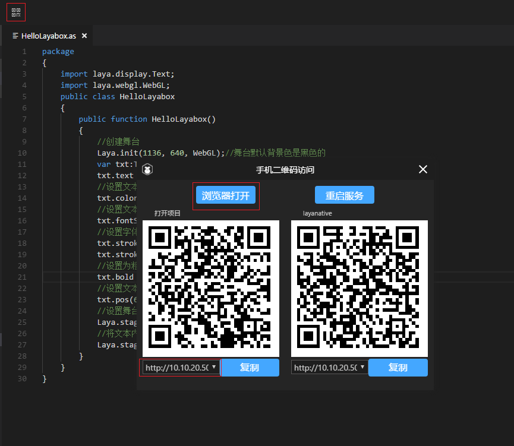

#LayaNative 사용하여 LayaAir 프로젝트 실행

당신이 이 문서를 볼 때, Layaiaiair나 Layaiair에 대해 잘 알고 있습니다. Layaiaiair의 문서에서 Layair를 어떻게 사용할지 상세하게 소개했습니다. "Hello Layayabox"

<!--TODO: 링크 주소 변경 *** Tips: 입력 항목 주소를 입력한 후 화면에 화면이 표시되지 않았을 경우 항목이 가로세로 화면을 설치하지 않았기 때문에 문서를 참고하십시오: htttps: htttps: github.com/layabox/layair-doc/tree/master/Chinese/LayaNative/screen/screen

절차: 현재 Hello Layabox 의 간단한 항목을 세웠습니다.

< br />
실행 효과는 그림 2의 시사와 같다:

< br />
도2

단계 2: LayaIDE 오른쪽 위쪽 '2차원 코드' 메뉴 키를 누르면 2차원 부호 인터페이스, 인터페이스 아래 http 주소를 표시합니다`http://10.10.20.50:8900/bin/h5/index.html`그림 3의 제시:

< br />
도

단계 3: 2차원 부호 인터페이스를 클릭한 '브라우저 열기' 단추를 누르면 브라우저에서`http://10.10.20.50:8900/bin/h5/index.html`방식 열기, 켜진 후 화면 4개 표시:

 

도

단계 4: 핸드폰에 설치된 LayaBox 테스트 App 을 켜면 그림 5개처럼 보여 줍니다:

< br />
도

단계 5: App 의 위쪽 파란 2차원 아이콘 클릭, 스캔 2중 오른쪽 layaNative 2차원 코드.

< br />
도

< br />
도

절차 6: 스톡이 성공한 후, App 을 측정하여 Hello Layabox 프로젝트를 실행할 수 있는 항목 실례, 그림 7개

< br />
도